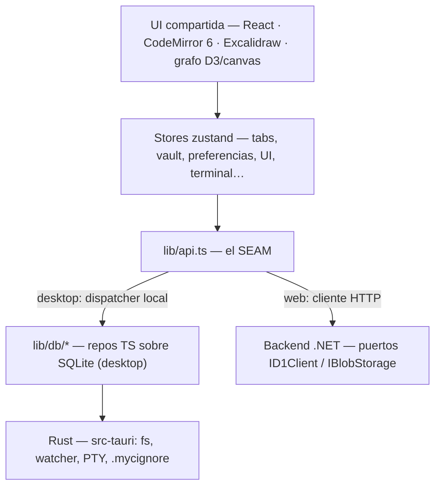

# Arquitectura de Mycelium

Mycelium es un sistema de gestión de conocimiento estilo Obsidian: notas Markdown con
enlaces `[[wiki]]`, grafo de conocimiento y edición en vivo. Se mantiene en **dos
versiones** que comparten casi todo el frontend y **divergen en la capa de datos**.

## Las dos versiones

| Versión | Rama | Datos | Login |
|---|---|---|---|
| **Desktop** | `desktop-tauri` | Tauri + SQLite nativo + [[vault-en-carpeta]] | No (ver [[desktop-sin-login]]) |
| **Web** | `web-cloud` | Next.js + backend .NET (D1/R2 previstos) | Sí (email + contraseña) |

La razón de esta forma está en [[Dos ramas en vez de monorepo]] y la regla que la
sostiene, en [[Implementacion independiente por rama]].

## Capas

**`frontend/lib/api.ts` es la costura**: mismo contrato, dos implementaciones. En
desktop es un *dispatcher* que resuelve contra los repos locales; en web, un cliente
HTTP. Todo lo que está por encima (UI y stores) es común.

Detalle por versión: [[Capa de datos del desktop]] · [[Capa de datos de la web]].

## Frontend compartido

- **Next.js** (App Router, TypeScript). En desktop se exporta estático
  (`output: "export"`) y Tauri sirve `out/`.
  > [!warning] Este Next tiene cambios de API respecto a lo conocido
  > Rige `frontend/AGENTS.md`: consultar `node_modules/next/dist/docs/` antes de
  > escribir código de Next.
- **CodeMirror 6** para el editor, con decoraciones propias para la vista en vivo (ver
  [[CodeMirror y la vista en vivo]]).
- **Excalidraw** para diagramas (`.excalidraw`), **Mermaid** en bloques y **KaTeX**.
- **Grafo** de conexiones global + mini-grafo por nota.
- **zustand** para el estado, con `persist` (ver [[Estado con Zustand]]).
- **Sistema de diseño** con tokens de dos capas: ver [[DESIGN_SYSTEM]].

## Modelo de contenido

- Una **nota** es un archivo `.md`; **su título es el nombre del archivo**. Los
  `[[enlaces]]` resuelven **por título**, no por ruta.
- `[[destino|alias]]`, embeds `![[nota]]` y `![[dibujo.excalidraw]]`, `#tags`.
- **Callouts** `> [!tipo]` con 10 tipos, plegables (`-`/`+`) y anidables.
- El **frontmatter YAML** del inicio de la nota se interpreta como **propiedades**
  (`FUN-M-04`, ver [[metadata-yaml]]): un **mapa plano** cuyos valores pueden ser texto,
  número, casilla, fecha, fecha y hora o lista. `tags:` son etiquetas de la nota, igual
  que los `#tag` del cuerpo. Lo que cae fuera del subconjunto (mapas anidados, escalares
  multilínea, anclas, listas de mapas) se muestra **crudo** y no se reescribe nunca. El
  parseo vive en `lib/frontmatter.ts` —propio, sin dependencia de YAML— y las
  propiedades se indexan en la tabla `propiedades` del índice del vault.

## Estructura del repo

| Carpeta | Contenido |
|---|---|
| `frontend/` | Next.js + `src-tauri/` (Rust, solo desktop) |
| `backend/` | .NET 9 minimal API — **solo en `web-cloud`** |
| `docs/` | Esta documentación (ver [[Mapa de documentacion]]) |
| `installers/` | Artefactos de build, sin trackear (ver [[Generar instaladores desktop]]) |
| `legacy/` | Prototipo vanilla original — **solo en `web-cloud`** |

## Relacionadas

- [[HUs]] — historias de usuario con criterios de aceptación (el "qué" del producto).
- [[MIGRACION-TAURI]] — cómo se construyó la versión desktop.
- [[RAMAS]] — qué archivos divergen entre versiones.
- [[Estado del proyecto]] — dónde está todo hoy.
- [[Mapa de documentacion]] — índice general.
