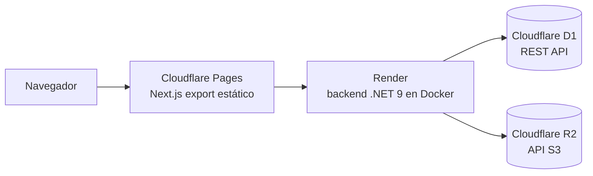

# Despliegue de la web en Cloudflare

Qué se hizo para poner la línea **web** en producción, dónde vive ese trabajo y en qué
estado quedó. Se documenta acá porque el código y sus guías viven **solo en
`web-cloud`** (se limpiaron de `desktop-tauri`), y desde el vault de trabajo actual son
invisibles. Ver [[RAMAS]].

> [!info] Estado: preparado, sin despliegue confirmado
> El código y la infraestructura están completos; **no hay registro de un despliegue
> efectivo** (ni en el vault ni en los commits). Sí se llegó a **crear la base D1**: el
> `database_id` está rellenado en `wrangler.toml`. Todo esto es de **junio de 2026**,
> antes de la migración a Tauri.

## Topología decidida

**Restricción central que forzó el diseño**: ASP.NET Core (.NET 9) **no corre en
Cloudflare Workers** (solo JS/Wasm). Por eso Cloudflare guarda **datos** y el contenedor
.NET se hospeda **aparte, en Render**. El frontend es 100% cliente (`"use client"`, sin
rutas server ni `app/api`), así que sale como export estático a Pages.

Otras decisiones tomadas entonces: el email queda deshabilitado (`LogEmailSender`), sin
auto-verificación — el administrador verifica cada cuenta a mano en la D1.

## Dónde vive (todo en `web-cloud`)

| Archivo | Qué es |
|---|---|
| `DEPLOYMENT-PLAN.md` | El **plan**: contexto, restricciones, decisiones y alcance. |
| `docs/DEPLOYMENT.md` | La **guía paso a paso** de lo que hay que hacer a mano (crear D1/R2, migrar el esquema, configurar Render, Pages). |
| `backend/src/Micelio.Api/Adapters/Cloudflare/D1Client.cs` | Adaptador D1 sobre la REST API. Devuelve **el mismo envelope** que `LocalSqliteD1Client`, así repositorios y mappers no cambian. |
| `backend/src/Micelio.Api/Adapters/Cloudflare/R2BlobStorage.cs` | Adaptador R2 por API S3. |
| `backend/migrations/d1/schema.sql` · `seed.sql` | Esquema (tablas + FTS5, idempotente) y datos semilla. |
| `backend/Dockerfile` · `render.yaml` | Contenedor y servicio de Render. |
| `wrangler.toml` | Ids de los recursos Cloudflare y comando de migración. |
| `backend/src/Micelio.Api/appsettings.Production.json` · `frontend/.env.production.example` | Configuración de producción. |

Se activa con `Storage:Provider=cloudflare`; en local sigue `local` (SQLite + disco).
Es el mismo mecanismo de puertos/adaptadores descrito en [[Capa de datos de la web]].

## Historia: la rama `deploy/cloudflare`

Dos commits de **2026-06-17**, ambos ya **integrados en `web-cloud`**:

- `9cccce4` — `feat(deploy): adaptadores Cloudflare D1/R2 + infra Render/Pages`
- `e2b19fc` — `feat: config deploy`

La rama es **ancestro directo** de `web-cloud` (y por lo tanto de `desktop-tauri`): no
tiene un solo commit propio. Su etiqueta ya no aporta nada — ver la sección de ramas
históricas en [[RAMAS]].

## Si algún día se retoma

1. Releer `DEPLOYMENT-PLAN.md` y `docs/DEPLOYMENT.md` **en `web-cloud`**.
2. Verificar qué recursos de Cloudflare siguen vivos (la D1 `micelio-prod` con
   `database_id` `5fc44645-…` y el bucket R2 `micelio-blobs`).
3. Tener en cuenta que la línea web quedó congelada en **1.0.0**
   ([[Versionado del sistema]]): lo posterior es solo-desktop.

> [!warning] `.wrangler/cache/wrangler-account.json` está trackeado en `web-cloud`
> Contiene el **Account ID** de Cloudflare y el email de la cuenta. No es un token (no
> da acceso por sí solo), pero es un cache de herramienta que **no debería estar en
> git**. En `desktop-tauri` ya no existe. Al retomar la línea web, sacarlo del índice y
> agregarlo a `.gitignore`.

## Relacionadas

- [[Capa de datos de la web]] — puertos, adaptadores y por qué esto encaja sin tocar la lógica.
- [[RAMAS]] — qué vive solo en `web-cloud` y el estado de las ramas históricas.
- [[Arquitectura de Mycelium]] — el cuadro general.
- [[DESKTOP-LOCAL]] — el empaquetado de esa misma época (obsoleto), que apuntaba a estos datos.
- [[Estado del proyecto]] — dónde está todo hoy.
- [[Mapa de documentacion]] — índice general.
