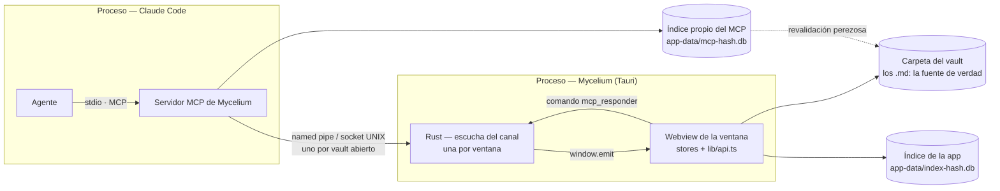
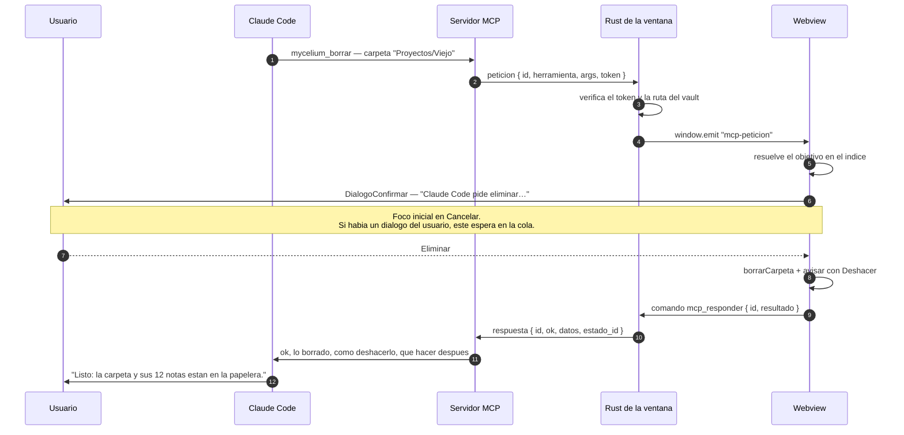

# MCP de Mycelium — la mitad de control

**Planificación** · abierta el 2026-09-23 · `FUN-L-09` `IA-MCP-MYCELIUM`

Esta nota decide **qué puede operar Claude Code de la aplicación**, **por dónde se lo
pide** y **quién lo autoriza**. Es una de las tres partes en que [[MCP de Mycelium - encuadre]]
reparte el diseño; las otras dos son [[MCP de Mycelium - memoria]] —cómo se busca— y
[[MCP de Mycelium - evaluacion]] —cómo se comprueba que algo de esto sirve—.

> [!important] Solo se planifica
> No hay código. Cada apartado marca qué es **decisión** —se implementa así salvo que
> alguien traiga un argumento nuevo— y qué es **pregunta abierta** —falta un dato o una
> preferencia del usuario—. Las preguntas están todas juntas en la § 7.

---

## 1. El principio: no exponer la app, exponer lo que el disco no sabe hacer

El asistente ya vive dentro del vault. Corre en la [[terminal-integrada]], con el `cwd` en
la carpeta, y sabe leer y escribir archivos. Así que la pregunta correcta **no** es «¿qué
funciones tiene Mycelium?» sino **«¿qué hace hoy mal, o no puede hacer, con el sistema de
archivos en la mano?»**.

> [!warning] El sesgo a evitar es exponer la app entera
> Un `tabsStore` con veinte acciones y un `lib/api.ts` con cuarenta rutas invitan a
> envolverlas una por una. Sería un error caro: cada herramienta es superficie que hay que
> mantener, documentar, versionar y **defender cuando el agente la usa mal**. Además, un
> catálogo largo cuesta tokens en cada conversación, aunque no se use ninguna.

De ahí sale el criterio de admisión. **Una herramienta entra solo si cumple una de estas
tres:**

1. **El sistema de archivos no puede hacerlo bien.** Renombrar es el caso puro: la app
   repara los enlaces entrantes ([[titulo-renombra]], `FUN-M-08`), pero un `mv` desde la
   terminal no dispara nada — y eso está escrito como advertencia en el propio `CLAUDE.md`
   que genera [[ia-framework-vault]]. La instrucción existe porque la capacidad falta.
2. **Solo la ventana lo sabe.** Qué nota mira el usuario, qué pestañas hay abiertas, si hay
   algo sin guardar. Nada de eso está en el disco.
3. **Hace visible al usuario lo que el agente hizo.** Terminar diciendo «mirá la nota X» y
   que el usuario tenga que buscarla es trabajo que el agente podía ahorrar.

Y un criterio de exclusión que pesa más que los tres: **si equivocarse es caro e
irreversible, no se expone**, por muy útil que parezca.

### 1.1 Decisión — las nueve herramientas, agrupadas por intención

El agrupamiento es por **lo que el agente quiere lograr**, no por el módulo interno que lo
resuelve; es lo que engram hace bien y lo que el encuadre recoge de él. Un agente no piensa
«quiero llamar a `tabsStore.openNoteBackground`»: piensa «quiero que el usuario vea esto».

| Herramienta | Qué hace | Qué devuelve | ¿Necesita la app abierta? | ¿Confirma el usuario? |
|---|---|---|---|---|
| **Orientarse** | | | | |
| `mycelium_estado` | Dice si hay una ventana, con qué vault, en qué anda —indexando, abriendo— y **qué está mirando el usuario**: paneles, pestañas, nota activa, borradores sin guardar | `app`, `vault`, `indice` con su frescura, `ventana` (o `null`), `estado_id` | **No.** Con la app cerrada responde igual, con `ventana: null` y lo que sabe del disco | No |
| **Mostrar** | | | | |
| `mycelium_abrir` | Abre una nota, un archivo, el grafo, la papelera o una búsqueda en una pestaña. Opcionalmente la **revela** en el explorador y salta a un encabezado, una línea o un texto | Qué abrió (id y ruta), en qué panel, y el resumen de pestañas resultante | **Sí** | No |
| `mycelium_cerrar` | Cierra pestañas por selector: una nota, las de un tipo, las no ancladas | Qué cerró y qué **no** cerró, con el motivo | **Sí** | No, salvo que haya cambios sin guardar |
| **Escribir a través de la app** | | | | |
| `mycelium_crear` | Crea una nota, un `.canvas`, una `.base`, un `.excalidraw` o un `.drawio`, opcionalmente **a partir de una Espora** con sus variables ya sustituidas | `id`, `ruta`, `titulo_final` y si hubo que desambiguar el nombre | **Sí** | No |
| `mycelium_renombrar` | Renombra una nota o una carpeta **reparando los enlaces entrantes** | Nombre nuevo, id nuevo, y **cuántas notas se reescribieron, y cuáles** | **Sí** | Solo si supera el umbral de alcance (§ 3.3) |
| `mycelium_mover` | Mueve una nota o una carpeta a otra carpeta, con la misma reparación | Ruta nueva, id nuevo, enlaces reescritos | **Sí** | Igual que renombrar |
| `mycelium_borrar` | Manda una nota o una carpeta a la papelera de Mycelium | La entrada de papelera con la que se restaura, y el aviso con **Deshacer** que vio el usuario | **Sí** | **Nota: no. Carpeta: sí** (§ 3.2) |
| `mycelium_papelera` | Lista la papelera y **restaura** de ella | Entradas con su origen y su fecha | **Sí** | No (restaurar es reparar) |
| **Coordinarse** | | | | |
| `mycelium_sincronizar` | Espera a que el índice se ponga al día con lo que se escribió desde la terminal, o lo fuerza | `estado_id` nuevo, cuántos archivos entraron, cuánto tardó | **Sí** | No |

Son **nueve**, y tres de ellas —`estado`, `abrir`, `sincronizar`— cubren la mayoría del uso
real. La lista está pensada para **crecer con evidencia**: la § 1.2 dice qué se dejó fuera y
qué tendría que pasar para que entre.

> [!info] `mycelium_sincronizar` vive en la frontera con la mitad de memoria
> Es control —le pide algo al dueño del índice— pero existe sobre todo para que las
> herramientas de búsqueda de [[MCP de Mycelium - memoria]] no contesten con un índice
> viejo después de que el agente escribió treinta archivos. Si aquella nota prefiere
> quedársela, que se la quede: lo que **no** puede pasar es que no exista o que esté dos
> veces.

### 1.2 Decisión — lo que queda fuera, a propósito

| Lo que no se expone | Por qué |
|---|---|
| **Borrado permanente** (`borrarPermanente`) | Es la única operación del vault de la que no se vuelve. El agente puede mandar a la papelera y el usuario vacía cuando quiera. Ningún caso de uso justifica el riesgo |
| **Cambiar preferencias** (`preferencesStore`, `prefsVaultStore`, atmósferas, tema) | Son del usuario, no del vault. Una IA que cambia el tema o la carpeta de Esporas «para que quede mejor» rompe el acuerdo de que la app es de quien la mira. Si hace falta, se expone **leer**, no escribir |
| **Configuración del vault**: `.mycignore`, vincular o desvincular vaults, el updater | Cambian qué existe para la app y qué se instala en la máquina. Un error acá se paga fuera del vault |
| **Abrir, cerrar o cambiar de vault**; abrir o cerrar ventanas | El agente vive dentro de un vault por definición (§ 2.3). Que pueda sacar al usuario del vault en el que trabaja es todo riesgo y ningún beneficio |
| **Terminal**: abrir consolas, escribir en ellas | El agente **ya es** un proceso en una terminal. Darle una segunda es una forma barata de que se hable a sí mismo o de que escriba en la consola del usuario |
| **Exportar** a PDF, ZIP o carpeta | Escribe fuera del vault, en una ruta arbitraria. El agente ya tiene el sistema de archivos para eso, con los permisos de Claude Code mirando, que es donde ese control corresponde |
| **Editar el contenido de una nota** (`putContenido`) | Ya lo puede hacer: escribir el archivo es lo que mejor hace. Pasarlo por la app no agrega nada, y agrega una forma más de pisar un editor abierto con cambios sin guardar |
| **Reparar enlaces rotos en masa** (`lib/enlaces.ts`, `FUN-L-17`) | Es el mejor candidato a v2, y queda fuera por una razón concreta: `mycelium_renombrar` **le quita la causa principal**. Entra si la evaluación muestra que siguen apareciendo enlaces rotos en sesiones con MCP |
| **Mover pestañas entre paneles, dividir la pantalla, anclar en el visor** | Es la disposición del espacio de trabajo del usuario. `mycelium_abrir` ya elige panel; el resto es ruido |

> [!danger] Configuración y borrado permanente no se exponen «pero con confirmación»
> Se podría argumentar que con un diálogo de por medio cualquier cosa es segura. No lo es:
> un diálogo que aparece a menudo **enseña a decir que sí sin leer**, y eso está escrito en
> [[avisos-y-confirmaciones]] como el motivo por el que borrar una nota dejó de preguntar.
> La confirmación protege lo raro. Lo que no debe pasar nunca se resuelve **no
> implementándolo**.

---

## 2. El canal

### 2.1 El problema

El servidor MCP es un proceso que **lanza Claude Code** y con el que habla por `stdio`. La
app es **otro proceso**: un binario Tauri, con un Rust que tiene los comandos y un webview
que tiene el estado de la interfaz. Y buena parte de lo que queremos operar —qué pestañas
hay, qué nota mira el usuario— **solo existe en el JavaScript de ese webview**, no en el
disco ni en el índice.



> [!warning] Diagrama corregido el 2026-09-23
> La primera versión mostraba el índice dentro de `.mycelium/` y al servidor **leyendo el
> índice de la app** con ella cerrada. Las dos cosas quedaron superadas: el índice de la app
> vive en el app-data ([[Capa de datos del desktop]]), y [[MCP de Mycelium - memoria]] decidió
> que el servidor mantiene **el suyo** y nunca abre el de la app. Lo señaló la
> [[MCP de Mycelium - revision critica]].

### 2.2 Decisión — *named pipe* en Windows, socket UNIX en el resto

**Un canal por vault abierto**, cuyo nombre se deriva de la ruta canónica del vault —definida en [[MCP de Mycelium - plan]] § 7.3: la cadena de la entrada del registro, resuelta con una normalización única—:
`\\.\pipe\mycelium-<hash>` en Windows, `$XDG_RUNTIME_DIR/mycelium-<hash>.sock` en Linux y
`$TMPDIR` en macOS. Encima corre un protocolo de líneas JSON con correlación por `id`:
prácticamente el mismo JSON-RPC que el servidor ya habla por `stdio`.

Las alternativas, y por qué no:

| Opción | Por qué no |
|---|---|
| **HTTP en loopback** | Es la más fácil y la peor: hay que **elegir y anunciar un puerto**, Windows puede preguntar por el cortafuegos al enlazar, y —lo grave— **cualquier página web que el usuario tenga abierta puede hacerle `fetch` a `127.0.0.1`**. Defenderse exige comprobar `Origin`, cabeceras a medida y un *token*: reconstruir a mano lo que el pipe da de arranque. Un pipe con nombre **no es alcanzable desde un navegador**, y ese solo hecho borra una familia entera de ataques |
| **WebSocket en loopback** | Lo mismo que HTTP, con más piezas y con `ws://` exento de varias de las protecciones de origen |
| **Un comando de Tauri** | No es un canal: los comandos se invocan **desde el webview hacia Rust**, no desde un proceso ajeno. No hay por dónde entrar |
| **Un archivo buzón en el vault** (el agente escribe, la app vigila con el watcher) | Sin conexión no hay respuesta ni errores: solo un archivo que quizá alguien lea. Ensucia el vault con basura de protocolo, justo en contra de que el vault sea del usuario. Y el watcher agrupa ráfagas, así que la latencia sería de cientos de milisegundos en el mejor caso |
| **Portapapeles, `stdin` de la terminal, atajos sintéticos** | Se mencionan para descartarlos: pelean con el usuario por el foco y no tienen forma de devolver un error |

Lo que el pipe da gratis, y conviene decir en voz alta:

- **Control de acceso del sistema operativo.** La DACL del pipe se restringe al usuario
  actual; el socket UNIX se crea con modo `0600` en un directorio del usuario. Otro usuario
  de la misma máquina no llega.
- **Sin puerto, sin descubrimiento, sin cortafuegos.** El nombre se calcula; no hay que
  publicar nada ni leer un archivo para saber a qué conectarse.
- **Cierre limpio.** Si la app muere, el pipe deja de existir y el cliente se entera en la
  conexión, no por un plazo vencido.

> [!info] Dónde vive la escucha: en Rust, **por ventana**
> Se abre en `registrar_vault` y se cierra en `soltar_vault` —los dos ya existen en
> `src-tauri/src/ventanas.rs`—, guardada en un mapa `etiqueta de ventana → escucha`, igual
> que el mapa de *debouncers* del watcher. No es una preferencia estética:
> [[ventanas-multiples]] documenta que **el estado global a la app que en realidad pertenece
> a una ventana** fue la fuente de tres defectos seguidos —el watcher robado, los eventos
> del watcher difundidos, el puente `open-files` duplicando notas en los dos vaults—. Un
> escuchador global sería el cuarto.

### 2.3 Decisión — el vault es la dirección, y así se resuelve «¿a qué ventana le hablo?»

`FUN-L-16` garantiza que **un vault se abre en una sola ventana** ([[ventanas-multiples]]
§ 2), y la instancia única garantiza que hay un solo proceso. Entonces la ruta canónica del
vault **identifica unívocamente una ventana**, y el nombre del canal ya la lleva.

El servidor MCP averigua su vault en este orden, y se queda con el primero que resuelva:

1. La variable de entorno `MYCELIUM_VAULT`, que la app inyecta al abrir una consola (§ 3.4).
2. El argumento `--vault <ruta>` de la configuración MCP.
3. El `cwd` del proceso, subiendo directorios hasta encontrar uno que contenga `.mycelium/`.

Si ninguno resuelve, **no se adivina**: todas las herramientas fallan con
`VAULT_DESCONOCIDO`, y `mycelium_estado` devuelve la lista de vaults abiertos para que el
agente pueda decirle al usuario cuál pasarle. Elegir «la ventana que tiene el foco» sería el
mismo fallo que `open-files` tuvo que corregir, pero al revés: escribir en el vault
equivocado sin que nadie se entere.

### 2.4 Decisión — con la app cerrada, el servidor arranca igual y lo dice

El encuadre pedía decidir esto explícitamente, y la respuesta es que **el servidor no
depende de la app para existir**. El proceso levanta, publica su catálogo y contesta; lo que
cambia es qué puede hacer:

| Con la app cerrada | Qué pasa |
|---|---|
| `mycelium_estado` | **Funciona.** Devuelve `app: "cerrada"`, la ruta del vault y la frescura del índice leída del disco. `ventana: null` |
| Las herramientas de memoria ([[MCP de Mycelium - memoria]]) | **Funcionan**, sobre el **índice propio** del servidor, que revalida contra el disco |
| Las siete restantes de esta nota | Fallan con `APP_CERRADA`, y el error dice qué sí se puede hacer |

No se ofrece «lanzar Mycelium si está cerrado». Abrir una ventana en el escritorio de
alguien porque un agente lo decidió es intrusivo, y además arrastra la pregunta de qué vault
abrir. Si el agente necesita la app, la **pide**: el mensaje del error es lo que le repite
al usuario.

> [!warning] El índice tiene dueño, y el MCP no lo es
> Regla 3 del encuadre. El servidor abre el índice **en modo lector** y nunca escribe en él,
> ni siquiera con la app cerrada: dos escritores sobre el mismo SQLite es el problema que
> `FUN-L-16` decidió evitar **prohibiendo la situación**, no resolviéndola. Todo lo que muta
> pasa por la app, y por eso esas siete herramientas necesitan ventana. La duda técnica que
> queda es el modo de *journal* — § 7.

---

## 3. Seguridad y permisos

### 3.1 Tres clases, no un permiso por herramienta

| Clase | Qué incluye | Regla |
|---|---|---|
| **Mirar** | `mycelium_estado` | Libre. No cambia nada y es la primera llamada de casi toda sesión |
| **Mostrar** | `mycelium_abrir`, `mycelium_cerrar`, `mycelium_papelera` listando | Libre, porque es **visible y trivialmente reversible**: el usuario ve la pestaña y la cierra. Pero mostrar no es robar el foco — § 3.5 |
| **Escribir** | `crear`, `renombrar`, `mover`, `borrar`, `papelera` restaurando, `sincronizar` | Pasa por la red de seguridad que la app **ya tiene** |

### 3.2 Decisión — la red de seguridad es la de la app, no una nueva

[[avisos-y-confirmaciones]] (`FUN-M-33`) ya resolvió este problema para el usuario humano, y
lo resolvió bien: **lo reversible no pregunta y avisa con Deshacer; lo que pregunta lo dibuja
Mycelium, con el foco inicial en «Cancelar» y con el verbo en el botón**. Inventar un segundo
mecanismo para el agente costaría dos cosas: el usuario tendría que aprender dos lenguajes de
confirmación, y el nuevo no estaría probado.

Así que el MCP **reusa `confirmar()` y `avisar()` tal cual**, y hereda sus reglas:

- **Borrar una nota no pregunta**: va a la papelera y el usuario ve «*«Nombre» fue a la
  papelera*» con **Deshacer**. La respuesta de la herramienta le dice al agente que ese aviso
  existe y con qué entrada restaurar, así que puede ofrecerlo también por su lado.
- **Borrar una carpeta sí pregunta**, igual que en la app.
- `confirmar()` **devuelve `false` si no hay interfaz montada**. Ese default —ante la duda,
  no se ejecuta lo destructivo— es exactamente el que queremos para un proceso ajeno, y ya
  está escrito en `lib/confirmar.ts`.

> [!danger] Hay una colisión que hoy no existe y que este diseño crea
> `confirmarStore` admite **una pregunta a la vez**: si llega otra, «la anterior se cancela y
> por lo tanto NO se ejecuta su acción destructiva». Con el MCP eso deja de ser un detalle
> benigno. Si el usuario está mirando «¿Eliminar esta carpeta?» y el agente pide una
> confirmación, **la del usuario se cancela sola** —su borrado no ocurre, sin explicación— y
> encima aparece una pregunta que él no provocó.
>
> **Decisión**: `confirmarStore` pasa de «una pendiente» a **cola**, y lo del MCP **se encola
> detrás** de lo del usuario, nunca lo desplaza. Si hay un diálogo del usuario en pantalla,
> la herramienta espera; si la espera vence, devuelve `OCUPADA` con `reintentar_en_ms`.
> Además, el diálogo pedido por el agente **se rotula como tal** —«Claude Code pide…»—: una
> pregunta que el usuario no provocó y que no dice de dónde viene es una pregunta que se
> contesta que sí por inercia.

### 3.3 Decisión — lo que dispara la pregunta es el alcance, no el verbo

Renombrar una nota no pregunta en la app, y tampoco debería preguntar por MCP. Pero un agente
en un bucle puede renombrar cuarenta notas en cuatro segundos, y eso **no es lo mismo que el
usuario renombrando una**. El riesgo no está en el verbo: está en el alcance.

Entonces `renombrar` y `mover` piden confirmación cuando el cambio **reescribiría enlaces en
más de `N` notas** —y el diálogo dice el número y las primeras—; y el servidor lleva un
contador por sesión: pasadas `M` escrituras sin que el usuario haya intervenido, la siguiente
pregunta, sea cual sea. Los dos números son preferencia del usuario, con un valor por defecto
conservador (§ 7).

Esto es lo que sostiene el sistema **cuando el agente se equivoque**, que es el caso que
importa. Un agente que decide que todas las notas deberían llamarse distinto no produce
cuarenta renombrados silenciosos: produce un diálogo en la primera docena.

### 3.4 Decisión — autenticación: el sistema operativo primero, el *token* después, y decir la verdad sobre el límite

Tres capas, en orden de lo que de verdad protegen:

1. **El sistema operativo.** DACL del pipe restringida al usuario; socket `0600`. Esto sí es
   un límite real: separa usuarios.
2. **Un *token* por ventana**, generado al abrir el vault y válido mientras esa ventana viva.
   Viaja en el saludo de la conexión. La app lo **inyecta en el entorno** de las consolas que
   abre: `terminal_abrir` ya construye el `CommandBuilder` y hoy solo pone `TERM`, así que
   agregar `MYCELIUM_VAULT`, `MYCELIUM_VENTANA` y `MYCELIUM_MCP_TOKEN` es una línea. Un
   Claude Code lanzado **en la terminal integrada queda autenticado sin que nadie configure
   nada**, que es el camino principal.
3. **Para el Claude Code de fuera**, el *token* se lee de un archivo en el directorio de
   configuración de la app —**no del vault**: el vault se comparte, se copia y se versiona—,
   con permisos de solo-usuario.

> [!warning] La tercera capa no es una frontera de seguridad, y no hay que venderla como tal
> Cualquier proceso que corra **como el usuario** puede leer ese archivo. No hay forma de
> impedirlo sin un sistema de capacidades del que Windows no dispone para este caso. El
> *token* sirve para tres cosas honestas: que un programa **no se conecte por accidente**,
> que la app pueda **revocar** —cerrar la ventana invalida todo— y que el registro diga **qué
> conexión** hizo cada cosa.
>
> La defensa real contra el daño no es la autenticación: es la § 1.2 —lo que no existe no se
> puede invocar— y la § 3.2 —lo irreversible lo confirma una persona—.

Además, el saludo verifica que la ruta del vault que declara el cliente **es la misma** que
la de la ventana. Protege contra un pipe viejo, una carpeta renombrada por fuera o un cliente
configurado con `--vault` equivocado.

### 3.5 Decisión — mostrar no es robar el foco

`mycelium_abrir` abre **en segundo plano** por defecto —`tabsStore` ya tiene
`openNoteBackground`— y solo toma el foco con `foco: true`. Un agente que trabaja mientras el
usuario escribe y le arranca la pestaña de debajo del cursor es hostil, y sería la primera
queja. El agente pide el foco cuando tiene algo que mostrar **ahora**, no cada vez que abre
algo para sí mismo.

### 3.6 Una operación que pide confirmación, de punta a punta



Y el camino que hay que diseñar igual de bien, que es cuando dice que no:

> [!important] `RECHAZADO_POR_EL_USUARIO` no es un error para reintentar
> Es una **respuesta**. El agente no vuelve a pedir lo mismo con otras palabras, no lo parte
> en trozos más chicos para que no pregunte, y no busca la puerta de atrás del sistema de
> archivos. Lo informa y sigue. Esto va escrito en el error mismo y repetido en las
> instrucciones del framework (§ 6), porque es la clase de regla que un agente incumple con
> la mejor intención.

---

## 4. Qué devuelve cada herramienta

> [!important] Un `ok: true` es una respuesta que obliga a otra llamada
> Y otra llamada son más tokens, más latencia y una oportunidad más de equivocarse. La regla
> de diseño es: **la respuesta tiene que contener lo que el agente necesita para decidir el
> paso siguiente**, sin volver a preguntar.

### 4.1 Decisión — un sobre común

Toda respuesta, salga bien o mal, tiene la misma forma:

```json
{
  "ok": true,
  "datos": {},
  "estado_id": "v-8f31c2",
  "aviso": "Se abrió en segundo plano; no se tocó el foco del usuario.",
  "siguiente": ["mycelium_abrir", "mycelium_estado"]
}
```

- **`estado_id`** cambia cada vez que cambia el árbol del vault. Es barato de comparar y le
  dice al agente, sin pensarlo, si lo que sabía sigue valiendo.
- **`aviso`** es una línea de prosa para lo que el agente debería contarle al usuario o tener
  en cuenta. No es relleno: se omite cuando no hay nada que decir.
- **`siguiente`** son las herramientas que tienen sentido desde acá. Es la idea de engram de
  **recuperación progresiva** aplicada al control: la respuesta no trae todo, trae el camino.

### 4.2 Decisión — se devuelve el efecto, no el eco

Ejemplos de la diferencia, que es toda la diferencia:

| En vez de… | Se devuelve… |
|---|---|
| `{ ok: true }` al renombrar | El nombre nuevo, el id nuevo, **cuántas notas se reescribieron y cuáles** —hasta diez, con el total— y si alguna quedó sin reparar |
| `{ ok: true }` al borrar | La entrada de papelera con la que se restaura, **qué pestañas se cerraron** por efecto colateral, y que el usuario vio un aviso con Deshacer |
| `{ ok: true }` al abrir | En qué panel quedó, si tomó el foco, **y el resumen de pestañas abiertas después** — así el agente sabe que ya había dejado seis notas abiertas |
| Volcar el árbol entero en `mycelium_estado` | Lo que el usuario mira ahora, y el **`estado_id`** para pedir el resto solo si hace falta |

Y una regla de tamaño: **ninguna respuesta vuelca contenido de notas**. Para eso está la
mitad de memoria, con sus previsualizaciones y su detalle bajo demanda.

---

## 5. Errores y estados imposibles

### 5.1 Decisión — errores tipificados, con salida

Un error trae `codigo` —para que el agente ramifique sin leer prosa—, `mensaje` —para que se
lo cuente al usuario— y **lo que haga falta para arreglarlo en la misma vuelta**.

| Código | Cuándo | Qué trae además |
|---|---|---|
| `APP_CERRADA` | No hay escucha en el canal | Qué herramientas sí funcionan sin ventana |
| `VAULT_DESCONOCIDO` | El servidor no pudo resolver su vault (§ 2.3) | Los vaults abiertos, para que el usuario elija |
| `VAULT_DISTINTO` | El canal respondió, pero la ventana tiene otro vault | Las dos rutas, para que se vea el desajuste |
| `NO_ENCONTRADO` | El objetivo no existe | **Las candidatas más parecidas por título**, con su ruta |
| `AMBIGUO` | Dos notas con el mismo título | Las dos rutas; el agente repite la llamada con ruta en vez de título |
| `CAMBIOS_SIN_GUARDAR` | La pestaña destino tiene un borrador | Qué pestaña, y el parámetro `forzar` que lo permite |
| `OCUPADA` | La app está abriendo el vault o indexando | La etapa (`indexando`, `ajustes`…), el progreso y `reintentar_en_ms` |
| `ESTADO_CAMBIO` | El `si_estado` enviado ya no es el actual | El `estado_id` nuevo |
| `RECHAZADO_POR_EL_USUARIO` | El diálogo dijo que no | Nada. **No se reintenta** |
| `SIN_RESPUESTA` | La ventana no contestó dentro del plazo | Cuánto se esperó |
| `NO_AUTORIZADO` | *Token* ausente, vencido o de otra ventana | Cómo obtenerlo |
| `FUERA_DEL_VAULT` | La ruta se sale de la carpeta | La ruta que se intentó |

> [!info] `NO_ENCONTRADO` con candidatas es la decisión más rentable de esta sección
> «No existe *Arquitectura de mycelium*» obliga a buscar. «No existe; lo más parecido es
> *Arquitectura de Mycelium*, en `docs/arquitectura/`» **resuelve el problema en el mismo
> mensaje**. Cuesta una consulta al FTS que el índice hace en milisegundos y ahorra una ronda
> entera.

### 5.2 Los estados imposibles, uno por uno

| Situación | Qué pasa, por diseño |
|---|---|
| **Abrir una nota que no existe** | `NO_ENCONTRADO` con candidatas. **Nunca se crea**: un verbo que mira no escribe. Si el agente quería crearla, tiene `mycelium_crear` |
| **Dos ventanas abiertas** (`FUN-L-16`) | No hay ambigüedad: el canal es por vault (§ 2.3). El agente le habla a la ventana de *su* vault, o a ninguna |
| **El vault cambió debajo** | `estado_id` en cada respuesta. Las herramientas que escriben aceptan `si_estado`: si no coincide, fallan con `ESTADO_CAMBIO` **antes de tocar nada**. Es concurrencia optimista, y es opcional: el agente la usa cuando su decisión dependía de algo que leyó antes |
| **La app está indexando** | `OCUPADA` con etapa y progreso —`vaultSessionStore` ya los tiene—. No se encola: indexar un vault grande tarda más de lo que un agente debe esperar bloqueado |
| **La ventana se cierra a mitad de una llamada** | El pipe se rompe y el servidor lo traduce a `APP_CERRADA`. **La operación puede haber ocurrido**: el mensaje lo dice, y el agente comprueba con `mycelium_estado` en vez de repetir a ciegas |
| **El webview congelado, o un modal del usuario en pantalla** | `SIN_RESPUESTA` por plazo vencido. La escucha en Rust no se bloquea nunca: cada petición tiene su temporizador |
| **Dos peticiones del MCP a la vez** | Se serializan por ventana. Un agente que abre seis notas en paralelo no puede dejar el `tabsStore` en un estado que nadie diseñó |
| **Confirmación pedida sin interfaz montada** | `confirmar()` devuelve `false` → `RECHAZADO_POR_EL_USUARIO`. El default seguro que ya está escrito |
| **El agente escribió archivos desde la terminal y pregunta por ellos** | El watcher reindexa, pero tarda. `mycelium_sincronizar` espera a que el `estado_id` se estabilice |

---

## 6. Cómo descubre el agente estas herramientas

Que existan no alcanza. Lo dice el encuadre al resumir graphify: **empujan al agente con
hooks e instrucciones en vez de confiar en que se acuerde**. Acá el lugar es el framework de
IA del vault ([[ia-framework-vault]], `FUN-L-08`, hoy `1.6.0`), que es justo el generador que
escribe el `CLAUDE.md` y los comandos `/vault-*`.

### 6.1 Decisión — el framework sube a `1.7.0` y registra el MCP

Funcionalidad nueva que la IA debe conocer ⇒ **minor** del framework, que se versiona aparte
de la app ([[Versionado del sistema]]). Lo que agrega:

| Qué | Dónde | Para qué |
|---|---|---|
| La configuración del servidor MCP | `.mcp.json` en la raíz del vault | Es donde Claude Code la busca. Empieza con punto, así que `.mycignore` lo oculta de la app por defecto ([[mycignore]]) |
| Una sección **«Operar Mycelium»** | `CLAUDE.md` | Las nueve herramientas y, sobre todo, **la línea divisoria**: renombrar, mover y borrar pasan por Mycelium; leer y escribir el contenido de una nota, no |
| La corrección de la regla dura 2 | `CLAUDE.md` | Hoy dice que un `mv` de la IA rompe los enlaces. Con `mycelium_renombrar` deja de ser un límite y pasa a ser **una instrucción**: no uses `mv`, usá la herramienta |
| Un *hook* `PreToolUse` | `.claude/settings.json` | Intercepta `Bash(mv …)` y `Bash(rm …)` **dentro del vault** y le recuerda al agente la herramienta que corresponde. Es el truco de graphify, y acá lo justifica un fallo nuestro ya documentado, no la imitación |
| `/vault-abrir`, y ajustes en los comandos que ya hay | `.claude/commands/` | `/vault-buscar` termina ofreciendo abrir la nota que citó; `/vault-nota` crea con `mycelium_crear` y la deja abierta |
| Qué **no** puede hacer | `CLAUDE.md` | La § 1.2 en una tabla corta. Un agente que sabe que no puede cambiar la configuración deja de intentarlo y —más importante— deja de prometerlo |

> [!warning] El vault de este repo sigue con la `1.2.0`
> Va cuatro versiones por detrás y sus instrucciones afirman dos cosas que ya son falsas.
> Registrar el MCP sin regenerar el framework acá no serviría de nada. La regeneración desde
> Configuración → Vault es **parte del trabajo de `FUN-L-09`**, no un pendiente aparte.

### 6.2 Decisión — nombres en español, con el riesgo anotado

`mycelium_abrir`, no `mycelium_open`. El vault, las instrucciones, los comandos y los commits
están en español, y partir el idioma justo en la frontera de las herramientas obliga al
agente a traducir en los dos sentidos. El riesgo es real y conviene escribirlo: los modelos
tienen más práctica con nombres de herramienta en inglés, y eso podría costar aciertos en la
elección.

No se resuelve opinando. **Es de las primeras cosas que debería medir**
[[MCP de Mycelium - evaluacion]]: el mismo juego de tareas con los dos juegos de nombres. Si
la diferencia es apreciable, se cambia; si no, gana la coherencia.

---

## 7. Preguntas abiertas

1. **¿Cuánto es «demasiado» en el umbral de alcance (§ 3.3)?** Hay que fijar `N` —notas cuyos
   enlaces se reescriben sin preguntar— y `M` —escrituras seguidas sin intervención del
   usuario—. Sospecha inicial: `N = 5`, `M = 10`, los dos configurables. Se calibran con uso
   real, no con intuición.
2. **¿Qué modo de *journal* usa el índice?** Un lector externo conviviendo con el escritor de
   la app quiere WAL. Hoy el esquema lo declara `lib/db/indexer.ts` y el *pool* lo gestiona
   `tauri-plugin-sql`: hay que comprobar qué modo está en uso y si cambiarlo afecta a
   `FUN-L-10`, que va a reescribir ese indexado en Rust. **Lo decide más la mitad de memoria
   que esta**, pero condiciona el modo lector con la app cerrada (§ 2.4).
3. **¿El servidor MCP es un binario aparte o un subcomando del ejecutable de Mycelium?** Un
   subcomando (`mycelium --mcp`) se instala solo con la app, comparte versión y no puede
   desincronizarse; un binario aparte es más fácil de arrancar y de depurar. Depende de si el
   instalador NSIS/MSI puede dejar el ejecutable en el `PATH`, que hay que comprobar.
4. **¿Qué pasa si la app se actualiza mientras hay una sesión MCP viva?** El canal muere con
   el proceso, pero el agente puede estar a mitad de una tanda. Falta decidir si el servidor
   reintenta la conexión en silencio o si `APP_CERRADA` alcanza. Toca [[autoactualizacion]].
5. ~~**¿Hay registro de lo que hizo el agente, y dónde se ve?**~~ **Decidido por el usuario
   el 2026-09-23**: sí, y **en el rail**, para no comerse espacio de pantalla. Ver § 8.
6. **¿Se expone «leer preferencias» aunque no se exponga escribirlas?** Saber que la carpeta
   de Esporas es `Moldes/` y no `Esporas/` le evita al agente una suposición equivocada
   ([[esporas-plantillas]]). Se podría meter en `mycelium_estado` sin herramienta nueva.
   Inclinación: sí, un subconjunto chico y explícito.
7. **¿Qué hace `mycelium_abrir` con un `.drawio` o un `.excalidraw`?** Abrirlos es trivial,
   pero `ir_a` no significa nada ahí, y la webapp de draw.io tarda en cargar ([[drawio]]). Hay
   que decidir si la respuesta espera a que el editor esté listo o vuelve antes.
8. **¿`mycelium_crear` se gana el sitio?** Es la más débil de las nueve: el agente ya sabe
   escribir archivos y el watcher los recoge. Lo que aporta es la sustitución de variables de
   una Espora, la desambiguación del nombre y quedar abierta al instante. Si la evaluación
   muestra que casi no se usa, se retira.

---

## 8. Dos decisiones del usuario (2026-09-23)

### 8.1 El registro de actividad vive en el rail

**Decisión**: un ítem propio en el rail —el mismo grupo que el Explorador, la Búsqueda y las
Esporas— que abre un panel con **lo que hizo el agente**: qué operación, cuándo, sobre qué
nota y con qué resultado. Del rail y no de un aviso flotante, por lo que pidió el usuario: no
ocupar pantalla. Se mira cuando se quiere mirar.

> [!important] Este panel no es un adorno: es lo que hace aceptable el resto
> Sin registro, un agente que renombra, mueve y borra opera **invisible**, y la única defensa
> posible sería preguntar por todo — que es como se arruina la herramienta—. Con registro, la
> regla del § 4 se sostiene: lo reversible **no pregunta**, porque se ve y se deshace.

Lo que hace falta que tenga, y el porqué de cada cosa:

| Qué | Por qué |
|---|---|
| Operación, momento y **efecto** («renombró *X* → *Y*, reescribió 7 enlaces») | El efecto es lo que el usuario necesita juzgar, no el nombre de la herramienta |
| Ir a lo afectado | Un registro que no lleva a la nota obliga a buscarla a mano |
| **Deshacer**, donde aplique | Reusa lo de [[avisos-y-confirmaciones]]; un registro sin deshacer solo informa del daño |
| Estado del canal (encendido, conectado, apagado) | Es el lugar natural para ver si el MCP está vivo — y para encenderlo si no |
| Lo **rechazado** por el usuario y lo que falló | Media depuración es entender qué pidió el agente y por qué no pasó |

**Dónde se guarda**: `.mycelium/actividad.jsonl`, *append-only* y con tope. Ahí y no en el
vault visible porque **no es contenido**: ensuciaría el árbol y el grafo. Y en un archivo
suelto y no en el índice, porque es descartable — si se pierde, no se pierde nada del vault.

**Es funcionalidad de la app, no del MCP**: va al BACKLOG como `FUN-*` propio y se entrega
**junto con** las primeras herramientas de escritura, no después. Un registro que llega tarde
llega cuando ya hubo que confiar a ciegas.

### 8.2 El MCP se puede apagar, desde Configuración → Vault

**Decisión**: un interruptor en **Configuración → Vault → «Asistente IA (Claude Code)»**,
donde ya vive el generador del framework. **Por vault** (en `.mycelium/preferencias.json`,
[[preferencias-por-vault]]) y **apagado por defecto**, igual que el framework, que también es
opt-in: que un proceso externo pueda manejar la aplicación es algo que se concede, no algo
que viene puesto.

> [!warning] El motivo real es el control, no el ahorro — conviene no venderlo mal
> El usuario lo pidió «para ahorrar recursos si no usa IA», y eso hay que matizarlo: el
> servidor MCP **lo lanza Claude Code** y vive lo que vive esa sesión, así que con la IA
> apagada no consume nada. Del lado de la app, lo que se apaga es **una escucha en un pipe**:
> memoria y CPU despreciables.
>
> Lo que el interruptor apaga de verdad es **la superficie**: con él en «no», ningún proceso
> de la máquina puede pedirle a Mycelium que abra, cree, renombre o borre nada. Eso sí vale,
> y es razón suficiente — pero si lo documentamos como una optimización, el día que alguien
> mida el consumo va a concluir que la funcionalidad no servía para lo que decía servir.

Qué implica, exactamente:

- **Apagado**: la ventana no abre el pipe. Las herramientas `mycelium_*` fallan con
  `MCP_DESACTIVADO` —un código propio, distinto de `APP_CERRADA`— que dice **dónde** se
  enciende. Fallar claro y rápido; nunca quedarse esperando.
- **Las `vault_*` siguen funcionando**, y hay que decirlo sin adornos: leen el índice propio
  del servidor, no la app. **Apagar esto no le impide a Claude Code leer el vault** — puede
  hacerlo con `grep` desde siempre. El interruptor gobierna **el canal de control**, no el
  acceso a archivos del usuario en su propia máquina. Prometer lo otro sería mentir.
- **Encender o apagar no requiere reiniciar** ni la app ni la sesión de la IA: la escucha se
  abre y se cierra en caliente, como el watcher.
- El **ítem del rail** refleja el estado y ofrece encenderlo, para que el usuario no tenga que
  saber de memoria dónde estaba el ajuste.

## Relacionadas

- [[MCP de Mycelium - encuadre]] — los hechos, las restricciones y el reparto del que sale esta nota.
- [[MCP de Mycelium - memoria]] — la otra mitad: buscar en el vault en vez de operarlo.
- [[MCP de Mycelium - evaluacion]] — cómo se comprueba que algo de esto mejora algo.
- [[ia-framework-vault]] — dónde se registra el MCP para que el agente sepa que existe.
- [[avisos-y-confirmaciones]] — la red de seguridad que este diseño reusa en vez de reinventar.
- [[ventanas-multiples]] — por qué la escucha es por ventana, y por qué el vault identifica a una.
- [[terminal-integrada]] — el proceso que lanza al agente y le inyecta el *token*.
- [[titulo-renombra]] — el `mv` que rompe enlaces, que es la razón de ser de `mycelium_renombrar`.
- [[Arquitectura de Mycelium]] · [[Capa de datos del desktop]] — qué hay del otro lado del canal.
- [[BACKLOG]] — `FUN-L-09`.
- [[Mapa de documentacion]] — índice general.
