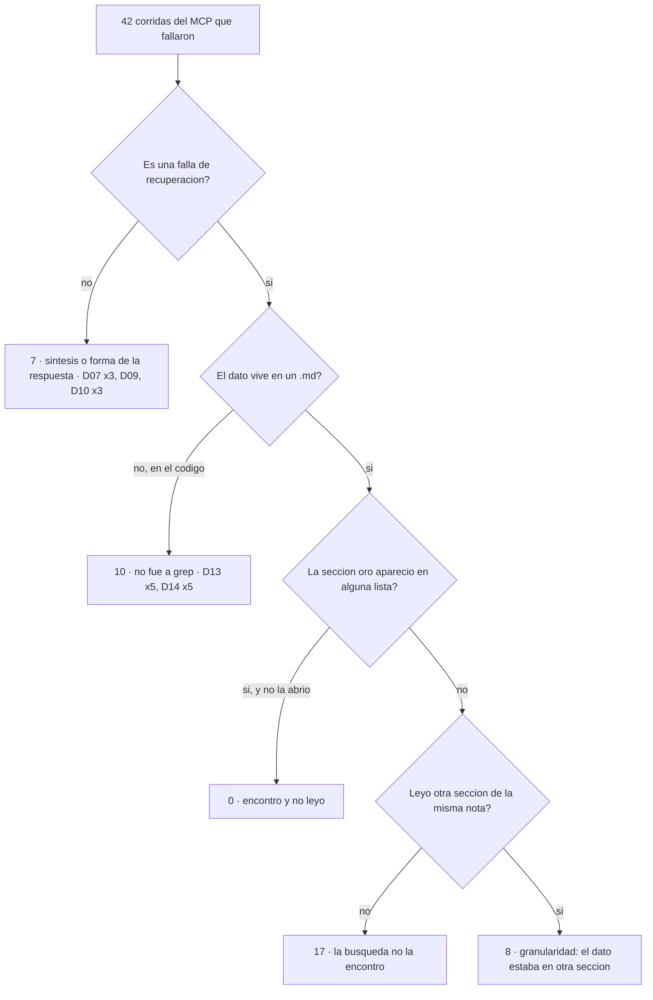

# MCP de Mycelium — diagnóstico de la fase 1

**Diagnóstico** · 2026-09-24 · `FUN-L-09` `IA-MCP-MYCELIUM`

La tanda `2026-09-24-mcp-fase1` perdió contra `grep` por **22,5 puntos** de acierto citado
(47,5 % contra 70,0 %) y la regla congelada de [[MCP de Mycelium - evaluacion]] § 9 decidió
la fila 1: se rehace, y **antes se investiga por qué**. Esta nota es esa investigación. No
corrió nada que llame a la API: todo sale de archivos que ya estaban en disco.

> [!important] La respuesta, en cuatro líneas
> 1. **La culpa es de la búsqueda, no del agente.** Cuando la sección con el dato apareció en
>    alguna lista de `vault_buscar`, el MCP acertó **27 de 30** corridas (90 %). Cuando no
>    apareció, **4 de 25** (16 %). No hay **ni un caso** de «la tenía en la lista y no la
>    abrió».
> 2. **El motivo es mecánico: los términos se combinan con Y.** 58 de las 181 búsquedas
>    volvieron **vacías**. Una sola palabra de la consulta que no esté en la nota la saca de
>    la lista: las cinco corridas de D08 preguntaron por «símbolos», y la nota que responde
>    no la usa nunca.
> 3. **La sección es demasiado chica para las preguntas que no son un dato suelto.** `grep`
>    lee notas enteras (mediana de 27.500 caracteres leídos por corrida contra 8.200 del
>    MCP); en C2 el costo real vivía **en otra sección de la misma nota** que el porqué.
> 4. **En C7 el agente no fue al código.** 0 de 10 corridas del MCP leyeron código, contra 4
>    de 10 de la línea base.

---

## 1. Qué se miró y cómo

| Fuente | Qué aporta |
|---|---|
| `eval/resultados.jsonl` | Las 80 filas vigentes del brazo MCP y las 80 del brazo base (manda la última de cada `session_id`) |
| `eval/juicios.jsonl` | El motivo del juez en las filas C2/C3 |
| `eval/preguntas.jsonl` | Solo las claves de **desarrollo** (D01–D16). Las selladas no se abrieron |
| Transcripciones `~/.claude/projects/C--mycelium-eval-corpus-c0a33b8ec71a/` | Cada llamada con sus argumentos y lo que el agente vio |
| `mcp-6376de955fcd347e-busquedas.jsonl` | La lista ordenada de cada `vault_buscar`. Las **181** búsquedas de la tanda se emparejaron una a una con su llamada en la transcripción (por texto y hora; ninguna quedó sin pareja) |
| `mcp-6376de955fcd347e.db` (una **copia**) | Para ubicar en qué sección vive cada dato y para reproducir las consultas del agente con otra semántica |

**La sección oro.** Para cada pregunta con respuesta en un `.md` se buscó en el índice qué
secciones contienen el dato decisivo (la lista está en el apéndice, para poder auditarla).
Con eso cada fallo se clasifica recorriendo la cadena **buscar → aparecer en la lista →
abrir → responder** y anotando dónde se cortó primero:

---

## 2. El reparto de los 42 fallos

| Causa (las del pedido) | Fallos | Corridas (pregunta, rep, `session_id`) |
|---|---|---|
| **1. La búsqueda no encuentra** | **17** | D03 r2 `af93fc8e` · D04 r3 `473e4205`, r4 `c89e3261` · D05 r3 `808b782c` · D06 r1 `1ba362a0` · D08 r1 `a3f28de1`, r2 `568d2fd4`, r3 `8dc211f6`, r4 `3628ade4`, r5 `b366efdb` · D12 r2 `e8979c56`, r3 `2f42f55e`, r4 `a933a227`, r5 `fe80b1d3` · D15 r1 `7a2fe1a9`, r2 `d770a793`, r4 `45d3e533` |
| 2. Encuentra y no lee | **0** | — (ver el matiz de D03 en § 3.2) |
| **3. Lee, pero el dato está en otra sección** | **8** | D03 r3 `f24f679b`, r4 `c6c91151`, r5 `9769996c` · D11 r1 `8557b0a8`, r2 `c000b3fc`, r3 `c30d68a7`, r4 `fc726fbe` · D16 r3 `6f7dc0db` |
| 4. Deja de buscar antes | 0 como causa propia | Amplifica a la 1 (§ 3.4) |
| **5. Abandona `grep` donde lo necesita** | **10** | D13 r1 `324dbb22`, r2 `f4305d9e`, r3 `a90e48ed`, r4 `169a9326`, r5 `49adc42e` · D14 r1–r5 (`e98916dd`, `1823a6c3`, `d42609ad`, `80f3b96e`, `88c0cde4`) |
| Fuera de la recuperación | 7 | Síntesis: D07 r2 `03db2a85`, r3 `b8a22880`, r5 `f9025678` · Forma de la abstención: D09 r1 `06de492f`, D10 r1 `4f986ffb`, r4 `14f5cc4b`, r5 `1bf01587` |

De los 17 de la causa 1, **11 tuvieron al menos una búsqueda vacía**; los otros 6 (D03 r2,
D08 r2–r4, D12 r2 y r4) recibieron listas, pero sin la sección oro.

### Contra la línea base: de dónde salen los 22,5 puntos

El Δ son **18 corridas netas**: 22 que la base acertó y el MCP no, menos 4 al revés. Las 22
perdidas, por causa:

| Pregunta | Base → MCP | Perdidas | Causa |
|---|---|---|---|
| D08 (C4) | 5 → 0 | 5 | 1 · búsqueda |
| D03 (C2) | 5 → 1 | 4 | 3 · granularidad (3) y 1 · búsqueda (1) |
| D11 (C6) | 5 → 1 | 4 | 3 · granularidad (índice de la nota truncado) |
| D13 (C7) | 3 → 0 | 3 | 5 · no fue al código |
| D15 (C8) | 5 → 2 | 3 | 1 · búsqueda (consultas vacías) |
| D04 (C2) | 5 → 3 | 2 | 1 · búsqueda (consultas vacías) |
| D16 (C8) | 5 → 4 | 1 | 3 · granularidad |
| **Total** | | **22** | **1: 11 · 3: 8 · 5: 3** |

Las ganadas: D02 (+2), D05 (+1) y D07 (+1). D14 falla en los dos brazos (0/5 y 0/5) y D12
también (1/5 y 1/5): no explican nada de la diferencia.

> [!warning] El reparto por clase del § 12 engaña en C4
> El −40 de C4 **no** es el terreno de `vault_vecinos`: D07, la pregunta de dos saltos, la
> ganó el MCP (2/5 contra 1/5). Todo el −40 es D08, y D08 es un fallo de **búsqueda**.

---

## 3. Lo que muestran los datos, causa por causa

### 3.1 La búsqueda: el «Y» vacía la lista

**58 de las 181 búsquedas (32 %) volvieron vacías**; 38 de las 80 corridas tuvieron al
menos una, y en 21 fue **la primera**. El agente escribe consultas largas —dos de cada tres
tienen 4 términos o más— y cada término de más es una condición más:

| Términos en la consulta | 1 | 2 | 3 | 4 | 5 | 6 | 7+ |
|---|---|---|---|---|---|---|---|
| Búsquedas | 11 | 9 | 40 | 35 | 39 | 28 | 19 |
| Vacías | 9 % | 33 % | 25 % | 40 % | 36 % | 21 % | 53 % |

El respaldo que diseñó [[MCP de Mycelium - memoria]] § 4 —si ninguna sección tiene todos los
términos, intersectar por nota— se disparó en **104 de 181** búsquedas y **en 57 siguió
vacío**: exige que la *nota* tenga todos los términos, que es el mismo «Y» un nivel más arriba.
Y cuando no está vacío, trae «la mejor sección de cada término», que suele ser ruido: para
«draw.io integración decisión» devolvió el `Mapa de documentacion` en el primer puesto porque
es la mejor sección para «decisión».

**El mecanismo, en dos casos:**

- **D08** (0/5). Las cinco corridas usaron «símbolo(s)» en la consulta. `titulo-renombra.md`
  —la nota que dice que hoy el nombre inválido **se rechaza**— no contiene esa palabra en
  ninguna sección. Resultado: la nota nunca apareció, los cinco agentes leyeron el síntoma de
  `DEF-084` en `Bugs_errores_y_defectos#s66`, que está redactado en presente («Mycelium guarda
  el archivo con…»), y lo contestaron como el comportamiento de hoy. La base hizo
  `grep -ril "renombr"`, vio `titulo-renombra.md` en la lista **por el nombre del archivo** y
  lo leyó entero: 5/5.
- **D15** (2/5, clase C8). «clip», «rectángulo» y «oscuro» no aparecen en
  `video-embebido.md`. Cualquier consulta que los incluyera volvía vacía; las dos corridas que
  acertaron llegaron cuando probaron **un término solo** («iframe», «video-embebido»). La base
  hizo `grep "rectángulo|oscuro|embed|iframe|clip|video"`: con **O** basta que coincida una.

**Reproducción con O, sobre la copia del índice.** Las mismas consultas que escribió el agente,
re-ejecutadas uniendo los términos con `OR` y el mismo BM25 (4 · 2 · 1), sobre las 133
búsquedas de preguntas con sección oro:

| | Con Y (lo que pasó) | Con O (reproducido) |
|---|---|---|
| La sección oro entra en el top 10 | 37 | **71** |
| Alguna sección de la nota oro entra en el top 10 | 53 | **105** |

De los **17** fallos de la causa 1, en **13** al menos una consulta del propio agente habría
puesto la sección oro en el top 10 (todos salvo D05 r3, que solo recupera la nota, y D12 r2–r4).

> [!caution] O no es gratis
> En D01 el O **empeora**: la sección oro entra en 3 de 10 consultas contra 8 de 10 con Y,
> porque las secciones que repiten un solo término común suben. El arreglo no es «cambiar Y por
> O» a secas, sino un ranking que premie **cubrir más términos** sin exigirlos todos. Esto se
> mide antes de construirlo (§ 6).

**El ranking no es el problema.** Cuando la sección oro apareció, estuvo en el **primer**
puesto 17 de 30 veces y nunca más abajo del 9. Lo que falla es que aparezca.

### 3.2 Encontró y no leyó: no aparece

En las 30 corridas en que la sección oro estuvo en una lista de resultados, el agente la
abrió —o abrió la nota entera— **las 30 veces**. La causa 2 no está en los datos.

El único matiz es **D03 r3–r5**: llegaron a `drawio.md` por un enlace, pidieron la nota y
recibieron su **índice de secciones**, donde figuraba `#s19 · 10. Verificación › El
instalador: no se llegó al objetivo`. No la abrieron: eligieron `#s4`, `#s5` y `#s9`. Se
clasificó como granularidad (§ 3.3) porque el encabezado no dice «costo» y el agente ya tenía
un número —el equivocado— en `#s9`. Leído de otra forma, son 3 casos de «tenía el puntero y no
lo abrió».

### 3.3 Granularidad: la sección que responde no alcanza

Es la hipótesis más fuerte para C2 y **se confirma en D03, no en D04**: D04 falló por la
búsqueda (dos consultas vacías seguidas en las dos corridas perdidas).

- **D03 (C2) — el dato partido en dos secciones de la misma nota.** `drawio.md#s9 · Cómo se
  empaqueta` trae el **objetivo** (30–35 MB); `#s19 · Verificación` trae lo que **costó de
  verdad** (40,3 MB). Las tres corridas que leyeron `#s4 #s5 #s9` contestaron «30–35 MB», y el
  juez las rechazó con el mismo motivo: *«30-35 era solo la meta. Falta el elemento obligatorio
  "40,3 MB"»*. La única que acertó (r1 `9a9e7e51`) fue la única que pidió también `#s19`. La
  base leyó `drawio.md` **entera** en las cinco corridas (18.357 caracteres) y acertó 5/5.
  Nótese que es una **contradicción resuelta dentro de una nota**: la sección no sabe que otra
  la corrige.
- **D11 (C6) — enumerar exige la nota, y el índice escondía la mitad.** La consulta
  «consolas defectos bugs» encuentra `DEF-072`, `DEF-099` y `DEF-100`, que dicen «consola»;
  `DEF-079`, `DEF-083` y `DEF-098` dicen «terminal integrada» y no aparecen. Tres corridas
  pidieron además el índice de `Bugs_errores_y_defectos.md`, que tiene 85 secciones: el índice
  **se corta en 40 filas, en `DEF-059`**, justo antes de todos los defectos de consolas. La que
  acertó (r5 `1d0c37ab`) pidió la nota con `forzar=true`. La base leyó la nota entera 4 de 5
  veces (y la quinta, `bugs-progreso` entero).
- **D16 r3 (C8)**: leyó `#s10`, `#s11` y `#s13` de `ventanas-multiples.md`; la resolución
  (`if !tauri::is_dev()`) está en `#s12`, la que la búsqueda no devolvió.

En los 8 casos **la nota que el agente ya había tocado contenía el dato**. El comportamiento
de fondo lo cuenta la tabla:

| Por corrida (mediana) | Base | MCP |
|---|---|---|
| Búsquedas | 2 (media 3,1) | 2 (media 2,3) |
| Lecturas | 2 | 1 |
| Caracteres leídos | **27.506** | **8.196** |
| Notas enteras leídas (media) | **1,91** | 0,06 con `forzar` |

La base no «busca mejor»: busca con O y **lee la nota entera**. El MCP se diseñó exactamente
para no hacer eso (§ 1 de la nota de memoria), y en las preguntas que necesitan más de una
sección, eso es lo que se pierde.

### 3.4 Deja de buscar antes: amplifica, no causa

La hipótesis «con `grep` reformulaba, con el MCP se conforma» **no aparece como causa propia**.
El número de búsquedas es parecido (media 3,1 contra 2,3; corridas con una sola búsqueda: 23
contra 29), y después de una búsqueda vacía el agente **sí** reformuló en 40 de 58 casos. El
problema es **cómo** reformula: con otra consulta larga, igual de expuesta al «Y».

Dos excepciones, contadas: **D04 r3** abandonó tras dos consultas vacías y contestó de
conocimiento general, sin leer nada; y en **D13** la base hizo una mediana de **9** búsquedas
contra 2 del MCP, que es la causa 5 vista desde otro ángulo.

### 3.5 Abandona `grep`: sí, en C7

- En toda la tanda, el agente del MCP buscó con `Grep`, `Glob` o `grep` en **4 de 80**
  corridas (y salió del MCP de cualquier forma en 5); la base, en 77 de 80.
- En C7, **0 de 10** corridas del MCP leyeron código, contra **4 de 10** de la base (las 3 que
  acertaron D13 leyeron `frontend/lib/canvas.ts`). La única corrida del MCP que usó `Grep` en
  C7 (D13 r1) lo limitó a `docs/*.md`.
- La descripción de `vault_buscar` no menciona `grep` ni dice que el código no está en el
  índice. Y en D13 las cinco corridas encontraron `canvas.md#s14`, que dice que los colores
  **no se editan** —la documentación quedó atrás del código—, y lo contestaron como verdad.
- **D14 no cuenta**: la base también sacó 0/5 (la que llegó a `terminal.ts` leyó el 5000 en
  vivo en vez del 200 guardado). De los 10 fallos de la causa 5, solo **3** son pérdida contra
  la base.

### 3.6 Lo que no es recuperación

- **D07 r2, r3, r5**: los tres leyeron `terminal-integrada#s2` (puesto 1) y vieron `CA8`. Fallan
  la segunda parte de la clave («los procesos se terminan») por cómo la redactan —«sus procesos
  terminarse», «se termina el PTY»— o por concluir «es diseño, no bug». Puede ser en parte un
  falso negativo de la regla mecánica; C4 no pasa por el juez. De todos modos el MCP le ganó a
  la base en D07.
- **D09 r1, D10 r1, r4, r5**: forma de la abstención (`no_esta` sin la prosa que espera la
  regla, o negarse sin buscar: D10 r1 y r4 no llamaron a ninguna herramienta). La base tiene el
  mismo patrón: C5 empató.

> [!warning] Una fuga del protocolo, sin efecto en el Δ
> **D12 r3** (`2f42f55e`) hizo `curl` al bucket real de R2 y leyó el `versions.json` de
> internet: el brazo tiene `Bash` y red. Acertó el contenido, citó mal y la fila quedó en 0, así
> que no movió el resultado. Pero una corrida puede contestar desde fuera del corpus; conviene
> que el arnés lo detecte como detecta las instrucciones ajenas.

---

## 4. Los casos pareados

| Pregunta | Base: qué hizo | MCP: qué hizo |
|---|---|---|
| **D03** C2 · 5 → 1 | 1–2 búsquedas (`find` por nombre, `grep "draw\.io\|drawio"`), **una** lectura: `drawio.md` entera, 18.357 caracteres. Dijo 40,3 MB las cinco veces | 1–4 búsquedas; la sección de 40,3 MB nunca apareció. 3 corridas abrieron el índice de `drawio.md` y leyeron `#s4 #s5 #s9`; contestaron el objetivo, 30–35 MB. r2 no abrió la nota |
| **D04** C2 · 5 → 3 | `grep` con O de 4–6 términos, y `autoactualizacion.md` entera (31.117 caracteres) | En las dos perdidas, las dos primeras consultas volvieron **vacías**. r3 contestó sin leer nada; r4 cayó en `Publicar una version` y citó eso |
| **D08** C4 · 5 → 0 | `grep -ril "renombr"` o un O; `titulo-renombra.md` entera en las 5 | 1–2 búsquedas con «símbolos»; `titulo-renombra` nunca apareció; leyeron `DEF-084` y dieron el síntoma viejo como el comportamiento actual |
| **D11** C6 · 5 → 1 | `Bugs_errores_y_defectos.md` entera (38.110) o `bugs-progreso` entera (68.681) | 1 búsqueda, 3–5 secciones que dicen «consola»; el índice de la nota cortado en `DEF-059`. r5 pidió la nota con `forzar` y acertó |
| **D13** C7 · 3 → 0 | Mediana de 9 búsquedas; las 3 que acertaron leyeron `canvas.ts` o `CanvasView.tsx` | 1–4 búsquedas en el índice; 0 lecturas de código; creyeron a `canvas.md#s14` |
| **D15** C8 · 5 → 2 | Un `grep` con O de 3–6 alternativas → `video-embebido.md` entera (7.325) | 3 a 7 búsquedas, **9 vacías** entre las tres perdidas; r2 terminó en `DEF-059`, otro defecto |
| **D16** C8 · 5 → 4 | `ventanas-multiples.md` entera en las 5 | r3 leyó `#s10 #s11 #s13`; la solución estaba en `#s12` |
| D07 C4 · 1 → 2 | Leyó 2 notas enteras, acertó el contenido 5/5 pero citó incompleto 4 veces | Sección oro en el puesto 1 las 5 veces; 3 fallan la redacción de la clave |
| D12 C6 · 1 → 1 | Hasta 6 notas enteras (75.378 caracteres); casi siempre sin la lista de la 2.1.0 | La sección oro (`Version 2.1.0#s1`) no apareció en ninguna consulta, y reproducidas con O entra en 1 de 14: es difícil para los dos |

---

## 5. Dónde ganó el MCP, y qué conservar

**C1 +20 son dos corridas de D02**, y no por encontrar mejor: la base leyó la nota correcta y
acertó el dato las cinco veces, pero en dos citó `Atmósferas` —el título H1— en vez de
`atmosferas`, el nombre de la nota. Con el MCP la cita sale de la `ref`, que trae la ruta
exacta, y las cinco corridas citaron bien. D01 empató 5/5. El +1 de D05 (C3) es chico y
mezclado: la base perdió una corrida por citar mal y otra por afirmar el distractor; el MCP,
una por citas.

Lo que eso dice que hay que **conservar**:

- **La `ref` con el nombre exacto de la nota.** Es la única ventaja de exactitud que se midió.
- **El costo cuando encuentra.** En C1 el MCP resolvió con una búsqueda, la sección oro en el
  primer puesto y una lectura: 3.254–5.743 tokens de contexto en D02, contra el mismo orden de la
  base pero con la cita siempre bien.
- **El ranking por sección cuando hay coincidencia.** 17 de 30 veces la sección oro estuvo
  primera. No hay evidencia para tocar los pesos.

---

## 6. Qué rehacer, ordenado por cuántos fallos explica

> [!important] Cómo se comprueba sin tocar la regla congelada
> Ninguna propuesta cambia el § 9 de [[MCP de Mycelium - evaluacion]] ni sus umbrales. Cada
> cambio se prueba en **dos pasos**: (1) **fuera de línea y gratis**, reproduciendo las 181
> consultas ya registradas contra el índice nuevo y midiendo si la sección oro entra en el
> top 10 —es un diagnóstico, no una decisión—; (2) una tanda nueva del brazo MCP con otra
> `version_mcp`, contra **la misma** línea base `2026-09-24-base`, y el informe aplica la regla
> tal cual. Como las 16 preguntas de desarrollo ya se miraron a fondo, el riesgo de ajustar el
> MCP a ellas es real: la confirmación la dan las **preguntas selladas**, que siguen sin abrir.

### 1. Buscar con cobertura, no con conjunción — causa 1

- **Ataca**: la búsqueda que no encuentra.
- **Explica**: **17 fallos**, de ellos **11 de las 22 corridas perdidas** (D08 5, D15 3, D04 2,
  D03 1). En 13 de los 17, una consulta del propio agente habría traído la sección oro con O.
- **Qué**: un ranking que no exija todos los términos y premie cubrir más (O con BM25 ya lo
  hace en parte; falta que una sección con 4 de 5 términos le gane a una con 1 término muy
  frecuente, que es lo que rompió D01). Sin el respaldo de intersección por nota, que en la
  tanda devolvió vacío o ruido.
- **Cómo se comprueba**: la reproducción fuera de línea tiene que subir la sección oro en el
  top 10 de **37/133** hacia **71/133 o más**, **sin bajar D01 ni D02** (hoy 8/10 y 5/5). Recién
  después, la tanda.

### 2. Leer más que una sección cuando hace falta — causa 3

- **Ataca**: la granularidad.
- **Explica**: **8 fallos**, todos corridas perdidas contra la base (D03 3, D11 4, D16 1). En
  los 8 la nota que el agente ya había tocado contenía el dato.
- **Qué**, de lo más barato a lo más caro:
  1. **El índice de la nota no se corta en 40 filas** (o se corta avisando cuántas faltan y
     cómo pedirlas). Solo esto explica D11: el índice terminaba en `DEF-059`.
  2. **Devolver la nota entera por defecto por debajo de un tamaño** (hoy 8 KB; `drawio.md` son
     18 KB y `ventanas-multiples.md`, 10 KB). El umbral se elige mirando el costo: la base leyó
     una mediana de 27.500 caracteres y aun así costó US$ 0,062.
  3. Que el preview avise cuando otra sección de la misma nota **corrige** a la que se muestra
     (D03: `#s19` corrige a `#s9`). Es lo más caro y lo menos seguro; va último.
- **Cómo se comprueba**: la tanda. Fuera de línea solo se puede verificar que, con la regla
  nueva, la lectura de las corridas de D03, D11 y D16 **habría incluido** el dato (hoy: no, en
  los 8).

### 3. Decirle al agente que `grep` sigue siendo imprescindible — causa 5

- **Ataca**: el abandono de `grep` fuera del índice.
- **Explica**: **3 corridas perdidas** (D13). Los otros 7 fallos de C7 (D14 y dos de D13) los
  tiene también la base.
- **Qué**: la descripción de `vault_buscar` (o las instrucciones del vault) tiene que decir que
  el índice **solo tiene los `.md`**, que el código y los otros tipos se buscan con `grep`, y
  que una nota puede haber quedado atrás del código.
- **Cómo se comprueba**: el § 12 ya mide la caída a `grep` en C7 (10 % en esta tanda). La tanda
  nueva tiene que acercarse al 40 % de corridas de la base que leyeron código. El bloqueante de
  C7 sigue sin umbral mecánico: eso no se cambia acá.

### 4. Consultas cortas — acompaña a la 1, no la reemplaza

- La tasa de vacías sube con el largo de la consulta (§ 3.1). Una línea en la descripción («2 o
  3 términos distintivos; si vuelve vacía, sacá términos en vez de agregar») es barata, pero
  **no explica ningún fallo por sí sola** si se hace la 1, y sin la 1 el agente seguiría a
  merced de una sola palabra ausente. Se prueba junto con la 1, en la misma tanda.

### Lo que los datos **no** sostienen

- **Embeddings.** C8 perdió por consultas vacías, no por falta de sinónimos: la reproducción
  con O rescata D15 en las tres corridas perdidas. Va en la línea de [[MCP de Mycelium - memoria]]
  § 10.
- **Recalibrar los pesos del ranking.** Cuando la sección aparece, aparece arriba.
- **Adelantar `vault_vecinos`.** La pregunta de dos saltos (D07) la ganó el MCP.

---

## 7. Lo que no se pudo determinar

- **Las secciones oro las definí yo**, buscando el dato en el índice. Están en el apéndice para
  que se puedan discutir; si una está mal, cambia la clasificación de sus corridas, no la
  dirección.
- **La reproducción con O mide la lista, no la respuesta.** Con otra lista el agente habría
  leído otra cosa; si eso termina en acierto, solo lo dice una tanda.
- **Cuánto cuesta leer notas enteras.** Si la propuesta 2 lleva el contexto del MCP al de la
  base, la ventaja de costo (K = 0,53) puede desaparecer. No hay forma de saberlo sin correr.
- **D07**: si los tres fallos son redacción del agente o una regla mecánica demasiado estricta.
  C4 no pasa por el juez y el juez todavía no está validado.
- **El azar de una misma pregunta.** D03 r1 pidió `#s19` y las otras cuatro no, con índices
  idénticos: 5 repeticiones no alcanzan para decir por qué.
- **D12** es difícil para los dos brazos por igual (la lista de versiones vive en una sola
  sección que ninguna consulta encontró, y con O aparece en 1 de 14). No informa sobre el MCP.
- Las advertencias del § 12 siguen: 16 preguntas, dos por clase, brazos no intercalados.

---

## Apéndice: las secciones oro

| Pregunta | Dónde está el dato |
|---|---|
| D01 | `enlaces-externos#s9`, `Version 2.1.0#s5`, `bugs-progreso#s6`, `BACKLOG#s7` |
| D02 | `Version 2.0.0#s4`, `BACKLOG#s10`, `atmosferas#s2 #s3 #s5`, `DESIGN#s10` |
| D03 | El costo real: `Version 2.1.0#s4`, `drawio#s19`, `BACKLOG#s14` |
| D04 | `autoactualizacion#s7` |
| D05 | `BACKLOG#s22`, `Version 1.5.0#s1` |
| D06 | `Capa de datos del desktop#s2`, `Generar instaladores desktop#s8`, `Levantar Mycelium en desarrollo#s2`, `vault-en-carpeta#s16` |
| D07 | `terminal-integrada#s2` |
| D08 | `titulo-renombra#s4` |
| D11 | Seis secciones de `Bugs_errores_y_defectos` (`DEF-072`, `-079`, `-083`, `-098`, `-099`, `-100`) |
| D12 | `Version 2.1.0#s1` |
| D13, D14 | Solo en el código (`frontend/lib/canvas.ts`, `frontend/lib/terminal.ts`) |
| D15 | `video-embebido#s6`, `Version 2.1.0#s5`, `BACKLOG#s7` |
| D16 | `ventanas-multiples#s12`, `#s9` |

D09 y D10 son de ausencia: no tienen sección oro.

---

## Relacionadas

- [[MCP de Mycelium - evaluacion]] — la regla que decidió «se rehace» y el resultado (§ 11 y § 12) que esta nota explica.
- [[MCP de Mycelium - memoria]] — el diseño del servidor: el «Y» y el respaldo por intersección (§ 4), la lectura por sección y el tope de 8 KB (§ 7), lo construido distinto (§ 13).
- [[MCP de Mycelium - plan]] — las fases; lo que se rehace entra acá.
