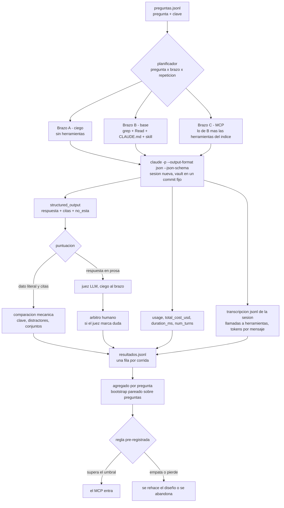

# MCP de Mycelium — cómo se evalúa

**Planificación** · abierta el 2026-09-23 · `FUN-L-09` `IA-MCP-MYCELIUM`

Tercera parte del diseño que arranca en [[MCP de Mycelium - encuadre]]. Las otras dos
—[[MCP de Mycelium - memoria]] y [[MCP de Mycelium - control]]— deciden **qué** se
construye; esta decide **cómo sabemos si sirvió**. Sin esta nota, las otras dos son
opiniones bien escritas.

> [!important] El pedido, textual
> *«Necesitamos una manera de evaluar las capacidades de la IA para encontrar información
> en el vault… poder evaluar la eficiencia con MCP y sin MCP»* (usuario, 2026-09-23).
> Dos brazos, los mismos números, la misma pregunta.

> [!danger] Una evaluación que siempre da bien no mide nada
> Esta es la restricción de diseño que manda sobre todas las demás: **tiene que existir un
> resultado posible que nos haga abandonar o rehacer el MCP**. Ese resultado está escrito
> y con umbrales en la sección 9, y se fija **antes** de correr nada. Si al terminar el
> plan no podemos señalar el número que nos haría tirar el trabajo, la evaluación es
> decorativa y hay que volver acá.

---

## 1. El grupo de control no es «nada»

El brazo «sin MCP» **no** es una IA a ciegas. Es el protocolo que la IA usa hoy en este
vault, y está escrito en dos lugares que hay que tratar como parte del experimento:

- El `CLAUDE.md` de la raíz, sección **«Protocolo de RECUPERACIÓN»**: entradas (nota mapa)
  → léxico (`grep -ril "término" --include="*.md" .` y nombres de archivo) → leer las
  candidatas **enteras** → expandir uno o dos saltos por `[[enlaces]]` salientes y por
  backlinks (`grep -rl "\[\[Título" --include="*.md" .`) → facetas `#tag` → responder
  **citando** la nota de la que sale cada afirmación, y decir explícitamente lo que la
  memoria no contiene.
- La skill `mycelium-memoria` (`.claude/skills/mycelium-memoria/SKILL.md`, hoy
  `mycelium-ia v1.2.0`): los mismos cinco movimientos con más detalle, más las «señales de
  que falta recuperar más» y los antipatrones.

> [!warning] Nada de hombres de paja
> La tentación de todo A/B es debilitar el control para que el tratamiento luzca. Regla
> dura: **el brazo sin MCP corre con el `CLAUDE.md` y la skill tal como están**, con
> `Grep`, `Glob`, `Read` y `Bash` disponibles, sin recortes y sin reescribir el protocolo
> «para que sea justo». Si el MCP no le gana a *eso*, no le gana a nada. El texto exacto
> de ambos archivos se congela junto con el commit del vault (sección 7): si el
> `CLAUDE.md` cambia, cambió el control y las corridas viejas dejan de ser comparables.

Y un tercer brazo, que no es un competidor sino un **filtro**:

| Brazo | Qué tiene | Para qué |
|---|---|---|
| **A · ciego** | Ningún acceso a archivos ni MCP | Detectar preguntas contaminadas (sección 8) |
| **B · base** | `Grep`/`Glob`/`Read`/`Bash` + `CLAUDE.md` + skill | El estado actual: lo que hay que superar |
| **C · MCP** | Lo de B **más** las herramientas del servidor | El tratamiento |

C conserva `grep`: el MCP no tiene que *reemplazar* la recuperación manual para ganar,
tiene que **ahorrarla**. Eso además habilita una métrica que sale gratis y que conviene
mirar temprano — la **tasa de adopción** (sección 5).



---

## 2. Las preguntas

### De dónde salen

**Decisión.** Las preguntas se cosechan de fuentes donde ya existían *antes* de conocer
la respuesta, no se inventan leyendo la nota:

1. **`docs/Bandeja de entrada.md`** — lo que el usuario anotó en crudo, con su vocabulario
   y sin el de las notas. Es la fuente más valiosa: son preguntas reales.
2. **Las transcripciones de sesiones pasadas** (`~/.claude/projects/…`): los mensajes del
   usuario que empiezan con «¿dónde…», «¿por qué…», «¿qué habíamos decidido…».
3. **Sembrado dirigido** por clase, cuando una clase queda sin cubrir. Solo en ese caso, y
   con la regla de vocabulario de la sección 8.

### Cuántas y de qué clase

**Decisión: 21 preguntas, tres por clase**, siete clases. El número sale de dos
restricciones opuestas: con menos de ~20 la varianza *entre preguntas* hace ilegible
cualquier diferencia (sección 6), y con muchas más el costo de escribir la **clave** a
mano —que es el trabajo caro, no correr el arnés— se vuelve el cuello de botella.

| Clase | Qué exige | Por qué está |
|---|---|---|
| **C1 · hecho puntual** | Un dato verificable, literal | El caso base; si acá no gana, no gana |
| **C2 · decisión y su porqué** | Recuperar la razón, no el enunciado | Es lo que el vault guarda mejor y lo que más se consulta |
| **C3 · contradicción resuelta** | Dos notas discrepan; gana la **posterior** | Donde `grep` más miente: devuelve el fragmento viejo |
| **C4 · dos saltos** | Seguir `[[enlaces]]` o backlinks | Es la promesa del grafo; si el MCP no gana acá, su modelo de datos sobra |
| **C5 · ausencia** | La respuesta correcta es **«no está»** | La clase que más se olvida y la que más duele en producción |
| **C6 · enumeración exhaustiva** | Listar *todos* los X | **Hostil al MCP**: `grep` recorre el archivo entero; un buscador que devuelve el *top-k* pierde |
| **C7 · fuera del índice** | El dato vive en un `.canvas`, `.base`, `.excalidraw` o en código | **Estructuralmente perdida** para el MCP: el encuadre verificó que solo se indexa `.md` |

> [!important] Dos clases están puestas para que el MCP pierda
> C6 y C7 no son relleno. Si el conjunto solo tuviera preguntas que el índice contesta
> bien, el resultado estaría decidido antes de correrlo. C7 en particular mide algo que el
> MCP **no puede** ganar hoy, y su función es hacer visible el costo de la decisión
> «solo `.md`»: si el agente con MCP se queda en las herramientas y no cae de vuelta a
> `grep`, empeora respecto de hoy. Eso es un defecto de diseño y esta clase lo detecta.

### Desarrollo y reserva

**Decisión.** El conjunto se parte en dos y la partición se fija el día que se escribe:

- **Desarrollo (14)** — visibles mientras se diseña y se itera el MCP. Se puede mirar
  dónde falla y ajustar.
- **Reserva (7)** — **selladas**. No se leen, no se corren, no se miran hasta el momento
  de la decisión, y se corren **una sola vez**. Si el número de reserva difiere mucho del
  de desarrollo, lo que hubo fue sobreajuste al conjunto, no una mejora.

Si la reserva se «quema» (se corrió y se ajustó mirando el resultado), se marca como
quemada en `preguntas.jsonl` y hay que escribir preguntas nuevas. No se hace de cuenta
que no pasó.

---

## 3. La respuesta de referencia (la «clave»)

El criterio tiene que ser tal que **dos personas distintas puntúen igual**. Eso se
consigue moviendo el juicio del puntuador al momento de escribir la clave: la clave no
dice «que mencione el addon correcto», dice **qué cadenas cuentan como acierto y cuáles
como error**.

**Decisión: la respuesta correcta son las dos cosas —el dato y las citas— y se puntúan por
separado.** Un dato correcto sin cita es un acierto que no podemos verificar (puede venir
del preentrenamiento, no de la memoria); una cita correcta con el dato mal es peor todavía
porque parece fundada. La métrica que manda combina ambas.

Una clave tiene estos campos:

| Campo | Qué es |
|---|---|
| `dato` | La afirmación normalizada, en una línea |
| `aceptadas` | Cadenas o patrones cuya presencia cuenta como acierto (sinónimos, variantes) |
| `distractores` | Cadenas cuya presencia **como respuesta** cuenta como error, aunque el resto esté bien |
| `notas_clave` | Las notas **sin las cuales la respuesta no está sostenida**. Suelen ser una o dos |
| `notas_admisibles` | Todas las notas donde el dato figura legítimamente (incluye las clave) |
| `veredicto` | `dato` o `ausencia` |
| `clase` | C1…C7 |
| `fuente` | De dónde salió la pregunta (bandeja, transcripción, sembrada) |

Y las tres reglas que hacen que no haya que opinar:

1. **Acierto (0/1)** — la respuesta contiene `dato` o alguna de `aceptadas`, y **no**
   afirma un `distractor` como respuesta. Para `veredicto: ausencia`, el acierto exige que
   el campo `no_esta` sea `true` **y** que la respuesta lo diga en prosa; inventar una
   fuente es error aunque el texto diga «no estoy seguro».
2. **Precisión de citas** — `|citas ∩ notas_admisibles| / |citas|`. Castiga al que cita de
   más para cubrirse.
3. **Exhaustividad de citas** — `|citas ∩ notas_clave| / |notas_clave|`. Castiga al que
   acierta sin poder mostrar de dónde.

> [!tip] Las citas se comparan como conjuntos de títulos, no como texto
> El brazo devuelve `citas` como una lista de **títulos de nota** (lo que hay entre
> `[[…]]`), normalizados: sin extensión, sin ruta, sin alias (`[[Título|alias]]` → `Título`),
> con los acentos y la caja tal como están en el nombre del archivo. Así la comparación es
> una intersección de conjuntos y no admite discusión. Un título que no existe en el vault
> es una **cita inventada** y se registra aparte: es el error más grave que puede cometer
> una memoria.

---

## 4. Ejemplo completo

La pregunta, la clave, dos respuestas plausibles y su puntuación. Es una pregunta real de
este vault y un caso de clase **C1 con distractor**.

### La pregunta

> **P-01** — En la terminal integrada de Mycelium, los emojis corrían el resto de la línea.
> ¿Qué hizo falta para arreglarlo, y por qué no alcanzaba la solución habitual?

### La clave

```json
{
  "id": "P-01",
  "clase": "C1",
  "fuente": "bandeja",
  "veredicto": "dato",
  "dato": "Cargar @xterm/addon-unicode-graphemes con activeVersion \"15-graphemes\"; unicode11 no alcanzaba porque ☑️ y ⚠️ son un carácter de texto más el selector U+FE0F y solo leyendo el grupo entero se sabe que ocupan dos celdas.",
  "aceptadas": ["addon-unicode-graphemes", "unicode-graphemes", "15-graphemes"],
  "distractores": ["addon-unicode11", "unicode11"],
  "notas_clave": ["Terminal integrada - PTY y xterm"],
  "notas_admisibles": ["Terminal integrada - PTY y xterm", "bugs-progreso", "Bugs_errores_y_defectos", "Version 2.0.0"]
}
```

> [!info] Por qué esta pregunta discrimina
> `unicode11` **está escrito en la nota**, en la fila de una tabla, y es la respuesta que
> cualquiera daría de memoria. Quien lea el `grep` sin abrir el callout entero contesta
> `unicode11` y falla. Quien lea la nota completa ve la tabla de medición y el motivo
> (el selector `U+FE0F`). La pregunta no mide si la herramienta *encuentra* la nota —las
> dos la encuentran—, mide si el fragmento que devuelve **alcanza para no equivocarse**.
> Ese es exactamente el riesgo de la recuperación progresiva que propone
> [[MCP de Mycelium - memoria]] siguiendo a engram: devolver previews baratos y que el
> preview mienta por recorte.

### Dos respuestas y su puntuación

**Respuesta X** (la que se equivoca): *«Se cargó `@xterm/addon-unicode11`, que hace que los
emojis midan dos celdas.»* · citas: `["Terminal integrada - PTY y xterm"]`

**Respuesta Y** (correcta): *«Hubo que cargar `@xterm/addon-unicode-graphemes` con
`activeVersion = "15-graphemes"`. `unicode11` —la respuesta habitual— arregla ✅ y 🟡 pero
no ☑️ ni ⚠️: son un carácter de texto seguido del selector invisible `U+FE0F`, y solo
mirando el grupo entero se sabe que ocupan dos celdas.»* · citas:
`["Terminal integrada - PTY y xterm", "bugs-progreso"]`

| | X | Y |
|---|---|---|
| Acierto | **0** — afirma un distractor | **1** — contiene `unicode-graphemes`, el distractor aparece pero **negado** |
| Precisión de citas | 1.0 | 1.0 (`bugs-progreso` es admisible) |
| Exhaustividad de citas | 1.0 | 1.0 |
| **Acierto citado** | **0** | **1** |

> [!warning] El único punto donde hace falta juicio, y cómo se cierra
> En Y el distractor aparece *para negarlo*. Una comparación de subcadenas a secas la
> marcaría mal. La regla de desempate está en la clave y es mecánica: **un distractor solo
> cuenta como error si aparece en la frase que responde**, es decir si aparece **sin** una
> de las marcas de negación del vocabulario cerrado (`no alcanz`, `no basta`, `no sirv`,
> `insuficiente`, `en vez de`, `no es`, `descartad`). Si aparece con una de ellas, el caso
> **no** se resuelve solo: se manda al juez de la sección 7. Preferimos mandar al juez un
> caso de más que puntuar mal en silencio.

### Cómo se ve la diferencia entre brazos

Lo que se compara en esta pregunta, fila contra fila de `resultados.jsonl`:

- **B (base)** — el camino es `grep -ril "emoji"` → varios impactos → abrir
  [[Terminal integrada - PTY y xterm]] entera (la nota completa entra al contexto) →
  responder. El costo es **la nota entera** y el riesgo es contestar desde el fragmento.
- **C (MCP)** — una llamada de búsqueda que devuelve el callout «Medirlo, no suponerlo»
  con el título de su nota. El costo es **el callout**, y la cita sale de la propia
  respuesta de la herramienta en vez de que el modelo la reconstruya.

La hipótesis concreta y falsable de P-01: **mismo acierto, mucho menos contexto**. Si el
MCP devuelve el callout recortado y el modelo contesta `unicode11`, C pierde en acierto
aunque gane en tokens — y eso es exactamente lo que queremos poder ver.

---

## 5. Las métricas

### La principal

> [!important] Métrica principal: **acierto citado**
> La proporción de corridas en las que el dato es correcto **y** todas las
> `notas_clave` están citadas (`acierto == 1 && exhaustividad == 1`).
>
> Por qué esta y no la eficiencia: **barato y rápido no vale nada si está mal.** Una
> memoria que contesta en un tercio de los tokens pero acierta cinco puntos menos es un
> retroceso, porque el error de recuperación no se nota —la respuesta suena igual de
> segura— y se propaga a todo lo que la IA escriba después. Y la cita es parte del
> acierto, no un adorno: una afirmación sin nota que la sostenga puede venir del
> preentrenamiento o de la conversación, y entonces no probó nada sobre el vault.

**La eficiencia es la métrica de desempate, no la de decisión.** Solo se compara el costo
**entre brazos que ya pasaron el piso de exactitud**. El orden es: primero no empeorar,
después ahorrar.

### Las secundarias

| Métrica | Definición operativa | Para qué |
|---|---|---|
| **Acierto** | 0/1, sección 3 | Separa «no lo encontró» de «no lo citó» |
| **Precisión de citas** | ∩ admisibles / citas | Detecta el que cita de más |
| **Exhaustividad de citas** | ∩ clave / clave | Detecta el que acierta sin fundar |
| **Citas inventadas** | Nº de títulos que no existen | Alucinación pura; cualquier valor > 0 es señal roja |
| **Tokens de recuperación** | Contexto del último mensaje − contexto del primero (sección 6) | Lo que la recuperación **metió** en el contexto |
| **Costo USD** | `total_cost_usd` de la corrida | El número verdadero de facturación, ya pesa el caché |
| **Llamadas a herramientas** | Conteo por nombre, de la transcripción | Cuántos viajes hizo hasta contestar |
| **Tasa de adopción** | % de corridas del brazo C con ≥ 1 llamada al MCP | Si el agente ignora el MCP, el problema es el diseño de las herramientas |
| **Tiempo de reloj** | `duration_ms` | **Diagnóstico, no decisorio** (ver el aviso) |

> [!warning] El tiempo de reloj no mide la velocidad del MCP
> `duration_ms` está dominado por la latencia de la API, la cola del servicio y el TTFT
> —en una corrida real el `ttft_ms` fue de 1201 ms sobre 1481 ms totales—, más los
> *hooks* locales que el usuario tenga configurados. La parte que le toca al servidor MCP
> es un margen dentro del ruido. Se registra porque es gratis y porque un salto grande
> delata un problema (un `grep` que recorre el vault entero, un índice sin abrir), pero
> **no entra en la regla de decisión**. Medir la latencia propia del MCP es otra medición,
> instrumentada adentro del servidor, y va en [[MCP de Mycelium - memoria]].

### Además, por clase

El agregado global esconde lo importante. **Se reporta siempre el desglose por clase
C1…C7**, porque la pregunta interesante no es «¿ganó?» sino «¿dónde ganó y dónde
perdió?». Un MCP que gana 20 puntos en C4 y pierde 30 en C7 no es un promedio: son dos
hechos, y el segundo es una tarea de diseño.

---

## 6. Qué se puede capturar de verdad

Esto se verificó ejecutando y leyendo archivos reales, no de memoria.

### Lo que sale de una corrida, verificado

`claude -p --output-format json` devuelve un único objeto JSON. Probado el 2026-09-23 con
Claude Code `2.1.281`. Campos útiles, **confirmados en una salida real**:

| Campo | Qué trae |
|---|---|
| `result` | El texto de la respuesta |
| `structured_output` | El objeto validado cuando se pasa `--json-schema` |
| `usage` | `input_tokens`, `cache_creation_input_tokens`, `cache_read_input_tokens`, `output_tokens`, `output_tokens_details.thinking_tokens` |
| `total_cost_usd` · `modelUsage` | Costo total y desglose por modelo, con el `contextWindow` y el `canonicalModel` |
| `duration_ms` · `duration_api_ms` · `ttft_ms` | Tiempos |
| `num_turns` | Turnos del bucle del agente |
| `session_id` | **La llave para abrir la transcripción** |
| `permission_denials` | Si un permiso cortó la corrida; una corrida con denegaciones se descarta |
| `is_error` · `subtype` · `stop_reason` | Si terminó bien |

> [!success] `--json-schema` resuelve el problema de extraer las citas
> Verificado: pasando un esquema, el agente devuelve JSON validado. Con
> `{"respuesta": string, "citas": string[], "no_esta": boolean}` las citas llegan como una
> lista y el veredicto de ausencia como un booleano, en vez de haber que sacarlos de la
> prosa con expresiones regulares. **Es lo que vuelve mecánica la mitad de la puntuación**
> y por eso el esquema es parte del protocolo, no una comodidad.

### Lo que sale de la transcripción, verificado

Las transcripciones viven en `~/.claude/projects/<cwd con los separadores convertidos en
guiones>/<session_id>.jsonl`, una línea = un objeto JSON. Confirmado en archivos reales de
este proyecto:

- Entradas `type: "assistant"` con `message.content[]`; los bloques `type: "tool_use"`
  traen `name` e `input`. **De acá salen las llamadas a herramientas contadas por nombre**,
  que es lo que el JSON de resultado no da.
- Cada entrada `assistant` trae su propio `message.usage` **completo** y un `timestamp`
  ISO. Eso permite reconstruir cómo creció el contexto turno a turno.
- Entradas `type: "user"` con bloques `tool_result` y un `toolUseResult` con el `stdout`
  crudo: se puede medir **el tamaño de lo que devolvió cada herramienta**.
- `type: "system"`, `subtype: "turn_duration"` con `durationMs`; y
  `subtype: "stop_hook_summary"` con los hooks que corrieron y cuánto tardó cada uno.
- `type: "cost-state"` con `totalCostUSD`, `totalAPIDuration`, `totalToolDuration`,
  `totalDuration` y `modelUsage`. Es el acumulado de una sesión **interactiva**; en modo
  `-p` el JSON de resultado ya trae lo mismo y es la vía preferida.
- Cada entrada trae `gitBranch`, `cwd`, `version` y `model` — sirven para auditar que la
  corrida se hizo donde decimos que se hizo.

### Lo que **no** se puede, y qué se hace

> [!danger] Los tokens crudos no son comparables entre brazos
> En una entrada real: `cache_read_input_tokens: 964737` contra `input_tokens: 2`. Casi
> todo el «consumo» es el prefijo cacheado releído en cada turno. Sumar `input_tokens` de
> todos los mensajes cuenta el mismo prefijo tantas veces como turnos hubo, y castiga al
> brazo que hace más viajes **por hacer viajes**, no por traer más texto.
>
> **Definición que sí usamos.** `tokens_recuperacion` = contexto del **último** mensaje
> `assistant` menos el del **primero**, donde contexto = `input_tokens +
> cache_creation_input_tokens + cache_read_input_tokens`. Es, literalmente, cuánto texto
> metió la recuperación en la ventana. No depende del número de turnos y no cuenta dos
> veces el preámbulo. Se registra igual el costo en dólares, que es la única cifra que
> pesa el caché como corresponde.

Otras cosas que la transcripción **no** da, con su salida:

| No se puede | Salida |
|---|---|
| Atribuir tokens a **una** llamada concreta | Se aproxima con el crecimiento del contexto entre mensajes consecutivos. Es ruidoso en los límites de caché: se reporta como aproximación o se usa el tamaño en caracteres del `toolUseResult`, que es exacto aunque no esté en tokens |
| Medir la latencia interna del servidor MCP | La transcripción no la ve. Hay que instrumentar el servidor y escribir su propio registro local (sin telemetría, restricción 2 del encuadre) |
| Comparar contra corridas de otra versión de Claude Code o de otro modelo | No se puede. Por eso `modelo` y `version_cc` son columnas obligatorias y un cambio invalida la comparación |
| Correr sin que los *hooks* del usuario metan ruido | Este entorno tiene hooks de `Stop` verificados en la transcripción (`metrics-stop.mjs` y un script de PowerShell), y su duración cae dentro del tiempo de la corrida. Se acota con `--setting-sources project,local`, que deja fuera los ajustes de usuario donde viven; y se comprueba en la transcripción que no aparezca ninguna entrada `stop_hook_summary`. `--bare` los saca todos pero **exige `ANTHROPIC_API_KEY`** (no lee OAuth ni el llavero), así que solo sirve si el usuario tiene una clave de API |

**Conclusión práctica: alcanza.** No hace falta instrumentación nueva para la primera
tanda: el JSON de resultado más la transcripción cubren exactitud, citas, tokens, costo,
llamadas y tiempo. Lo único que exige código propio es la latencia interna del servidor, y
eso recién importa cuando ya sepamos que el MCP sirve.

---

## 7. El protocolo de comparación

### Cómo corre una corrida

**Decisión.** Una corrida = **una pregunta, un brazo, una sesión nueva**. Nunca
`--continue`, nunca dos preguntas en la misma sesión: el contexto de la anterior es
contaminación.

```
claude -p "<pregunta>"                       # la pregunta, sola, sin pistas
  --session-id <uuid nuevo>
  --model <id exacto, p. ej. claude-sonnet-5>
  --effort <fijo>
  --output-format json
  --json-schema '{"respuesta":…, "citas":…, "no_esta":…}'
  --permission-mode bypassPermissions        # para que nada frene la corrida
  [--mcp-config eval/mcp.json --strict-mcp-config]   # solo el brazo C
  [--disallowed-tools …]                     # el brazo A: todo prohibido
```

Reglas del protocolo, todas con su motivo:

1. **Misma pregunta, palabra por palabra**, en los tres brazos. La pregunta vive en
   `preguntas.jsonl` y se pasa desde ahí, no se reescribe a mano.
2. **El vault fijo en un commit.** Se registra el SHA en cada fila. Es lo que hace que una
   corrida de dentro de tres meses sea comparable: si el vault creció, no cambió el MCP,
   cambió el corpus.
3. **Orden intercalado, no en bloques.** A, B, C, A, B, C… con el orden de las preguntas
   barajado por una semilla que se registra. Si se corriera un brazo entero y después el
   otro, el primero pagaría la creación del caché de prefijo y el segundo leería caché
   barato: una ventaja de costo puramente artificial. Además se descarta una **corrida de
   calentamiento** al principio de cada tanda.
4. **Sin hooks** (`--setting-sources project,local`; ver la sección 6) y con el mismo `cwd`.
5. **Una corrida con `is_error`, `permission_denials` no vacío o `stop_reason` anómalo se
   descarta y se repite**, y queda anotada como descartada. No se borra.

### Cuántas repeticiones

**Decisión: 5 repeticiones por pregunta y por brazo.** 21 × 3 × 5 = 315 corridas por
tanda completa (las de reserva, solo en la tanda de decisión).

El razonamiento, que importa más que el número:

- Los agentes no son deterministas: la misma pregunta puede encontrar la nota una vez y
  no la siguiente. Una sola corrida no distingue «el sistema falla» de «tuvo mala suerte».
- Con `k = 5` la tasa por pregunta toma valores 0, .2, .4, .6, .8, 1: un solo vuelco no
  cambia el signo, y se puede clasificar cada pregunta en **sólida** (0/5 o 5/5) o
  **inestable** (1–4 de 5). Con `k = 3` esa distinción no existe.
- **Subir `k` no es donde está la plata.** La varianza que domina el agregado es la que
  hay **entre preguntas**, no entre repeticiones de la misma: pasar a `k = 10` duplica el
  costo y casi no mueve el intervalo. Si hay presupuesto para más corridas, **se gasta en
  más preguntas**, no en más repeticiones.

### Qué se hace con la varianza

- **La unidad de análisis es la pregunta, no la corrida.** Para cada pregunta `q` se
  calcula `p_q` = aciertos citados / 5 en cada brazo, y la diferencia pareada
  `d_q = p_q(C) − p_q(B)`. El estadístico es el promedio de `d_q` sobre las preguntas.
- **Intervalo por bootstrap remuestreando preguntas** (10 000 réplicas), no un test sobre
  las 105 corridas: esas corridas no son independientes, vienen de 21 preguntas.
- **Se reportan las preguntas inestables aparte.** Son las que más información traen:
  marcan el borde de lo que el sistema recupera.

> [!warning] Lo que este diseño **no** puede detectar
> Con 21 preguntas pareadas, una diferencia real de menos de ~15 puntos porcentuales queda
> dentro del intervalo. **Si el MCP mejora poco, este arnés no lo va a poder probar**, y
> decirlo de antemano evita el error clásico de leer un empate como una victoria. Si el
> resultado cae en esa zona gris, la respuesta correcta no es correr más repeticiones: es
> escribir más preguntas (~40) y volver a correr, o aceptar que la mejora es demasiado
> chica para justificar el trabajo.

### Quién puntúa

**Decisión: tres niveles, y el juicio se usa lo menos posible.**

| Nivel | Qué puntúa | Cómo |
|---|---|---|
| **1 · mecánico** | Las tres métricas de citas, y el acierto cuando el dato es literal (versión, nombre de paquete, fecha, ID de defecto) | Intersección de conjuntos y búsqueda de las cadenas de la clave. Sin juicio. Cubre la mayoría |
| **2 · juez LLM** | El acierto en respuestas en prosa (C2, C3) y los casos que el nivel 1 marca ambiguos | Recibe **la pregunta, la clave y la respuesta**. Nada más |
| **3 · humano** | Todo lo que el juez marque `duda`, más una muestra aleatoria del 10 % de lo que no marcó | Arbitraje final; su veredicto se guarda y pisa al del juez |

Condiciones del juez, todas obligatorias:

- **Ciego al brazo.** Nunca se le dice si la respuesta vino del MCP o de `grep`. Las
  respuestas se barajan y se le pasan con un identificador opaco.
- **Sin acceso al vault.** Solo la clave. Si pudiera buscar, podría «rescatar» una
  respuesta floja encontrando él la evidencia, y estaría midiendo su propia recuperación.
- **Salida forzada** con `--json-schema`: `{veredicto: "correcto"|"incorrecto"|"duda",
  motivo: string}`. El `motivo` obliga a decir qué cadena de la clave vio.

> [!important] Cómo se valida al juez, y cuándo no se lo puede usar
> Antes de usarlo para decidir nada: en el piloto se toman ~60 respuestas reales, **el
> usuario las puntúa a mano** y esa tanda queda como **patrón**. Se corre el juez contra
> el patrón y se mide el acuerdo (kappa de Cohen, y la tasa de desacuerdo cruda).
>
> - **κ ≥ 0,8** para usarlo sin supervisión sobre la clase que sea.
> - Y una regla que manda sobre la anterior: **si la tasa de desacuerdo del juez con el
>   humano es mayor que la diferencia que estamos midiendo, el juez no puede decidir esa
>   comparación.** Un juez que se equivoca el 8 % no sirve para dictaminar una diferencia
>   de 5 puntos. En ese caso: o se puntúa a mano, o se afina la clave —casi siempre el
>   desacuerdo viene de una clave floja, no de un juez tonto— y se revalida.
> - El patrón se vuelve a correr en cada tanda: si el modelo del juez cambia, hay que
>   revalidarlo antes de creerle.

---

## 8. Qué haría fracasar la evaluación

Los sesgos ordenados por cuánto daño hacen. Cada uno con su contramedida concreta.

> [!danger] 1. Preguntas escritas mirando la respuesta
> El error más probable, porque es el más cómodo. Una pregunta redactada con las palabras
> de la nota le regala el impacto a `grep` **y** al FTS, y mide vocabulario, no
> recuperación.
> **Contramedidas:** las preguntas salen de la bandeja de entrada y de transcripciones
> reales (sección 2); y una regla revisable — **como máximo dos palabras de contenido
> compartidas con el título de la nota objetivo**; si hay más, se reformula con el término
> que usaría alguien que no leyó la nota («los emojis corren la línea», no «el ancho de
> los caracteres según la tabla de Unicode»).

> [!danger] 2. Corpus que la IA ya tiene en el contexto
> El `CLAUDE.md` de este vault entra en **todas** las sesiones y contiene, escritos, la
> regla de versionado, las versiones del framework de IA, la lista de documentos
> desactualizados y el flujo de subagentes. Una pregunta sobre cualquiera de esas cosas se
> contesta **sin recuperar nada** y las tres columnas darían empate perfecto — con lo cual
> la evaluación concluiría, correctamente y sin valor, que el MCP no aporta.
> **Contramedida: el brazo A.** Cualquier pregunta que el brazo ciego acierte en ≥ 2 de 5
> corridas se marca `contaminada` y sale del conjunto o se reformula. Es mecánico, barato
> y hay que correrlo **antes** de la primera tanda real. El brazo A se vuelve a correr en
> cada tanda, porque el `CLAUDE.md` cambia.

> [!danger] 3. Creer que lo que vale acá vale en cualquier vault
> Este vault es un caso **atípicamente favorable**: 93 notas, densamente enlazadas,
> escritas en gran parte por la misma IA que después las lee, con títulos pensados como
> consultas y mapas de entrada. Un vault típico de usuario tiene enlaces flojos, títulos
> genéricos y notas huérfanas — justo donde la ventaja del grafo se evapora.
> **Contramedidas:** (a) **ningún resultado se enuncia como «el MCP mejora la recuperación»
> sino como «el MCP mejora la recuperación en el vault de Mycelium, commit X»**; (b) antes
> de dar el diseño por bueno se corre un **corpus de retención**: otro vault real del
> usuario, con un puñado de preguntas propias, aunque sea con menos repeticiones. Si ahí
> la ventaja desaparece, lo que optimizamos fue este vault.

> [!danger] 4. Sobreajustar al conjunto de preguntas
> Iterar el MCP mirando dónde falla es legítimo y es para lo que están las 14 de
> desarrollo. Pero al final se termina construyendo *para esas 14*.
> **Contramedida:** las 7 de reserva, selladas, corridas una vez (sección 2).

> [!danger] 5. Un juez que se equivoca más que el efecto
> Cubierto en la sección 7. Se nombra de nuevo acá porque es un sesgo, no un detalle de
> implementación: un juez que favorece sistemáticamente las respuestas largas y bien
> redactadas —las del brazo con más contexto— **fabrica** la ventaja que después
> reportamos.
> **Contramedida:** ceguera al brazo, sin acceso al vault, validación contra patrón
> humano, y un chequeo directo — correlacionar el veredicto del juez con la **longitud** de
> la respuesta; si correlaciona fuerte, el juez está puntuando estilo.

> [!danger] 6. Mover el control sin darse cuenta
> El `CLAUDE.md` y la skill se editan seguido en este repo. Si el brazo B corre hoy con un
> protocolo y en tres meses con otro, la comparación cruzada es falsa.
> **Contramedida:** el hash del `CLAUDE.md` y de la skill se registran en cada fila. Si
> cambian, se anota en la tanda; comparar tandas con hashes distintos exige decirlo.

---

## 9. La regla de decisión, escrita antes de correr

> [!important] Pre-registro
> Esta sección se completa y se **congela** antes de la primera tanda real. Cambiarla
> después de ver los números es inventar la conclusión. Si hay que cambiarla, se cambia,
> se fecha y se dice qué se sabía al cambiarla.

Con `Δ` = diferencia pareada media en **acierto citado** (C − B), `IC` su intervalo del
95 % por bootstrap, y `T` la razón de `tokens_recuperacion` (C / B):

| Resultado | Lectura | Qué se hace |
|---|---|---|
| `Δ ≥ +10 pts` con `IC` sin el 0 | El MCP encuentra cosas que `grep` no | **Entra.** El costo es secundario |
| `Δ` compatible con 0 **y** `T ≤ 0,6` | Igual de exacto, bastante más barato | **Entra**, con el ahorro como justificación explícita |
| `Δ` compatible con 0 **y** `0,6 < T < 1` | Ni más exacto ni claramente más barato | **No entra como está.** Se rehace el diseño de las herramientas o se recorta el alcance |
| `Δ ≤ −5 pts` | El MCP **empeora** la recuperación | **Se abandona o se rehace de cero.** Y se investiga por qué: casi seguro recorte de contexto (el caso de P-01) |
| `T > 1` | El MCP cuesta más contexto que `grep` | Falla el objetivo declarado —«rápido y barato»— del encuadre. Se rehace |
| Adopción < 50 % en el brazo C | El agente ignora las herramientas | **No es un resultado sobre la recuperación, es un defecto de las herramientas**: nombres, descripciones o instrucciones. Se corrige y se vuelve a correr; no se reporta como comparación |
| Pierde en C7 por más de 30 pts sin caer a `grep` | El índice solo-`.md` le sacó capacidades al agente | Bloqueante: hay que garantizar el repliegue a `grep` antes de seguir |

> [!tip] El resultado más útil es el que duele
> Si la conclusión es «no sirve», la evaluación **ya pagó su costo**: nos ahorró construir
> un servidor MCP que no aportaba. La forma de saber que este diseño está bien es que las
> filas «se abandona» y «se rehace» son alcanzables con datos plausibles, no hipótesis de
> laboratorio. La de `T > 1` en particular es muy alcanzable: un MCP que devuelve notas
> enteras «por las dudas» consume más que un `grep` bien apuntado.

---

## 10. El formato de los datos

Para que una corrida de dentro de tres meses sea comparable con la de hoy, lo que hay que
guardar no es el resultado: es **todo lo que podría explicar una diferencia**.

**Decisión.** Los datos viven **fuera de `docs/`**, en `eval/` en la raíz del repo, porque
son datos de máquina y no notas de la memoria. Los volcados crudos van en `.mycignore`
—`eval/corridas/`— para que no aparezcan en la app ni en el grafo; `eval/preguntas.jsonl`
y `eval/resultados.jsonl` sí quedan visibles, porque son el registro que se audita a mano.

```
eval/
  preguntas.jsonl      una línea = una pregunta + su clave (sección 3)
  resultados.jsonl     una línea = una corrida puntuada
  patron-juez.jsonl    las respuestas puntuadas a mano, para validar al juez
  mcp.json             la config del servidor para el brazo C
  corridas/<tanda>/    los JSON crudos y las transcripciones copiadas (ignorado)
```

Una fila de `resultados.jsonl` (los campos de ambiente son los que hacen la comparabilidad):

```json
{"esquema": 1, "tanda": "2026-10-05-piloto", "pregunta": "P-01", "clase": "C1",
 "brazo": "mcp", "rep": 2, "fecha": "2026-10-05T14:03:11Z",

 "commit_vault": "bd18151", "hash_claude_md": "…", "hash_skill_memoria": "…",
 "modelo": "claude-sonnet-5", "effort": "medium", "version_cc": "2.1.278",
 "version_mcp": "0.1.0", "semilla_orden": 7,

 "session_id": "e2ff207e-…", "respuesta": "…", "citas": ["Terminal integrada - PTY y xterm"],
 "no_esta": false,

 "acierto": 1, "distractor": 0, "citas_precision": 1.0, "citas_exhaustividad": 1.0,
 "citas_inventadas": 0, "acierto_citado": 1,
 "puntuador": "mecanico", "juez_motivo": null,

 "tokens_recuperacion": 14820, "tokens_salida": 612, "tokens_pensamiento": 210,
 "costo_usd": 0.0412, "num_turns": 6,
 "llamadas": {"mcp__mycelium__buscar": 1, "Read": 0},
 "ms_total": 18422, "ms_api": 9110,

 "descartada": false, "motivo_descarte": null}
```

Reglas de higiene del formato, que son las que evitan el desastre a los tres meses:

1. **Las filas no se reescriben.** Una corrida mal puntuada se corrige con una fila nueva
   que la referencia; la vieja queda con `descartada: true`.
2. **Una pregunta no se edita en el lugar.** Cambiar el texto o la clave de `P-01` la
   convierte en `P-01b`. Las filas viejas siguen apuntando a la versión vieja, que queda
   en el archivo con `retirada: true`.
3. **`esquema` sube cuando cambia el conjunto de campos**, y el lector sabe qué esperar.
4. **Todo lo que pueda explicar una diferencia es columna**, no un comentario en un
   informe: modelo, esfuerzo, versión de Claude Code, versión del MCP, commit del vault,
   hashes del control. Es la diferencia entre «la tanda de octubre dio mejor» y «la tanda
   de octubre dio mejor **porque cambió el modelo**».

---

## 11. Decisiones y preguntas abiertas

### Decisiones

1. **Tres brazos**: ciego (filtro de contaminación), base (`grep` + `CLAUDE.md` + skill,
   sin recortes) y MCP (que conserva `grep`).
2. **21 preguntas**, tres por cada una de siete clases, **14 de desarrollo y 7 de reserva
   selladas**; cosechadas de la bandeja de entrada y de transcripciones reales.
3. **Dos clases hostiles al MCP** (C6 enumeración, C7 fuera del índice), a propósito.
4. **La respuesta de referencia son el dato y las citas**, con `aceptadas`, `distractores`,
   `notas_clave` y `notas_admisibles`, de modo que la mayoría se puntúe por comparación de
   cadenas y conjuntos.
5. **Métrica principal: acierto citado.** La eficiencia desempata entre brazos que ya
   pasaron el piso de exactitud.
6. **Tokens = crecimiento del contexto** (último mensaje menos primero), más el costo en
   dólares. Los tokens crudos no se comparan.
7. **El tiempo de reloj es diagnóstico**, no decisorio.
8. **5 repeticiones**; la unidad de análisis es la pregunta; intervalos por bootstrap
   remuestreando preguntas; el presupuesto extra va a más preguntas, no a más repeticiones.
9. **Captura**: `claude -p --output-format json --json-schema` para respuesta, citas,
   tokens, costo y tiempos; la transcripción `.jsonl` para las llamadas a herramientas.
   Verificado, no hace falta instrumentación nueva en la primera tanda.
10. **Juez en tres niveles**, con el LLM ciego al brazo y sin acceso al vault, validado
    contra un patrón humano y descartado si se equivoca más que el efecto.
11. **Regla de decisión pre-registrada** (sección 9), con filas que dicen «se abandona».
12. **Los datos viven en `eval/`**, fuera de la memoria, con `eval/corridas/` en
    `.mycignore`.

### Preguntas abiertas

- **¿Qué modelo se usa para las corridas?** Con `opus` la exactitud sube y tapa las
  diferencias de recuperación (un modelo fuerte compensa una herramienta mediocre); con
  `sonnet` o `haiku` la herramienta se nota más y la tanda es mucho más barata. Inclinación:
  correr la tanda principal con el modelo **más chico que todavía resuelva el brazo base
  razonablemente**, y repetir solo las preguntas de reserva con el modelo grande para
  confirmar que la conclusión no depende del tamaño. Falta decidirlo y justificarlo.
- **¿El brazo C debería tener una variante sin `grep`?** Un cuarto brazo «MCP puro» diría
  si las herramientas se bastan solas. Cuesta un 33 % más de corridas. Tal vez solo sobre
  las clases C4, C6 y C7.
- **¿Cómo se puntúa una respuesta parcialmente correcta?** Hoy el acierto es 0/1 y eso
  pierde información en C2 y C6 («dijo tres de las cinco razones»). Un puntaje parcial es
  más informativo pero devuelve el juicio al puntuador. Alternativa a evaluar para C6:
  tratar la enumeración como conjunto y usar precisión/exhaustividad, igual que las citas.
- **¿Cuál es el umbral de `T` que vale la pena?** El 0,6 de la sección 9 es un número
  puesto a ojo. Habría que atarlo a algo real: cuántas consultas al vault hace la IA en una
  sesión típica y cuánto de la ventana se le va hoy en eso. Se puede medir de las
  transcripciones existentes **antes** de construir nada.
- **¿El corpus de retención existe?** Depende de que el usuario tenga otro vault real con
  preguntas propias. Si no lo hay, la conclusión queda explícitamente limitada a este vault
  y hay que decirlo en el informe, no en una nota al pie.
- **¿Quién corre el arnés y cuándo?** Una tanda completa no es gratis (315 corridas). ¿Se
  corre a mano en los hitos, o hay un comando? Un `eval/correr.mjs` al estilo de
  `frontend/scripts/test-*.mjs` es lo natural, pero es código y hoy **solo se planifica**.

---

## Relacionadas

- [[MCP de Mycelium - encuadre]] — los hechos y las restricciones que esta nota respeta.
- [[MCP de Mycelium - memoria]] — lo que se mide: las herramientas de recuperación.
- [[MCP de Mycelium - control]] — la otra mitad del servidor.
- [[ia-framework-vault]] — el `CLAUDE.md` y la skill que son el **grupo de control**.
- [[Mycelium como memoria de la IA]] — la decisión de producto que esto pone a prueba.
- [[Terminal integrada - PTY y xterm]] — de donde sale la pregunta de ejemplo.
- [[Verificar antes de integrar]] — la disciplina de verificación del repo, de la que esto
  es el caso más difícil: acá lo verde no lo dice un compilador.
- [[BACKLOG]] — `FUN-L-09`.
