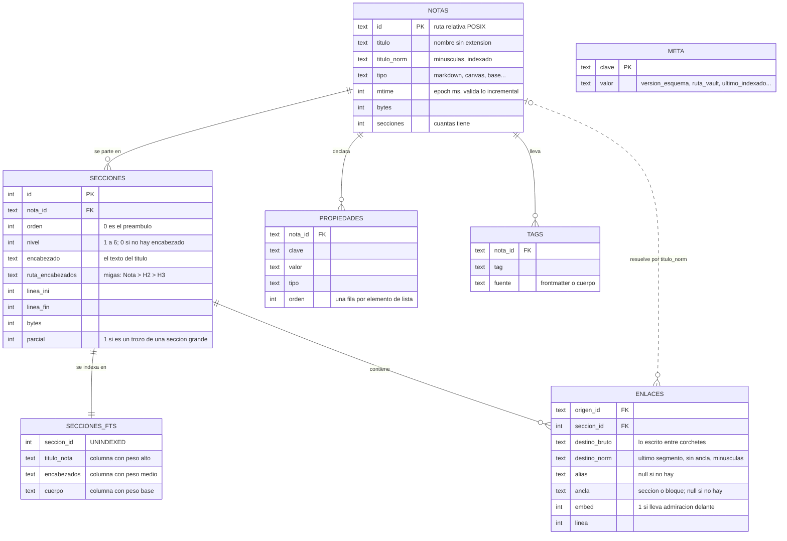
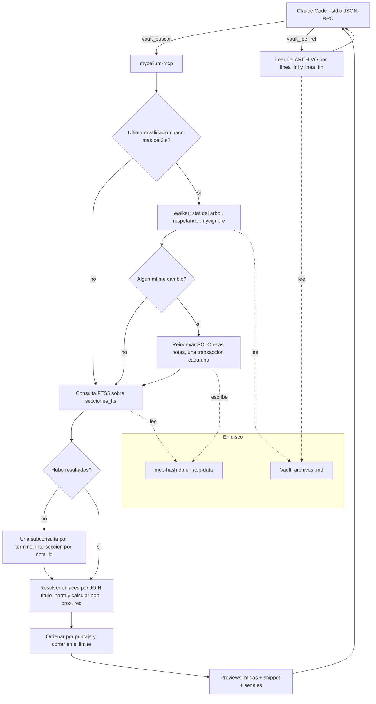

# MCP de Mycelium — la mitad de memoria

**Planificación** · 2026-09-23 · `FUN-L-09` `IA-MCP-MYCELIUM`

Esta nota decide **cómo el MCP encuentra información en el vault**: el modelo de datos, la
granularidad, el ranking, las herramientas y su formato de respuesta, cuándo se reindexa y
dónde corre el servidor. Parte de [[MCP de Mycelium - encuadre]], que fija los hechos y las
restricciones; las otras dos mitades son [[MCP de Mycelium - control]] (operar la app) y
[[MCP de Mycelium - evaluacion]] (medir si esto sirve).

> [!important] Solo se planifica
> No hay código todavía. Lo que sigue son decisiones con su porqué, no una implementación.

> [!info] Cómo leer los números
> Todo lo medido se midió **sobre este repo** el 2026-09-23 (`docs/`, 93 notas) y sobre el
> vault personal `Trabajo y Estudio` (1220 notas), que sirve de segundo caso real. Lo
> estimado va marcado como **(est.)**. Los tokens se calculan a 4 bytes por token; en
> español con acentos el tokenizador rinde algo peor, así que las cifras de tokens son un
> **piso**, no un techo.

---

## 1. La v1 en una frase, y el número que la justifica

> [!success] La v1 es: **FTS5 por sección + una tabla de enlaces materializada + cinco
> herramientas que devuelven previews.**
> Nada más. Sin embeddings, sin comunidades, sin escritura, sin grafo de 3 saltos.

El objetivo del encuadre es «mejor que `grep`». Eso hay que medirlo, así que se midió con
una consulta real del vault —«enlaces»— contra `docs/`:

| Paso | Con `grep` | Con el MCP |
|---|---|---|
| **Localizar** | `grep -ril "enlaces" docs` → **35 archivos**. Leerlos cuesta **694 KB ≈ 173.000 tokens** | 10 previews ≈ **1,7 KB ≈ 420 tokens** (est.) |
| — variante barata | `grep -rn "enlaces" docs` → **25,6 KB ≈ 6.400 tokens** de líneas sueltas, sin orden ni contexto | — |
| **Leer lo elegido** | la nota entera: `BACKLOG.md` = **126.533 bytes ≈ 31.600 tokens** | la sección: `FUN-L-09` en `BACKLOG.md` = **698 bytes ≈ 175 tokens** |

El segundo renglón es el que decide el diseño. Responder «¿qué dice el backlog de
`FUN-L-09`?» cuesta hoy **31.600 tokens** o cuesta **175**: un factor de **181**. Y no es
un caso raro: la mediana de sección en `docs/` es de **556 bytes** y en el vault personal de
**392 bytes**, contra notas de **12,5 KB** y **4,6 KB** de media respectivamente.

> [!warning] `grep -rn` parece barato y no lo es
> Devuelve líneas sueltas sin jerarquía: el agente todavía no sabe cuál abrir, así que
> abre tres notas «por si acaso». El costo real de `grep` no son sus 6.400 tokens de
> salida, son las lecturas completas que provoca después.

---

## 2. Dónde corre y cómo lee

### Decisión: un binario propio, que **nunca** abre el índice de la app

El servidor MCP es un **ejecutable aparte** (`mycelium-mcp`), hablando **stdio**, que
mantiene **su propio índice SQLite** y **nunca** abre `index-<hash>.db`, el índice de la app.

El porqué está en las restricciones 3 y 4 del encuadre:

- **El índice de la app tiene dueño.** Abrirlo aunque fuera en solo lectura ata el MCP a un
  esquema que cambia cuando cambia la app (`lib/db/indexer.ts` es literalmente un
  `CREATE TABLE` por tabla, sin migraciones versionadas) y lo pone a competir con el pool
  de hasta 10 conexiones de `tauri-plugin-sql`.
- **Tiene que servir con la app cerrada**, y ahí el índice de la app está **viejo por
  definición**: solo se reindexa al abrir el vault y cuando el watcher dispara, o sea,
  mientras Mycelium corre. Si Claude Code escribe tres notas con la app cerrada —que es el
  caso de uso principal—, el índice de la app no las tiene. Leerlo daría respuestas
  silenciosamente incompletas, que es el peor resultado posible para una memoria.
- **El problema de los dos escritores (`FUN-L-16`) desaparece por construcción**: son dos
  archivos distintos. El MCP escribe el suyo y no toca el de nadie.

El único archivo de la app que el MCP lee es `vaults.json` (JSON de 780 bytes, solo
lectura), y solo como respaldo para resolver un vault por nombre.

**Alternativas descartadas:**

| Alternativa | Por qué no |
|---|---|
| Leer el índice de la app en solo lectura | Viejo con la app cerrada; acoplamiento a un esquema sin versionar; contención con el pool del plugin |
| Escribir en el índice de la app | Es exactamente el escenario de dos escritores que `FUN-L-16` tuvo que prohibir en la propia app |
| Sin índice: `grep`/`ripgrep` por debajo, envuelto en MCP | Da el paso 1 más barato pero no da el paso 2 (secciones), ni backlinks correctos, ni ranking. Es `grep` con otro nombre |
| Servidor HTTP compartido entre sesiones (como graphify) | Un proceso más que levantar y matar, y un puerto abierto en la máquina del usuario, a cambio de compartir un caché que ya es barato de reconstruir |

### Dónde vive el índice del MCP

En el app-data de Mycelium, al lado del de la app: `%APPDATA%/com.mycelium.desktop/mcp-<hash>.db`,
con **la misma función de hash** que `abrirIndiceDeVault` (primeros 8 bytes del SHA-256 de
la ruta absoluta del vault, en hexadecimal).

Dos razones, y la segunda es la fuerte:

1. Si algún día los dos índices convergen en uno (ver § 10), la migración es «borrar uno»,
   no «mover archivos y reescribir rutas».
2. **El vault es una carpeta de texto plano y tiene que seguir siéndolo.** Un `.db` de 8 MB
   dentro del vault se sincronizaría con Dropbox/OneDrive, aparecería en `git status` y
   rompería la promesa del producto. Que `.mycelium/` ya guarde la papelera no es motivo
   para meter ahí un blob binario que crece con el vault.

### Journal, concurrencia y solo lectura

- **`journal_mode=WAL`**, por el mismo motivo que ya lo usa la app: el reindexado son miles
  de statements sueltos sobre un caché reconstruible. Además WAL es lo que permite que una
  consulta se sirva mientras otra sesión reindexa.
- **`busy_timeout=5000`**. Dos sesiones de Claude Code en el mismo vault levantan dos
  servidores sobre el mismo archivo. WAL serializa a un escritor por vez; el timeout hace
  que el segundo espere en vez de fallar.
- **Cerrojo consultivo** en la tabla `meta`: una fila `reindex_en_curso = <pid>:<epoch>`,
  que caduca a los 30 s. Sirve para que dos servidores no hagan **la misma pasada**, no
  para corrección: la corrección la da WAL.
- **Cada nota se reindexa en una transacción propia.** El reindexado de 400 notas no es una
  transacción de 400 notas: si el proceso muere a la mitad, lo escrito es consistente y lo
  que falta se detecta por `mtime` en el próximo arranque.
- **Si no se puede escribir** el índice (volumen de solo lectura, permisos), se reintenta en
  el directorio temporal del sistema; si tampoco, **las herramientas devuelven un error
  explícito** diciendo que el índice no está disponible y que conviene usar `grep`. Nunca
  se devuelven resultados parciales sin avisar: una memoria que miente es peor que ninguna.

### En qué lenguaje

**Rust, como binario secundario del bundle de Tauri.** El costo y el porqué, sin adornos:

- **A favor**: no agrega ninguna dependencia de runtime. Un MCP en Node obligaría a que el
  usuario tenga Node instalado, y Mycelium se vende como un instalador que funciona sin red
  y sin nada más. Además ya existe en Rust lo más aburrido de escribir: el walker
  (`archivos.rs`) y el filtro `.mycignore` (`mycignore.rs`, con tests).
- **En contra**: hay que **portar a Rust el parseo** que hoy solo existe en TypeScript —
  `lib/wikilinks.ts` (~70 líneas), `lib/frontmatter.ts` y la parte de `lib/propiedades.ts`
  que deriva propiedades y tags. Son pocas líneas pero son **la** fuente de los casos
  borde ya resueltos (la barra escapada de `DEF-045`, el frontmatter no soportado).
- **Por qué el costo es una inversión y no un peaje**: ese port **es** la mitad de
  `FUN-L-10` (mover el indexado del vault a Rust). Si se hace bien, queda un crate
  compartido y la app deja de indexar desde el frontend.

> [!tip] Si hace falta validar antes de pagar el port
> Un prototipo desechable en Node contra el arnés de [[MCP de Mycelium - evaluacion]] sirve
> para calibrar el ranking sin comprometerse a Rust — reutilizando los parsers TS tal cual,
> que ya son puros y sin imports a propósito. Es un **prototipo**, no un producto, y hay
> que decirlo antes de escribirlo o se queda.

---

## 3. El modelo de datos



### Qué **no** está y por qué

- **No hay tabla `contenidos`.** El texto completo de la nota no se duplica en el índice: el
  único lugar donde vive el texto es la columna `cuerpo` del FTS, que es la que hace falta
  para que `snippet()` funcione. Cuando el agente pide el **detalle** de una sección, el
  servidor lo lee **del archivo en disco** con `linea_ini`/`linea_fin`. Así lo que se
  devuelve es lo que hay ahora mismo en el archivo, no lo que había cuando se indexó.
- **No hay tabla `papelera`.** Una nota en la papelera se movió físicamente a
  `.mycelium/.trash`, que `.mycignore` ignora siempre, así que el walker nunca la ve y no
  entra al índice. La complicación de `DEF-046` es un problema del índice de la app, no de
  este.
- **No hay `usuarios`/`vaults`/`membresias`/`css_snippets`.** El índice de la app las
  necesita porque **es** la base de datos de la app. Este índice es solo un caché de
  recuperación.
- **No hay `destino_id` en `ENLACES`.** Es la decisión de § 5 y la más consecuente de todas.

### Tamaño esperado

| Vault | Texto | Secciones | Índice estimado |
|---|---|---|---|
| `docs/` de este repo | 1,16 MB | 1.291 | **≈2–3 MB** (est.) |
| `Trabajo y Estudio` | 5,60 MB | 6.199 | **≈9–14 MB** (est.) |

La estimación asume que un FTS5 con contenido pesa entre 1× y 1,5× el texto indexado, más
el resto de las tablas. Como referencia real: los índices que la app ya tiene en app-data
para los vaults del usuario van de 1,2 MB a 67 MB. **Hay que confirmarlo midiendo**, no dar
la estimación por buena.

---

## 4. La granularidad: se indexa por sección

### Decisión: la unidad de recuperación es la **sección**, no la nota

Una sección es lo que hay entre un encabezado `#`…`######` y el siguiente **de cualquier
nivel** (no anidado: cada línea del archivo pertenece a exactamente una sección). El texto
anterior al primer encabezado es la sección `orden = 0`, con `nivel = 0`. Los encabezados
**dentro de un bloque de código** no cortan: hay que llevar el estado de la cerca —tres
acentos graves o tres virgulillas— al partir, o cualquier nota que documente Markdown se
parte en pedazos absurdos. Esta misma nota es un caso.

**El porqué, medido:**

| | `docs/` (93 notas) | `Trabajo y Estudio` (1220 notas) |
|---|---|---|
| Nota media | 12.513 bytes (**≈3.100 tokens**) | 4.591 bytes (**≈1.150 tokens**) |
| Sección media | 900 bytes (**≈225 tokens**) | 903 bytes (**≈225 tokens**) |
| Sección mediana | 556 bytes | 392 bytes |
| p90 | 1.593 bytes | 1.208 bytes |

Devolver la sección en vez de la nota divide el costo de la lectura por **14** en `docs/` y
por **5** en el vault personal. Y el caso peor —`BACKLOG.md`— lo divide por **181**.

> [!important] El dato que casi rompe la decisión: casi la mitad de las notas reales no
> tienen encabezados
> En `docs/` solo **1 de 93** notas no tiene ningún encabezado. En el vault personal son
> **575 de 1220 (47%)**. Una nota sin encabezados es **una sola sección igual a la nota
> entera**, y ahí la granularidad por sección no gana nada.
>
> No invalida la decisión —esas notas miden 4,6 KB de media, que es un tamaño que se puede
> devolver— pero sí obliga al tope de abajo, porque la sección **más grande** medida tiene
> **489 KB**.

### El tope: 4 KB por unidad indexada

Una sección que pasa de **4.096 bytes** se parte en trozos por límite de párrafo, que
comparten `nota_id` y `ruta_encabezados` y se marcan con `parcial = 1`. 4 KB son ~1.000
tokens: lo más grande que tiene sentido devolverle a un agente sin que vuelva a pagar lo que
veníamos evitando.

El tope afecta a **16 de 1.291 secciones (1,2%)** en `docs/` y a **67 de 6.199 (1,1%)** en el
vault personal. Es decir: **cuesta casi nada y cubre el caso patológico.**

### Lo que se pierde, y cómo se recupera

Indexar por sección rompe el `AND` implícito entre términos que hoy hace `buscar.ts`: si
«tauri» está en una sección y «sqlite» en otra de la misma nota, la consulta `tauri sqlite`
ya no casa. Es una regresión real.

**Se resuelve sin una segunda tabla FTS**: `vault_buscar` primero consulta a nivel sección
con `AND`; si devuelve cero, emite **una subconsulta por término** e **intersecta por
`nota_id`**, devolviendo la mejor sección de cada término. Son 1–4 subconsultas sobre 6.000
filas: irrelevante en tiempo, y evita duplicar el índice.

**Alternativas descartadas:**

| Alternativa | Por qué no |
|---|---|
| Solo nota (como hoy) | Es el costo de 31.600 tokens del § 1. Es exactamente el problema |
| Dos tablas FTS (nota + sección) | Duplica el índice y el reindexado para resolver un caso que se arregla con dos subconsultas |
| *Chunks* de tamaño fijo con solape (RAG clásico) | Corta a mitad de frase, duplica texto en el solape y tira la estructura. El Markdown **ya trae** sus límites semánticos escritos: usarlos es gratis y es mejor |
| Por párrafo | Demasiado fino: pierde el contexto del encabezado y multiplica las filas por ~10 |

---

## 5. Los enlaces: materializados, pero **resueltos por join**

### Decisión: se guarda la arista tal como está escrita, no a dónde apunta

`ENLACES` guarda `destino_norm` (el destino normalizado: último segmento de la ruta, sin
ancla, en minúsculas) y **no** guarda un `destino_id`. La resolución es un `JOIN` contra
`notas.titulo_norm` **en el momento de la consulta**.

> [!success] Es lo que hace trivial el reindexado incremental
> Si se guardara `destino_id`, **crear** una nota obligaría a re-resolver todos los enlaces
> rotos que pudieran apuntarle, y **renombrar** una obligaría a re-resolver todos los que le
> apuntaban: un reindexado local se convertiría en una pasada global. Con el join, escribir
> una nota toca **solo las filas de esa nota**. Siempre.
>
> Y de yapa, la verdad que devuelve es la de este instante: crear la nota que faltaba
> repara sus backlinks **sin reindexar nada**.

El costo del join es una búsqueda por índice sobre `notas.titulo_norm`. Sobre 1.220 notas es
irrelevante (est.).

### Qué gana esto contra `grep`, en concreto

El protocolo de recuperación de `CLAUDE.md` propone hoy `grep -rl "\[\[Título" docs`. Eso:

- **No encuentra** `[[Carpeta/Título]]`, que es la misma arista escrita con ruta.
- **No encuentra** `[[Título\|alias]]` dentro de una tabla: la barra va escapada y es un
  caso real y documentado (`DEF-045`), en el que la vista de lectura muestra el enlace
  perfecto **mientras la conexión no existe**. Un `grep` ingenuo lo pierde en silencio.
- **Sí encuentra** los `[[…]]` que están dentro de bloques de código de ejemplo, que no son
  enlaces.

La tabla `ENLACES` los parte con `partirWikilink()`, que ya resuelve los tres casos. **Esto
no es "lo mismo pero más rápido": es un resultado distinto y correcto.**

### Enlaces rotos, alias y ambigüedad

- **Roto** = la fila existe y el `LEFT JOIN` devuelve `NULL`. No se borra ni se esconde: es
  información valiosa (es lo que `/vault-huerfanas` busca hoy con un escaneo completo) y se
  repara sola cuando aparece el destino.
- **Alias** (`[[destino|alias]]`): se guardan los dos. El destino manda para la arista; el
  alias se devuelve porque es **cómo se llama a esa idea en ese contexto**, y eso es
  vocabulario útil para la siguiente consulta.
- **Ambigüedad**: si dos notas comparten título, el join devuelve **las dos** y la respuesta
  las marca `ambiguo: true`. El grafo de la app resuelve a «la primera que aparezca», lo que
  esconde una violación de la regla dura nº1 del vault (títulos únicos). Devolver las dos y
  decirlo es más honesto y además es un diagnóstico. Es la idea de las aristas con confianza
  de graphify, en su versión más barata.
- **Refinamiento** cuando `destino_bruto` trae ruta (`[[Carpeta/Nota]]`): se prefiere el
  candidato cuyo `id` termine en esa ruta. El grafo actual tira esa información al quedarse
  con el último segmento.

### Lo que cuesta mantenerlo

Al reindexar una nota: `DELETE FROM enlaces WHERE origen_id = ?` + un `INSERT` por enlace.
La media de `docs/` es de **16 enlaces por nota** (1.517 enlaces / 93 notas). Es decir,
**~17 statements**, dentro de la misma transacción que ya reescribe sus secciones.

Comparado con lo que hay hoy, que es el punto: `grafo.ts` **carga el contenido de todas las
notas del vault en una sola consulta y escanea todo con una expresión regular** cada vez que
se le pide el grafo o los backlinks de una nota. Para `docs/` son 1,16 MB por pregunta; para
el vault personal, 5,6 MB. Con la tabla, un backlink es una búsqueda por índice.

---

## 6. El ranking

### Decisión: BM25 manda, y **el resto se calibra, no se inventa**

El puntaje es una suma ponderada de cuatro señales normalizadas a `[0,1]`:

| Señal | Qué es | De dónde sale |
|---|---|---|
| `rel` | Relevancia léxica | `-bm25(secciones_fts, 0, W_tit, W_enc, 1.0)`, normalizado dividiendo por el mejor del conjunto |
| `pop` | Cuánto la citan | `log1p(backlinks) / log1p(max_backlinks_del_vault)` |
| `prox` | Cercanía en el grafo | `0.5^d`, con `d` = saltos hasta la nota que el agente pasa en `cerca_de`; `0` si no pasó ninguna |
| `rec` | Recencia | `exp(-dias_desde_mtime / 90)` |

```
puntaje = w_rel·rel + w_pop·pop + w_prox·prox + w_rec·rec
```

> [!danger] La v1 sale con `w_rel = 1` y **todo lo demás en 0**
> Los pesos «razonables» que uno escribiría acá (0,60 / 0,15 / 0,15 / 0,10) son una opinión
> disfrazada de número. El encuadre es explícito: *lo que no se puede medir, no se decide*.
>
> Así que la v1 **calcula las cuatro señales y las devuelve en la respuesta**, pero solo
> `rel` ordena. El arnés de [[MCP de Mycelium - evaluacion]] registra las cuatro en cada
> consulta, y los pesos se ajustan **offline** sobre ese registro —una regresión sobre
> consultas ya ejecutadas— sin volver a correr la recuperación. Un peso entra a producción
> cuando muestra una mejora medida, no antes.

Esto es barato de construir (las cuatro señales son una consulta SQL cada una) y convierte
la calibración de un debate en un experimento.

### Por qué esas cuatro y no otras

- **`rel` primero** porque es lo único que sabe de qué habla la consulta. Las otras tres son
  *priors*: ordenan empates, no encuentran nada.
- **`pop`** es el equivalente honesto de PageRank a esta escala. El vault premia el enlace
  como unidad de valor; una nota muy citada suele ser el hub del tema.
- **`prox`** es **opt-in por consulta** (`cerca_de`), no un peso global. Es la diferencia
  entre «buscá "ranking"» y «buscá "ranking" mientras trabajo en `MCP de Mycelium - memoria`».
  El agente sabe en qué está; el índice no.
- **`rec`** es la más débil de las cuatro y hay que decirlo: el `mtime` de un vault versionado
  miente. Un `git clone` pone la misma fecha en todo y un `git pull` toca lo que no cambió.
  Candidata a quedar en 0 permanentemente.

**Alternativas descartadas:**

| Alternativa | Por qué no |
|---|---|
| Pesos fijos elegidos a ojo | Es el error que el encuadre prohíbe. Además nadie los vuelve a tocar |
| PageRank / detección de comunidades (Leiden, como graphify) | Un cálculo global que hay que rehacer al cambiar el grafo, para mejorar un *prior* que todavía no demostró aportar nada. Fase 2, si `pop` demuestra que la señal de grafo sirve |
| Un LLM que reordene los candidatos | Paga tokens justo en el paso que viene a abaratar tokens |
| `ORDER BY rank` a secas (lo de hoy) | Es la v1, con el nombre correcto: `w_rel = 1` **es** `ORDER BY rank`. La diferencia es que ahora las otras señales quedan registradas |

---

## 7. Las herramientas

Cinco, agrupadas por **intención** y no por tabla —la lección de engram—, con el prefijo
`vault_` para que sigan la línea de los comandos `/vault-*` que el usuario ya conoce.

> [!important] Esta mitad es **de solo lectura**
> No hay `vault_escribir`, `vault_crear` ni `vault_renombrar`. El agente ya escribe notas
> perfectamente con sus herramientas de archivos, y una herramienta de escritura acá
> reintroduciría el problema de los dos escritores por la puerta de atrás. Lo que se pueda
> **operar** de la app lo decide [[MCP de Mycelium - control]].

### `vault_contexto`

**Qué hace**: el *briefing* de una sesión. Se llama una vez, al empezar.

**Parámetros**: ninguno.

**Devuelve** (~400 tokens, est.): nombre y ruta del vault, cuántas notas y secciones, cuándo
se indexó por última vez, las notas mapa/índice detectadas, los 10 *hubs* por backlinks, el
vocabulario de tags con sus conteos y las claves de propiedad en uso.

**Por qué existe**: es lo más barato que se puede hacer contra el desajuste de vocabulario.
Un agente que sabe que el vault dice «retroenlaces» y no «inlinks» hace mejor la primera
consulta. Es también la razón principal por la que en § 9 se puede decir que no a los
embeddings.

### `vault_buscar`

**Parámetros**: `consulta` · `filtros?` (`propiedades`, `tags`, `carpeta`, `tipo`) ·
`cerca_de?` (nota que activa `prox`) · `ambito?` (`secciones` | `notas`, por defecto
`secciones`) · `limite?` (10 por defecto, 50 máximo).

**Devuelve**: **previews, nunca el texto completo.** Un bloque de texto compacto, dos líneas
por resultado:

```
12 resultados · mostrando 10 · índice al día (hace 3 s)

[1] docs/BACKLOG.md#s412 · BACKLOG › 1.3 Grandes › FUN-L-09
    …expone el vault a la IA como herramientas estructuradas: búsqueda en el «índice»,
    backlinks de una nota, vecindario del grafo… (rel .92 pop .41 prox .50 rec .08)

[2] docs/arquitectura/MCP de Mycelium - encuadre.md#s3 · Encuadre › Los dos objetivos
    …dar a Claude Code acceso a la «memoria» documental del vault… (rel .77 …)

Detalle: vault_leer(ref) · Quién lo cita: vault_vecinos(nota)
```

**Tres decisiones en ese formato:**

1. **Texto compacto, no JSON.** Un JSON con diez objetos repite las claves diez veces:
   ~150 tokens de llaves y comillas sobre un total de ~420. La `ref` está igual de
   disponible para copiar.
2. **Las migas (`ruta_encabezados`) van siempre.** Es lo que hace el preview
   autodescriptivo: «BACKLOG › 1.3 Grandes › FUN-L-09» dice qué es sin abrir nada.
3. **La última línea enseña el próximo paso.** Dejar la recuperación progresiva escrita en
   la respuesta es más fiable que confiar en que el agente recuerde la descripción de la
   herramienta. Es la misma intuición que los *hooks* de graphify, en su versión barata.

### `vault_leer`

**Parámetros**: `refs` (1 a 10) · `contexto?` (`0` | `1` | `2`: cuántas secciones vecinas
sumar) · `forzar?`.

**Devuelve**: el texto **leído del archivo en disco** en el momento de la llamada, con la
nota, las migas, el rango de líneas y los títulos a los que enlaza esa sección.

> [!warning] Pedir una nota entera dice lo que cuesta antes de cobrarlo
> Si la `ref` es una nota y no una sección, y la nota pasa de ~8 KB, **no** se devuelve
> entera: se devuelve su **índice de secciones** más la primera, y una línea que dice
> `para el texto completo: forzar=true (≈31.600 tokens)`. El agente casi siempre quiere una
> sección y no lo sabía. Si de verdad la quiere, la pide y la paga.

### `vault_vecinos`

**Parámetros**: `nota` · `direccion?` (`entrantes` | `salientes` | `ambas`) · `saltos?`
(1 o 2) · `limite?`.

**Devuelve**: entrantes (con el fragmento alrededor del enlace y el alias con el que la
llaman), salientes (con la `ref` de la sección donde está el enlace), y los **rotos**. Las
ambigüedades vienen marcadas.

Es la herramienta que hoy **no tiene sustituto correcto**: `grep "\[\[Título"` da un
resultado distinto y peor (§ 5), y `conexiones()` de la app escanea el vault entero para
contestarlo.

### `vault_salud`

**Parámetros**: ninguno.

**Devuelve**: notas huérfanas (sin entrantes ni salientes), enlaces rotos agrupados por
destino, títulos duplicados y frescura del índice. Tres consultas contra las tablas que ya
existen.

**Por qué entra en la v1 y no en fase 2**: es lo que hace `/vault-huerfanas` hoy con un
escaneo completo, cuesta ~30 líneas una vez que `ENLACES` existe, y es la demostración más
visible de que materializar las aristas valió la pena.

### Presupuesto de tokens de una sesión típica (est.)

| Paso | Tokens |
|---|---|
| `vault_contexto` (una vez) | ~400 |
| `vault_buscar` (10 previews) | ~420 |
| `vault_leer` de 2 secciones elegidas | ~450 |
| `vault_vecinos` de la mejor | ~250 |
| **Total** | **≈1.500** |

Contra los **173.000** del camino `grep` + leer candidatas del § 1, o los ~35.000 de un
`grep` seguido de abrir una sola nota grande. **Son estimaciones**: el número que vale es el
que mida [[MCP de Mycelium - evaluacion]].

---

## 8. El flujo de una consulta, de punta a punta



Dos cosas que el diagrama deja ver y conviene subrayar:

- **La revalidación está en el camino de la consulta**, no en un hilo aparte. Eso garantiza
  que lo que se responde refleja el disco en ese instante.
- **El índice nunca devuelve texto al agente.** El índice decide *qué* devolver; el texto
  sale siempre del archivo. Un índice viejo puede ordenar mal, pero no puede devolver
  contenido que ya no existe.

---

## 9. Actualización incremental

### Decisión: revalidación **perezosa**, con techo de 2 segundos

Antes de servir una consulta, si pasaron más de **2.000 ms** desde la última comprobación, se
recorre el árbol pidiendo solo `(ruta, mtime, tamaño)` y se reindexa lo que cambió. Es el
mismo truco de dos fases que `FUN-M-12` le puso a `indexarVault`: los metadatos son baratos,
el contenido es caro.

Costo: un `stat` de 93 archivos en `docs/`, de ~1.220 en el vault personal. **Estimado en
pocos milisegundos**; hay que medirlo, y el umbral de decisión es claro: **si la pasada
supera ~50 ms, se cambia por un watcher.**

**Por qué no un watcher desde el principio**, teniendo `notify` ya como dependencia y
`vault_watch.rs` escrito:

- El MCP es un proceso **ocioso entre llamadas**. No hay una pantalla que mantener viva: el
  único instante en el que la frescura importa es cuando llega una consulta, y ahí la
  revalidación perezosa da una garantía **más fuerte** que un watcher (el watcher tiene
  debounce y puede estar a mitad de ráfaga justo cuando llega la pregunta).
- Un watcher sobre una carpeta sincronizada en la nube genera ráfagas —está documentado en
  el propio `vault_watch.rs`— y obliga a un hilo, un debounce y un estado compartido.
- **Y el caso que más importa es el peor para el watcher**: el agente escribe una nota y
  pregunta por ella en el siguiente turno. Con revalidación perezosa está garantizado que la
  ve. Con watcher + debounce, depende de cuánto tardó el turno.

### Qué se reindexa cuando cambia una nota

**Solo esa nota.** En una transacción: borrar sus filas de `secciones`, `secciones_fts`,
`enlaces`, `propiedades` y `tags`; reparsear; reinsertar. Estimado en **menos de 5 ms** para
una nota de 12,5 KB (un parseo de un solo paso más ~40 inserts).

**Nada de otras notas se toca**, y eso es consecuencia directa de la decisión de § 5: como
los enlaces no guardan a dónde apuntan, escribir una nota no puede invalidar la resolución de
ninguna otra.

| Qué pasó en disco | Qué hace el índice |
|---|---|
| Nota modificada (`mtime` distinto) | Reindexa esa nota |
| Nota nueva | La indexa; los enlaces rotos que le apuntaban **se reparan solos** en el próximo join |
| Nota borrada | Borra sus filas; los enlaces que le apuntaban pasan a rotos **solos** |
| Nota renombrada / movida | Borrado + alta. Los backlinks al título viejo quedan rotos, que es **exactamente lo que pasó en el disco** |
| `.mycignore` cambió | Se detecta por su `mtime` y se fuerza una pasada completa |
| `meta.version_esquema` no coincide | Se descarta el índice y se reconstruye. Mismo patrón defensivo que el `forzarTodo` de `indexarVault` |

### El arranque en frío

Primera vez en un vault: hay que leer y parsear todo. Para `docs/` son 1,16 MB y 93
archivos; para el vault personal, 5,6 MB y 1.220. **Estimado en 1–3 segundos** en Rust, con
todo en un proceso y sin puente IPC de por medio —que es justo lo que hace lento al indexador
de hoy—. Como es al arrancar el servidor y no en la primera consulta, el agente casi nunca
lo espera. **Pendiente de medir.**

---

## 10. Embeddings: no, y qué haría cambiar de opinión

### Decisión: la v1 no lleva embeddings ni almacén de vectores

graphify los rechaza por principio. Acá el rechazo no es por principio sino por **este**
caso, y por tres motivos concretos:

1. **La restricción de local y sin conexión convierte «agregar embeddings» en «empaquetar un
   modelo».** Sin red, hay que meter un runtime ONNX y un modelo multilingüe en el
   instalador. La referencia de costo es fresca: draw.io llevó el instalador a **40,3 MB** y
   ese sobrecosto fue tema de discusión con el usuario. Un modelo multilingüe decente, aun
   cuantizado, está en el mismo orden o peor.
2. **La escala no lo pide.** 1.291 secciones en `docs/`, 6.199 en un vault personal de 1.220
   notas. BM25 sobre esos volúmenes no tiene un problema de precisión que un vector vaya a
   arreglar. (El almacenamiento, curiosamente, **no** es el problema: 6.199 × 384 floats son
   ~9 MB y un escaneo por fuerza bruta a esa escala es instantáneo. El problema es el modelo.)
3. **El vault tiene vocabulario controlado, y encima ya tiene un tesauro escrito.** Lo
   redactan dos autores —el usuario y el agente— con los mismos términos, los `[[enlaces]]`
   **son** las asociaciones, y el **léxico** de `FUN-M-17` ya guarda exactamente lo que un
   embedding vendría a aproximar: su tipo es
   `DestinoLexico = { titulo, formas[] }` — «un destino con las formas en que el corpus lo
   nombra»— en `.claude/enlaces-lexico.json`. Es un mapa de sinónimos **por vault,
   determinista, inspectable y curado por el usuario**. Antes de estimar sinónimos con un
   modelo de 300 MB conviene usar el archivo que ya los tiene escritos.

Lo que sí se pierde: el desajuste de vocabulario cuando el usuario pregunta con palabras que
la nota no usa («cómo evito que dos procesos escriban el índice» contra una nota que dice
«dos escritores»). Es real y es estrecho.

### Lo barato que hay que probar **antes**

**Expansión de consulta** a partir de material que ya existe: el léxico del vault, los
títulos de nota, los alias de los enlaces (§ 5) y el vocabulario de tags que devuelve
`vault_contexto`. Cero dependencias nuevas, cero MB en el instalador. Si eso cierra la brecha
de *recall*, los embeddings no se construyen nunca.

### Qué evidencia cambiaría la postura

> [!question] Los embeddings entran si pasa **1 o 2**, y además **3**
> 1. El arnés de [[MCP de Mycelium - evaluacion]] mide **recall@10 por debajo de 0,80** en la
>    clase de preguntas «con las palabras del usuario, no las del vault», **y** los fallos
>    son atribuibles a desajuste de vocabulario: la respuesta existe y no contiene ningún
>    término de la consulta. Si los fallos son de otra cosa, un vector no los arregla.
> 2. Aparece un vault de más de **~5.000 notas / ~25.000 secciones**, donde BM25 empieza a
>    perder precisión porque demasiadas secciones comparten vocabulario.
> 3. Existe un modelo con calidad aceptable en español que sume **menos de ~40 MB** al
>    instalador (el precio que ya se pagó por draw.io, que al menos es el tope conocido y
>    aceptado), y la expansión de consulta ya se probó y **no** alcanzó.

Y si entran, entran **como cuarta señal del ranking del § 6**, con su peso calibrado igual
que los otros — no como un sistema paralelo.

---

## 11. Lo que **no** entra en la v1

| Fase 2 | Qué evidencia lo justificaría |
|---|---|
| Watcher de archivos en vez de revalidación perezosa | La pasada de `stat` supera ~50 ms en un vault real |
| PageRank / comunidades en el grafo | `pop` demuestra en el arnés que la señal de grafo aporta, y se quiere más de ella |
| Indexar el contenido de `.canvas` (tarjetas de texto) | Se usan canvas con texto sustantivo. Hoy ni la app los indexa en FTS, y son prosa de verdad, a diferencia de `.base` y `.drawio` |
| Saltos de grafo > 2 en `vault_vecinos` | Alguien lo pide; a 3 saltos en un vault denso el vecindario es casi el vault entero |
| Un índice único compartido con la app (convergencia con `FUN-L-10`) | El port de los parsers a Rust está hecho y el indexador de la app ya vive ahí. Entonces «dos índices» pasa a ser deuda, no diseño |
| Embeddings | § 10 |

---

## 12. Preguntas abiertas

> [!question] No decididas a propósito. Una pregunta bien planteada vale más que una
> decisión inventada.

1. **¿Rust de entrada, o prototipo Node primero?** Está decidido que el producto es Rust
   (§ 2). Lo que **no** está decidido es si conviene pagar antes un prototipo desechable en
   Node para calibrar el ranking contra el arnés. Depende de cuándo esté listo el arnés.
2. **¿4 KB es el tope correcto?** Cubre el 98,8% de las secciones sin partirlas, pero el
   número sale de «~1.000 tokens suena bien», no de una medición de utilidad. El arnés puede
   contestarlo probando 2 KB, 4 KB y 8 KB.
3. **¿`secciones` o `notas` por defecto en `vault_buscar`?** La medición dice secciones, pero
   el 47% de notas sin encabezados del vault personal hace que en ese vault los dos modos
   coincidan casi siempre. Puede que el parámetro sobre.
4. **¿Qué hace el MCP con los tipos que no son `.md`?** Hoy un `.excalidraw`, `.base`,
   `.canvas` o `.drawio` existe en el árbol pero su contenido no entra al FTS. ¿Aparecen
   como notas sin cuerpo (para que `[[Mi base]]` resuelva y no cuente como roto) o no
   aparecen? Inclinación: **aparecen en `NOTAS`, sin secciones**, que es lo que hace hoy el
   grafo y evita falsos enlaces rotos. Falta confirmarlo.
5. **¿Cómo se registra el servidor en `.mcp.json`?** El generador de `FUN-L-08` es el lugar
   natural —ya escribe `CLAUDE.md`, dos skills y seis comandos— pero implica subir
   `FRAMEWORK_IA_VERSION` y toca terreno de [[MCP de Mycelium - control]]. Se decide allá.
6. **¿Y los comandos `/vault-*` que ya existen?** Con el MCP andando, `/vault-buscar` y
   `/vault-huerfanas` hacen a mano lo que una herramienta hace mejor. ¿Se reescriben para
   usar el MCP, se borran, o quedan como camino de respaldo para cuando el MCP no está?
   Inclinación: **reescribirlos** para que usen el MCP y caigan a `grep` si no responde.
7. **¿Cuánto pesa de verdad el índice?** Las cifras de § 3 son estimadas a 1–1,5× el texto.
   Es lo primero que hay que medir cuando exista el primer índice real.

---

## Relacionadas

- [[MCP de Mycelium - encuadre]] — los hechos y las restricciones de las que parte todo esto.
- [[MCP de Mycelium - control]] — la otra mitad: operar la app, no solo leerla.
- [[MCP de Mycelium - evaluacion]] — quién dice si esto mejora algo, y con qué números.
- [[Capa de datos del desktop]] — el índice de la app, que este diseño decide **no** abrir.
- [[Mycelium como memoria de la IA]] — la decisión de producto de la que sale `FUN-L-09`.
- [[ia-framework-vault]] — lo que hace de memoria hoy, sin MCP.
- [[Rendimiento de la apertura del vault]] — de dónde salen las lecciones de `FUN-M-12`.
- [[Rendimiento del grafo]] — el vault de referencia y el costo del grafo actual.
- [[BACKLOG]] — `FUN-L-09`, y `FUN-L-10` (el indexado en Rust con el que esto converge).
- [[Mapa de documentacion]] — índice general.
