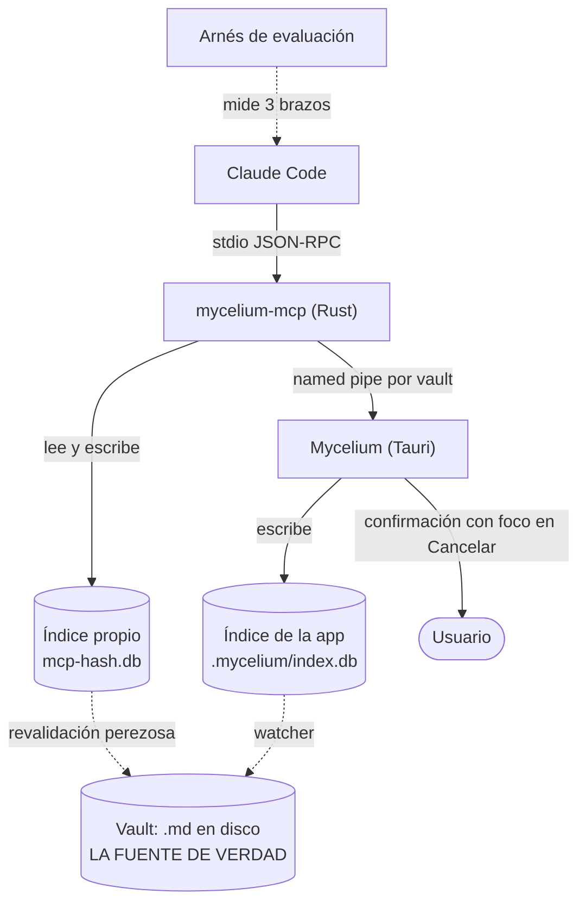

# MCP de Mycelium — el plan integrado

**Planificación** · 2026-09-23 · `FUN-L-09` `IA-MCP-MYCELIUM`

Las tres partes del diseño —[[MCP de Mycelium - memoria]], [[MCP de Mycelium - control]] y
[[MCP de Mycelium - evaluacion]]— se escribieron **en paralelo**, sobre el terreno común de
[[MCP de Mycelium - encuadre]]. Esta nota las junta: qué quedó decidido, **dónde se
contradicen y cómo se resuelve**, qué hay que construir antes que el MCP, en qué orden, y
qué sigue esperando una decisión del usuario.

> [!important] Sigue siendo solo planificación
> Nada de esto está construido. Lo que cambia respecto de ayer es que ahora hay un plan
> entero que se sostiene, con sus costos a la vista.

## 1. El diseño en una página

- **Memoria** (5 herramientas `vault_*`, solo lectura): índice propio en Rust, granularidad
  de **sección**, enlaces materializados y resueltos por *join*, ranking léxico en la v1 con
  las demás señales calculadas pero **en peso cero** hasta calibrarlas, sin embeddings.
- **Control** (9 herramientas `mycelium_*`, escriben): *named pipe* por vault, permisos
  apoyados en la red de seguridad que la app ya tiene, y un criterio de admisión que deja
  fuera lo caro e irreversible.
- **Evaluación**: tres brazos (ciego · base · MCP), 21 preguntas en siete clases, **acierto
  citado** como métrica principal y la eficiencia como desempate, con umbrales
  pre-registrados que pueden decir «esto no sirvió».

## 2. Las fronteras entre las tres, resueltas

Las tres notas se escribieron sin verse. Donde se pisan, decide esta nota.

### 2.1 `mycelium_sincronizar` cambia de motivo, no de dueño

[[MCP de Mycelium - control]] la justificaba así: *«espera a que el índice se ponga al día
con lo que se escribió desde la terminal»*. Pero [[MCP de Mycelium - memoria]] decidió que el
MCP **mantiene su propio índice** y lo revalida antes de cada consulta, así que para *buscar*
esa espera ya no hace falta.

**Queda, con otro porqué**: sirve para que **la app** se ponga al día, no la búsqueda. El
caso real es el usuario mirando la ventana mientras el agente trabaja: si el agente creó
cuatro notas, el árbol tiene que mostrarlas. Es una herramienta sobre la **vista**, no sobre
la memoria, y por eso se queda del lado del control.

### 2.2 Dos prefijos, y es a propósito

`vault_*` contra `mycelium_*` parecía una inconsistencia. **Se conserva**, porque la
distinción es exactamente la que el agente necesita tener presente:

| Prefijo | Qué toca | ¿Con la app cerrada? |
|---|---|---|
| `vault_*` | La **memoria**: lo que está escrito en el vault | **Sí** |
| `mycelium_*` | La **aplicación**: lo que se ve y se opera | No — fallan con `APP_CERRADA` |

Un agente que recuerde una sola regla —«`vault_` siempre anda; `mycelium_` necesita la
ventana abierta»— se equivoca mucho menos que uno al que le dimos catorce nombres uniformes.

### 2.3 El modo de *journal* deja de ser una pregunta

[[MCP de Mycelium - control]] lo dejó abierto y lo derivó a memoria; memoria lo respondió al
decidir un índice propio: **WAL, `busy_timeout`, y un cerrojo consultivo** para dos sesiones
sobre el mismo vault. Como el MCP nunca abre el índice de la app, el problema de los dos
escritores (`FUN-L-16`) desaparece por construcción. **Cerrado.**

### 2.4 Los comandos `/vault-*` se reescriben, no se borran

`/vault-buscar` y `/vault-huerfanas` harían a mano lo que el MCP hace mejor. Se reescriben
sobre las herramientas, **con caída a `grep`** cuando el MCP no esté: el framework de IA se
instala en vaults donde puede no haber servidor, y un comando que falla sin explicación es
peor que uno lento. Toca el framework (`FUN-L-08`), que sube de versión.

## 3. El riesgo que ninguna de las tres podía ver sola

> [!danger] Dos indexadores que responden la misma pregunta
> El MCP construye **su propio índice, en Rust**, con su propio parser de wikilinks, de
> frontmatter y de secciones. La app mantiene **el suyo, en TypeScript**. A partir de ahí,
> «qué es un enlace» y «dónde empieza una sección» se contestan en **dos** implementaciones
> distintas, que van a derivar.
>
> Hoy mismo, en este repo, arreglamos tres veces esa clase de defecto: la extensión de cada
> tipo de archivo se contestaba en **tres** archivos y agregar `.drawio` tocó uno solo —el
> archivo se creaba bien, se listaba sin extensión y los embeds no resolvían—. La respuesta
> fue centralizar y **tipar** para que un tipo nuevo no compile hasta contestar en el único
> lugar que manda. Dos indexadores es el mismo error, un orden de magnitud más grande.

**La salida no es renunciar al índice propio** —el argumento de la frescura con la app
cerrada es sólido— sino **no dejar dos**: el indexador en Rust del MCP tiene que ser **el
indexador**, y la app pasar a consumirlo. Eso es exactamente `FUN-L-10`
(`VAULT-INDEX-EN-RUST`), que ya está en el BACKLOG y hasta hoy no tenía quién lo empujara.

**Decisión**: `FUN-L-09` y `FUN-L-10` se planifican como **una sola línea de trabajo**. El
MCP no es un consumidor del índice: es la excusa para que el índice viva donde debía.
Mientras convivan las dos implementaciones —que van a convivir un tiempo— hace falta una
**prueba de equivalencia**: el mismo vault indexado por las dos tiene que dar el mismo
conjunto de enlaces, secciones y propiedades. Si esa prueba no existe, la deriva es cuestión
de semanas.

## 4. Lo que hay que construir en la app, y no es «solo MCP»

Dos cosas que el plan asume y que son cambios de Mycelium, no del servidor. Van al BACKLOG
por separado para que no viajen escondidas:

1. **La confirmación tiene que ser una cola.** `confirmarStore` admite **una** pregunta a la
   vez y, si llega otra, **cancela la anterior** —está escrito en el propio comentario del
   código—. Hoy no molesta porque solo pregunta el usuario; con un agente pidiendo cosas, su
   petición cancelaría el diálogo abierto y el borrado del usuario **no ocurriría, sin
   explicación**. Hay que pasarlo a cola y rotular quién pregunta.
2. **La terminal tiene que pasar el vault en el entorno.** `terminal_abrir` hoy solo define
   `TERM`. Sumar `MYCELIUM_VAULT` y el *token* de la ventana deja autenticado, sin
   configurar nada, al Claude Code que corre en la terminal integrada.

## 5. El orden, y por qué empieza por medir

> [!tip] La fase 0 es la única que no se puede saltear
> El arnés mide **la línea base**: cuánto le cuesta hoy a la IA encontrar algo con `grep`.
> Sin ese número, «más rápido y más barato» no se puede afirmar ni desmentir, y el umbral de
> fracaso que la evaluación dejó escrito —si el MCP consume **más** contexto que el `grep`
> actual, se rehace— no se puede evaluar.

| Fase | Qué | Para qué |
|---|---|---|
| **0** | Arnés + línea base de los brazos ciego y base | Tener contra qué comparar, y las preguntas escritas **antes** de conocer la solución |
| **1** | `vault_buscar` + `vault_leer` sobre índice propio, ranking léxico | La v1 más chica que ya pueda ganarle a `grep`. Se mide |
| **2** | Enlaces materializados + `vault_vecinos` + `vault_contexto` | Lo que `grep` no puede hacer: backlinks y vecindario |
| **3** | Calibración del ranking con las señales que la fase 1 ya devolvía | Pesos medidos, no inventados |
| **4** | Control: `mycelium_estado`, `abrir`, `sincronizar` (las tres de más uso) | Cerrar el ciclo: la IA opera lo que la ventana muestra |
| **5** | El resto del control, con la cola de confirmación ya hecha | Lo que escribe, detrás de la red de seguridad |

Las fases 1 y 2 se miden con el mismo arnés. Si la fase 1 no le gana a `grep`, **no se sigue
a la 2**: se revisa el diseño.

## 6. Lo que sigue esperando una decisión del usuario

1. **Con qué modelo se corre la evaluación.** Con el grande, la exactitud tapa las
   diferencias de recuperación; con uno chico, la herramienta se nota y la tanda es barata.
   *Recomendación*: tanda principal con el modelo más chico que resuelva bien el brazo base,
   y repetir las preguntas selladas con el grande.
2. **¿Hay un segundo vault real?** Sin él, la conclusión queda limitada a «…en el vault de
   Mycelium», y eso va en el informe, no en una nota al pie.
3. **Los nombres de las herramientas, en español o en inglés.** Se decidió español por
   coherencia con el repo; el riesgo es que los modelos tengan más práctica con los ingleses.
   Renombrar es trivial: *recomendación*, medirlo en la fase 0 y zanjarlo con el dato.
4. **Qué hace el MCP con lo que no es `.md`.** Hoy un `.canvas`, un `.base` o un `.drawio` no
   entran al índice. La inclinación de la nota de memoria es incluirlos **como nodos sin
   secciones**, para que `[[Mi base]]` resuelva. Indexar además su **texto** cerraría una de
   las clases de pregunta que la evaluación dejó diseñada para que el MCP pierda.
5. **Puntaje parcial** en las preguntas de enumeración, o todo o nada.

## Relacionadas

- [[MCP de Mycelium - encuadre]] — los hechos y las restricciones de partida.
- [[MCP de Mycelium - memoria]] · [[MCP de Mycelium - control]] · [[MCP de Mycelium - evaluacion]] — las tres partes.
- [[Mycelium como memoria de la IA]] — la decisión de producto de la que sale todo.
- [[BACKLOG]] — `FUN-L-09` y `FUN-L-10`, que este plan une.
- [[Mapa de documentacion]] — índice general.
