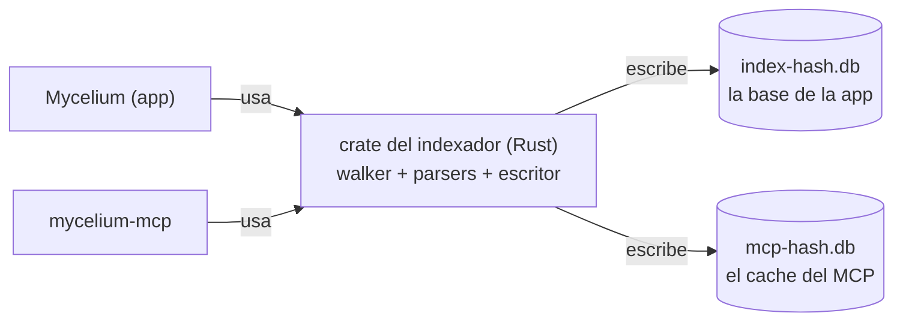

# MCP de Mycelium — revisión crítica del diseño

**Revisión** · 2026-09-23 · `FUN-L-09` `IA-MCP-MYCELIUM`

Esta nota revisa las seis que componen el diseño del MCP: [[MCP de Mycelium - plan]] (la
integración), [[MCP de Mycelium - encuadre]], [[MCP de Mycelium - memoria]],
[[MCP de Mycelium - control]], [[MCP de Mycelium - evaluacion]] y
[[Memoria documental para IA - estado del arte]]. No las reescribe: dice qué está mal, qué
va a doler, qué se puede hacer más chico y qué decisión falta tomar. Cada hallazgo trae su
evidencia; donde una afirmación era verificable en el repo, se verificó contra el código en
`e4bdb36` y no contra la nota.

> [!important] Qué no se discute acá
> Las decisiones ya tomadas por el usuario —empaquetar en vez de servicio remoto, solo
> desktop, el modelo más chico para la tanda principal, el panel de actividad en el rail, el
> interruptor en Configuración → Vault— **no se relitigan**. Lo que sí se hace, porque es lo
> más útil que puede hacer un revisor con una decisión tomada, es señalar las consecuencias
> que esas decisiones arrastran y que las notas no vieron. Hay dos, y una es grave (§ 2.3).

> [!success] Lo que está bien resuelto, para no volver sobre ello
> Antes de la lista de problemas, lo que **no** tiene problemas y no hay que tocar:
> - **El índice propio, nunca el de la app**, con el texto siempre leído del disco. Es la
>   decisión central de [[MCP de Mycelium - memoria]] y es correcta por los tres motivos que
>   da; el estado del arte confirma que nadie afuera tiene el problema del segundo autor.
> - **Los enlaces resueltos por join**, sin `destino_id`. Es lo que hace local el reindexado
>   y lo que repara solos los enlaces rotos. No hay nada que mejorar.
> - **Pesos en cero hasta calibrar**, con las señales devueltas para regresión *offline*.
>   Convierte un debate en un experimento, que es exactamente lo que el encuadre pedía.
> - **El criterio de admisión de control** (§ 1 de esa nota) y la lista de lo que **no** se
>   expone. Es la parte más madura del diseño: la seguridad real está en no implementar, no
>   en confirmar.
> - **El arnés**: tres brazos, la clave con distractores, la métrica principal correcta, el
>   juez validado contra patrón humano, el pre-registro con filas que dicen «se abandona».
>   Tiene grietas —abajo— pero el armazón es el correcto.

---

## 1. Los tres que arreglaría primero

Si solo se pudieran arreglar tres cosas antes de escribir una línea:

1. **El plan cierra el problema de los dos escritores en § 2.3 y lo vuelve a abrir en § 3**
   (§ 2.1 de esta nota). Es una contradicción interna del plan, no entre notas hijas, y
   define qué es `FUN-L-10`. Se arregla con una frase, pero la frase decide una arquitectura.
2. **El modelo más chico no tiene ventana para el brazo D, y probablemente tampoco para el
   brazo B** (§ 2.3). Consecuencia directa de una decisión del usuario que las notas no
   vieron, y rompe la regla de decisión tal como está pre-registrada.
3. **La regla de decisión no existe hoy**: el plan dice que manda el costo en dólares y la
   evaluación sigue pre-registrando la razón de tokens, sin ningún número para el costo
   (§ 2.2). El pre-registro es lo único que protege la evaluación de leerse a conveniencia, y
   hoy está roto.

---

## 2. Correcciones — lo que está mal

Ordenadas por severidad. Para cada una: qué dice el diseño, por qué está mal, qué propongo
y cuánto cuesta.

### 2.1 El plan resuelve «dos escritores» por construcción y después propone deshacerlo

**Qué dice.** [[MCP de Mycelium - plan]] § 2.3 cierra el modo de *journal* así: *«Como el MCP
nunca abre el índice de la app, el problema de los dos escritores (`FUN-L-16`) desaparece por
construcción. Cerrado.»* Dos secciones después, en § 3, decide que *«el indexador en Rust del
MCP tiene que ser **el** indexador, y la app pasar a consumirlo»*, y que `FUN-L-09` y
`FUN-L-10` son *una sola línea de trabajo*. [[MCP de Mycelium - memoria]] § 2 refuerza la
ambigüedad: *«si algún día los dos índices convergen en uno (ver § 10), la migración es
"borrar uno"»*.

**Por qué está mal.** «Un indexador» y «un índice» son dos cosas distintas, y el plan las
usa como si fueran la misma. Si lo que converge es **el archivo**, la app y el MCP escriben
la misma base y se vuelve exactamente al escenario que § 2.3 declaró cerrado. Y además no es
posible tal como está diseñado el índice del MCP: memoria § 3 excluye a propósito
`contenidos`, `papelera`, `diagramas`, `css_snippets`, `usuarios`, `vaults` —*«el índice de
la app las necesita porque **es** la base de datos de la app»*—. La app no puede «consumir»
un caché que no tiene sus tablas. Lo único que puede converger es **el código**: el walker,
los parsers de wikilinks/frontmatter/secciones y el escritor SQLite, como un crate que los dos
procesos usan para escribir **cada uno su archivo**.

**Propuesta.** Reescribir plan § 3 para que diga que lo que se unifica es el **crate**, no la
base: dos archivos, un solo código que decide «qué es un enlace». La «prueba de equivalencia»
deja de ser *«el mismo vault indexado por las dos [implementaciones] tiene que dar el mismo
conjunto»* —que es una prueba entre dos bases— y pasa a ser una batería de tests del crate
contra los casos borde ya resueltos en TS (`DEF-045`, cercas de código, frontmatter no
soportado), que además existe antes de que haya dos bases que comparar. Y que `FUN-L-10`
quede definido así en el BACKLOG. **Costo**: un párrafo en el plan y otro en el BACKLOG; y
aceptar que «dos índices» es permanente y no deuda, porque tienen dueños y contenidos
distintos.

### 2.2 La regla de decisión pre-registrada ya no existe

**Qué dice.** [[MCP de Mycelium - evaluacion]] § 9 pre-registra la decisión con `T` = razón
de `tokens_recuperacion`, con umbrales (`T ≤ 0,6` entra; `T > 1` se rehace), y exige que la
sección se **congele antes de correr**. [[MCP de Mycelium - plan]] § 4.2 decide que *«cuando
digamos "barato", el número que manda es el costo en dólares»* y que el contexto ocupado pasa
a ser *diagnóstico*.

**Por qué está mal.** El plan cambió la métrica y **no escribió la regla nueva**: no hay un
umbral de costo en ninguna de las seis notas. Hoy conviven la tabla de § 9, que dice `T`, y
una decisión que dice «dólares» sin número. Es la situación que el propio pre-registro
existe para evitar —*«si no podemos señalar el número que nos haría tirar el trabajo, la
evaluación es decorativa»*—. Y hay un segundo problema que el plan no vio: el costo en
dólares es una métrica **más ruidosa** que los tokens, porque depende de si la corrida
anterior con el mismo prefijo cayó dentro de los cinco minutos del TTL del caché. El orden
intercalado A·B·C fue diseñado para neutralizar eso en la comparación B contra C; con D,
cuyo único argumento es la amortización del caché, el ruido deja de ser un detalle.

**Propuesta.** Reescribir § 9 ahora, con número, y congelarla: `K` = razón de `costo_usd`
(C / B), con los mismos tres cortes que tenía `T` (entra si `K ≤ 0,6`; no entra como está si
`0,6 < K < 1`; se rehace si `K > 1`), `T` reportado como diagnóstico, y para el brazo D una
fila propia que se mide **por sesión** (§ 5.6 de esta nota). El 0,6 sigue siendo «a ojo»,
como ya admite la nota; lo importante es que exista antes de la primera tanda. **Costo**: una
tabla. Cero código.

### 2.3 El modelo más chico no tiene ventana para lo que el plan quiere medir

**Qué dice.** Decisión del usuario, registrada en plan § 7.1 y evaluación § 11: la tanda
principal corre con **el modelo más chico**. Plan § 4.2 agrega el **brazo D**: el corpus
entero en contexto, que para `docs/` estima en **≈290.000 tokens** (estado del arte § 5,
*«entra cómodo en una ventana de 1 M»*).

**Por qué está mal.** El modelo más chico de la familia actual es Haiku 4.5, y su ventana es
de **200.000 tokens**, no de 1 M —Sonnet 5 y Opus 5 sí tienen 1 M—. El brazo D **no puede
correr** con el modelo elegido para la tanda principal, y 290.000 es además un *piso* (la
nota de memoria advierte que el español acentuado tokeniza peor). El plan nunca cruza las dos
decisiones porque llegaron en momentos distintos.

Y hay una segunda consecuencia, peor, sobre el **brazo B**: el protocolo de recuperación de
hoy lee las candidatas **enteras**, y la medición de memoria § 1 dice que un `grep` de una
palabra común lleva a **173.000 tokens** de lecturas. Con `CLAUDE.md` (que entra siempre) y
el prompt del sistema, una corrida de B con Haiku queda al borde de la ventana. Ahí Claude
Code **compacta** el contexto, y `tokens_recuperacion` —definido como *contexto del último
mensaje menos el del primero*— da un número sin sentido o negativo. La métrica está definida
suponiendo que el contexto solo crece.

**Propuesta.** Tres cosas, ninguna cara: (a) el brazo D se declara **sub-experimento con el
modelo de 1 M**, no un cuarto brazo de la tanda principal —y se dice que su resultado es un
umbral de tamaño de corpus, como el plan ya admite—; (b) `resultados.jsonl` suma una columna
`compactado` (se lee de la transcripción) y una corrida compactada se **descarta y se
repite**, o se reporta como «el brazo no entra en la ventana», que es un dato y no un error;
(c) el piso del 50 % de acierto citado que la fase 0 tiene que comprobar se amplía: si B no
entra en la ventana de Haiku para más de una fracción de las preguntas, el piso también sube
de modelo. **Costo**: una columna y dos párrafos; y aceptar que la tanda principal puede
terminar en Sonnet 5 sin que eso sea un fracaso del plan.

### 2.4 Control § 2.4 sigue diciendo lo contrario que memoria, y el plan no lo marcó

**Qué dice.** [[MCP de Mycelium - control]] § 2.4: *«El servidor abre el índice **en modo
lector** y nunca escribe en él, ni siquiera con la app cerrada»*, y las herramientas de
memoria *«funcionan, en modo lector del índice SQLite»*. Su diagrama de § 2.1 dibuja
`DISCO[("Carpeta del vault .mycelium/ — índice SQLite")]` con el MCP leyéndolo. El plan
resolvió § 2.1 (`sincronizar`) y § 2.3 (*journal*), pero no dice que **§ 2.4 y el diagrama
quedaron superados**.

**Por qué está mal.** Dos errores de hecho. Primero, el MCP **no** lee el índice de la app:
memoria § 2 decidió índice propio y el plan lo confirmó. Segundo, el índice de la app **no
está en `.mycelium/`**: `abrirIndiceDeVault` lo abre como `sqlite:index-<hash>.db`, que
`tauri-plugin-sql` resuelve **en app-data**, y el comentario de `lib/db/client.ts` lo dice
textualmente (*«NO dentro del vault»*). El encuadre repite la imprecisión (*«`.mycelium/`
(índice interno + papelera)»*) y el `CLAUDE.md` del vault también, así que es un error
heredado, pero en un diagrama de arquitectura del canal es un error de arquitectura. Quien
lea control sin el plan construye lo contrario de lo decidido.

**Propuesta.** Un callout `[!warning] Superado por el plan` al inicio de control § 2.4 con el
enlace a plan § 2.3, y corregir el nodo del diagrama a «índice propio del MCP en app-data».
**Costo**: cinco líneas.

### 2.5 `vault_leer` puede devolver las líneas equivocadas, y la nota afirma que no

**Qué dice.** Memoria § 8: *«Un índice viejo puede ordenar mal, pero no puede devolver
contenido que ya no existe»*. `vault_leer` lee del archivo *«con `linea_ini`/`linea_fin`»*
(§ 3, § 7). La revalidación perezosa (§ 9) corre *«antes de servir una consulta»* si pasaron
más de 2 s, pero el diagrama de § 8 la pone solo en el camino de `vault_buscar`; el de
`vault_leer` va directo al disco.

**Por qué está mal.** El caso concreto: el agente hace `vault_buscar`, obtiene la `ref`
`BACKLOG.md#s412` con líneas 880–902, piensa veinte segundos, y en el medio el usuario
inserta tres párrafos arriba en la app (que guarda al vuelo). `vault_leer` devuelve las
líneas 880–902 **del archivo nuevo**: contenido que existe, pero no es la sección pedida. El
segundo autor es exactamente el problema que el diseño dice resolver, y acá lo deja pasar.

**Propuesta.** `vault_leer` hace **un `stat` de esa nota** antes de leer; si el `mtime` no
coincide con el indexado, reindexa esa nota (menos de 5 ms según la propia estimación) y
recién después resuelve la `ref`. Si la sección ya no existe, lo dice. **Costo**: una
comprobación por `ref`. Y corregir la frase de § 8.

### 2.6 «Medir los nombres en la fase 0» no se puede: en la fase 0 no hay MCP

**Qué dice.** Plan § 7.3, sobre español o inglés en los nombres de herramientas:
*«recomendación, medirlo en la fase 0 y zanjarlo con el dato»*. Plan § 6: la fase 0 es
*«arnés + línea base de los brazos ciego y base»*.

**Por qué está mal.** Los brazos ciego y base no tienen herramientas del MCP. No hay nada
que nombrar. Lo mismo pasa con control § 6.2 (*«es de las primeras cosas que debería medir
la evaluación»*). Es una costura plan ↔ notas hijas: el plan afirma una medición en un
momento en que no puede existir.

**Propuesta.** Fase 1, y como **dos variantes del brazo C** sobre las preguntas de
desarrollo, no como tanda completa. **Costo**: mover una palabra. Y de paso: el ejemplo de
`resultados.jsonl` en evaluación § 10 cuenta la llamada como `mcp__mycelium__buscar`; Claude
Code nombra las herramientas MCP `mcp__<servidor>__<herramienta>`, así que sería
`mcp__mycelium__vault_buscar`. Trivial, pero es el campo por el que se calcula la adopción.

### 2.7 El disparador de embeddings sigue sin ser medible, ahora por otro motivo

**Qué dice.** El estado del arte detectó que memoria § 10 ataba los embeddings a un
`recall@10 < 0,80` que el arnés no producía, y el plan § 4.3 lo corrigió con **C8 · desajuste
de vocabulario, tres preguntas**, el registro de la lista ordenada y `secciones_clave`.

**Por qué sigue mal.** Con **tres** preguntas, `recall@10` toma los valores 0, ⅓, ⅔ y 1. El
umbral 0,80 solo se cruza si falla al menos una de tres: es «una pregunta salió mal», no una
medición. La decisión más cara del diseño quedó atada ahora a un número **posible** pero
**sin resolución**. Además, C8 son preguntas *sembradas* por definición (hay que redactarlas
sin el vocabulario de la nota), y evaluación § 2 permite sembrar solo *«cuando una clase
queda sin cubrir»* — es compatible, pero hay que decirlo.

**Propuesta.** C8 con **ocho a diez preguntas** (son las únicas que además necesitan
`secciones_clave`, así que es donde vale la pena pagar la clave a mano), y que el disparador
diga eso. O, más honesto y más chico: quitar el número y dejar *«se decide mirando C8 y las
listas registradas»*. Lo que no puede quedar es un umbral que parece medición y no lo es.
**Costo**: cinco a siete claves más. Detalle menor de la misma sección: memoria § 10 dice que
los embeddings entrarían *«como cuarta señal»*; ya hay cuatro y el plan sumó la quinta
(`ENLACES_FTS`), así que serían la sexta.

### 2.8 `MCP_DESACTIVADO` y `APP_CERRADA` son indistinguibles tal como está escrito

**Qué dice.** Control § 8.2: *«Apagado: la ventana **no abre el pipe**. Las herramientas
`mycelium_*` fallan con `MCP_DESACTIVADO` —un código propio, **distinto** de
`APP_CERRADA`— que dice dónde se enciende»*. Y § 5.1: `APP_CERRADA` es *«no hay escucha en
el canal»*.

**Por qué está mal.** Si la ventana no abre el pipe, el servidor ve lo mismo en los dos
casos: no hay escucha. No tiene con qué distinguirlos, salvo que lea
`.mycelium/preferencias.json` —cosa que memoria § 2 dice a propósito que **no** hace: el
único archivo de la app que toca es `vaults.json`—.

**Propuesta.** La ventana **abre el pipe siempre** que tenga vault; con el interruptor en
«no», contesta `MCP_DESACTIVADO` a todo menos a `mycelium_estado`. Es más chico (una sola
fuente de verdad, del lado de la app, sin que el servidor lea preferencias) y da el error
correcto. El interruptor sigue apagando la **superficie**, que es lo que control § 8.2 dice
que importa. **Costo**: nada; es elegir la otra de las dos implementaciones.

### 2.9 Errores de hecho menores

- **Control § 6.1**: *«`.mcp.json` empieza con punto, así que `.mycignore` lo oculta de la
  app por defecto»*. Falso: el default de `mycignore.rs` es `.*/` y **solo ignora
  directorios** ocultos; el test se llama literalmente
  `default_ignora_dirs_ocultos_pero_no_archivos_ocultos`. El archivo no se ve igual, pero
  porque el walker lista solo extensiones importables. Resultado correcto, razón equivocada;
  importa porque el mismo razonamiento se reutilizaría para cualquier otro archivo oculto.
- **Números que ya no cierran**: en `e4bdb36`, `docs/` tiene **98** notas (no 93),
  `BACKLOG.md` pesa **127.542** bytes (no 126.533) y hay **1.652** `[[…]]` (no 1.517,
  aunque este cuenta ejemplos en código). No es un error —las notas del diseño hicieron
  crecer el corpus— pero las seis notas citan cifras «medidas el 2026-09-23» sin decir en
  qué commit, y la evaluación exige registrar `commit_vault` en cada fila. Las cifras del
  diseño deberían tener el mismo rigor.
- **Encuadre § 2** dice que `.mycelium/` guarda el índice (ver § 2.4 de esta nota).

---

## 3. Riesgos — lo que va a doler

### 3.1 La ruta canónica no existe, y de ella cuelgan el hash del índice y el nombre del pipe

Memoria § 2 usa *«la misma función de hash que `abrirIndiceDeVault`»*; control § 2.2 deriva
el pipe *«de la ruta canónica del vault»*. En el código, `hashRuta` hashea la `String`
**tal cual la recibe**, sin normalizar, y `registrar_vault` guarda esa misma `String`. No
hay canonicalización en ninguna parte de la app. Del lado del MCP, control § 2.3 resuelve el
vault por `cwd` subiendo hasta `.mycelium/`: en Windows, `std::fs::canonicalize` devuelve
rutas con prefijo `\\?\`, y el sistema de archivos no distingue `C:\Trabajo` de
`c:\trabajo` mientras que SHA-256 sí. Cualquiera de esas diferencias produce **otro hash**:
un segundo índice `mcp-<hash2>.db` que arranca en frío, y un nombre de pipe que no existe →
`APP_CERRADA` con la app abierta. Va a pasar la primera vez que alguien lance Claude Code
desde Git Bash en vez de desde la terminal integrada.

**Propuesta.** Definir la forma canónica como **la cadena que está en `vaults.json`** (el
archivo que el MCP ya lee): el servidor resuelve cualquier ruta que le llegue a una entrada
de ese archivo por comparación insensible a mayúsculas y separadores, y hashea **esa**
cadena. Si no hay entrada, `VAULT_DESCONOCIDO` con las candidatas. **Costo**: una función; y
una línea en control § 2.3.

### 3.2 «El vault» de este repo es la raíz, no `docs/`, y lo que decide el corpus no está versionado

Todas las mediciones de memoria y del estado del arte hablan de `docs/` como si fuera el
vault. Pero `.mycelium/` y `.mycignore` viven en la **raíz del repo**: el vault que abre la
app —y el que encontraría el MCP subiendo desde `docs/`— es la raíz, con `README.md`,
`CLAUDE.md`, `Esporas/`, `Mycelium-help.md` y lo que el `.mycignore` no excluya. Ese
`.mycignore` excluye `frontend/`, `backend/`, `scripts/`, `installers/`… y está **sin
versionar** (`??` en `git status`). Consecuencias:

- Evaluación § 7 fija *«el vault en un commit»* y registra `commit_vault`; pero el archivo
  que define **qué es el corpus** no está en ningún commit. Dos personas en el mismo SHA
  pueden indexar corpus distintos.
- En un *worktree* (donde corren los subagentes) no hay `.mycignore`, así que rige el default
  y entran `frontend/README.md`, `frontend/AGENTS.md`, `installers/`, etc.
- Las cifras de arranque en frío (*«93 archivos, 1–3 s»*) y de `vault_contexto` están
  medidas sobre un subconjunto del vault real.

**Propuesta.** Versionar `.mycignore` (es la definición del corpus, no una preferencia
local), registrar su hash en `resultados.jsonl` junto al del `CLAUDE.md`, y decir en el
encuadre que el vault de referencia es la raíz del repo con ese `.mycignore`. **Costo**: un
`git add` y una columna.

### 3.3 Los plazos de Claude Code no aparecen en ninguna nota

Tres lugares donde el diseño espera y el cliente no:

1. **Confirmación humana.** Control § 3.2/§ 3.6: la herramienta *«espera»* a que el usuario
   conteste el diálogo, con un plazo tras el cual devuelve `OCUPADA`. Pero Claude Code
   impone **su propio** plazo a cada llamada MCP (configurable, `MCP_TIMEOUT`), y el diseño
   no lo menciona. Si el usuario tarda más que ese plazo en leer «Claude Code pide eliminar
   12 notas», la llamada falla del lado del agente **mientras el diálogo sigue en pantalla**
   y la acción se ejecuta después, sin que el agente lo sepa. Es la peor combinación
   posible: el agente cree que no pasó y pasó.
2. **Arranque en frío.** Memoria § 9: la primera indexación (*«1–3 segundos»*, pendiente de
   medir) ocurre *«al arrancar el servidor»*. Claude Code también tiene un plazo para que un
   servidor conteste `initialize`; en un vault de 1.220 notas sobre OneDrive, un arranque
   lento marca al servidor como caído y **ninguna** herramienta aparece en la sesión.
3. **`mycelium_sincronizar`** y el `OCUPADA` mientras se indexa: mismo problema.

**Propuesta.** Regla general: **ninguna herramienta espera a un humano ni a una indexación
completa dentro de la llamada**. La confirmación devuelve `PENDIENTE` con un `id` y el
agente consulta `mycelium_estado` (o recibe el resultado en la próxima llamada); el índice se
construye **después** de responder `initialize`, y `vault_buscar` devuelve `INDEXANDO` con
progreso si le preguntan antes. **Costo**: un estado más en dos herramientas. Es la
diferencia entre un diseño que funciona en la demo y uno que funciona con el usuario leyendo
el diálogo con calma.

### 3.4 `.mcp.json` dentro del vault carga con tres cosas que el diseño evitó en otro lado

Control § 6.1 registra el servidor en `.mcp.json` **en la raíz del vault**, generado por el
framework. Pero:

- Necesita la **ruta del ejecutable**, que es de esta máquina (`…\Programs\Mycelium\…` o
  donde caiga el *sidecar*; control § 7.3 deja abierto si va al `PATH`). El vault *«se
  comparte, se copia y se versiona»* (control § 3.4, para explicar por qué el *token* no va
  ahí). El mismo argumento vale para una ruta absoluta.
- Claude Code **pide aprobación** la primera vez que ve un `.mcp.json` de proyecto. Es un
  tercer opt-in, sumado a regenerar el framework y al interruptor de la app, y ocurre en la
  terminal, no en Mycelium.
- Obliga a subir el framework de versión solo por eso, y a regenerarlo en cada vault.

**Propuesta** (es de las que quitan): registrar el servidor **en el ámbito de usuario** de
Claude Code, una vez por máquina, desde la app —un botón «Registrar en Claude Code» en la
misma pantalla del interruptor, que ejecute el `claude mcp add --scope user` o muestre el
JSON para pegar si el CLI no está—. El servidor ya resuelve su vault por entorno, `--vault` o
`cwd` (control § 2.3), así que no necesita estar en el vault. Desaparecen el archivo con ruta
de máquina, la aprobación por vault y el motivo para tocar el framework. **Costo**: depende
de que `claude` esté en el `PATH`; el respaldo es el JSON en pantalla. Es una preferencia con
argumento; la decisión es del usuario.

### 3.5 El *hook* que bloquea `mv` está escrito para una shell que el usuario no usa

Control § 6.1 agrega un `PreToolUse` que intercepta *«`Bash(mv …)` y `Bash(rm …)`»*. Dos
problemas. **Uno**: la terminal integrada sugiere PowerShell 7 o Windows PowerShell como
shell por defecto (`terminal_shells()`, `terminal.rs`), y Claude Code tiene una herramienta
`PowerShell` aparte de `Bash`; los comandos reales son `Move-Item`, `Rename-Item`,
`Remove-Item`, `ren`, `del` y `git mv`. El *hook* no ve ninguno. **Dos**, y es la
consecuencia no vista de una decisión del usuario: con el interruptor **apagado por
defecto**, un agente que obedece al `CLAUDE.md` nuevo (*«no uses `mv`, usá la herramienta»*)
llama a `mycelium_renombrar`, recibe `MCP_DESACTIVADO`, y si intenta `mv` el *hook* lo frena.
No puede renombrar de ninguna manera hasta que el usuario vaya a Configuración. El diseño
convirtió una advertencia en un callejón sin salida, en el estado por defecto.

**Propuesta.** Quitar el *hook* de la v1. Dejar la instrucción en `CLAUDE.md` con la
alternativa explícita (*«si `mycelium_renombrar` devuelve `MCP_DESACTIVADO`, pedile al
usuario que lo encienda; si no puede, renombrá con `mv` y reparé los enlaces a mano»*) y
confiar en el panel de actividad, que es lo que el propio diseño dice que hace aceptable no
preguntar. Si más adelante el arnés muestra que los agentes siguen usando `mv` con el MCP
encendido, se vuelve a considerar, para las dos herramientas de shell. **Costo**: negativo.

### 3.6 El *token* del entorno envejece y el diseño dice que eso es una virtud

Control § 3.4: *token* por ventana, *«válido mientras esa ventana viva»*, inyectado en el
entorno de la terminal al abrirla; *«cerrar la ventana invalida todo»* se presenta como
ventaja. Pero el entorno de un proceso se fija al lanzarlo: un Claude Code que lleva una hora
en la terminal integrada, y un usuario que sale del vault y vuelve a entrar en la misma
ventana (o que la app regenera el *token* por cualquier motivo), queda con un *token* viejo y
todas las `mycelium_*` fallan con `NO_AUTORIZADO` sin que nada haya cambiado para él.

**Propuesta.** El entorno es una **pista**, el archivo de la capa 3 es la **fuente**: ante
`NO_AUTORIZADO`, el servidor relee el archivo del directorio de configuración antes de
fallar. Una línea, y el caso del Claude Code «de fuera» y el «de dentro» pasan a ser el
mismo código.

### 3.7 La reserva de siete preguntas hace dos trabajos y no alcanza para ninguno

Evaluación § 2 sella **7** preguntas para detectar sobreajuste (*«si el número de reserva
difiere mucho del de desarrollo»*); plan § 7.1 las usa además para repetir con el modelo
grande. Con 7 preguntas × 5 repeticiones, el intervalo de `p` es de unos ±30 puntos: «difiere
mucho» no está definido, y si difiere no se sabe si fue el modelo o el sobreajuste, porque las
mismas siete preguntas cargan las dos comparaciones. La propia nota dice que con menos de ~20
preguntas *«la varianza entre preguntas hace ilegible cualquier diferencia»*.

**Propuesta.** Elegir un trabajo para la reserva. El más valioso es la réplica con el modelo
grande (es el control de que el resultado es sobre la herramienta y no sobre el modelo); el de
sobreajuste se cubre mejor con la regla ya escrita de «si la mejora es chica, más preguntas».
Y definir ahora qué es «difiere mucho», o no pretender que se detecta. **Costo**: una
decisión, cero corridas.

### 3.8 Otros riesgos, más breves

- **La quinta señal es de nota y el ranking es de sección.** `ENLACES_FTS` (plan § 4.1) se
  indexa por `destino_norm`, o sea por **nota**. Fundida en un ranking por **sección**, cada
  sección de un *hub* recibe el mismo empuje y el top-10 se llena con diez secciones de la
  misma nota. Falta la regla de fusión (la mejor sección por nota; o aplicar la señal solo en
  `ambito = notas`). Y el argumento del estado del arte —*«en un vault casi toda consulta es
  navegacional»*— empuja hacia que la unidad de **ranking** sea la nota y la de **lectura** la
  sección, lo que reabre la pregunta 3 de memoria § 12. Conviene decidirlo antes de la fase 3.
- **El contador `M` de escrituras «sin que el usuario haya intervenido»** (control § 3.3) no
  define «intervenir» —¿un clic en la app? ¿un mensaje en la terminal? ¿contestar un
  diálogo?— y vive **en el servidor**, que es uno por sesión de Claude Code: dos sesiones,
  dos contadores. Si el contador es una defensa, tiene que vivir en la ventana.
- **`FUN-L-10` no está en ninguna fase.** El plan § 3 lo une a `FUN-L-09` y la tabla de § 6
  nunca dice cuándo la app pasa a usar el crate. Mientras tanto hay dos parsers derivando, que
  es el riesgo que § 3 describe como «cuestión de semanas».
- **Sidecar o subcomando.** Memoria § 2 decide *«binario secundario del bundle de Tauri»*;
  control § 7.3 lo deja como pregunta abierta. El plan no reconcilia. Importa para § 3.4 de
  esta nota, porque decide qué ruta se registra.

---

## 4. Mejoras — lo mismo, más chico

- **Plegar `mycelium_sincronizar` en las herramientas que escriben** (nueve → ocho). El plan
  § 2.1 la re-motivó como herramienta *«sobre la vista»*, pero la vista ya la actualiza el
  watcher solo. El motivo real es otro y es concreto: `mycelium_renombrar` resuelve su
  objetivo **contra el índice de la app**, así que renombrar una nota que el agente escribió
  hace un segundo desde la terminal da `NO_ENCONTRADO`. Eso se resuelve mejor sin
  herramienta: cada `mycelium_*` que escribe espera a que el watcher se asiente (o devuelve
  `OCUPADA` con progreso) **antes** de resolver el objetivo. El agente no tiene que acordarse
  de sincronizar; la herramienta no puede olvidarse.
- **Quitar el *hook*** (§ 3.5).
- **Registrar el MCP en el ámbito de usuario y no en el vault** (§ 3.4).
- **Abrir el pipe siempre** y contestar `MCP_DESACTIVADO` desde la app (§ 2.8): menos
  lecturas de archivos ajenos, un estado menos que inferir.
- **Preferencia, no defecto**: la señal `rec` —que memoria § 6 ya llama *«candidata a quedar
  en 0 permanentemente»* porque el `mtime` de un vault versionado miente— podría no
  calcularse en la v1 y ahorrarse la columna. Lo marco como gusto: calcularla es barato y
  registrarla no estorba.

---

## 5. Decisiones que faltan

Las que **no** están en las listas de preguntas abiertas de ninguna nota y van a frenar la
construcción:

1. **Qué es «el vault» para este repo y para el MCP** (raíz o `docs/`), y si `.mycignore` se
   versiona (§ 3.2). Afecta todas las cifras y la reproducibilidad del arnés.
2. **La forma canónica de la ruta** que alimenta el hash y el nombre del pipe (§ 3.1).
3. **Qué pasa cuando el plazo del cliente MCP vence antes que el humano** (§ 3.3): ¿la
   confirmación es síncrona o devuelve `PENDIENTE`? ¿El índice se construye antes o después
   de `initialize`?
4. **Cómo se distingue `MCP_DESACTIVADO` de `APP_CERRADA`** (§ 2.8).
5. **Cómo se funde una señal de nota en un ranking de sección**, y si la unidad de ranking
   es la nota (§ 3.8).
6. **El protocolo del brazo D.** Plan § 4.2 dice medirlo *«por sesión y no por pregunta»*;
   evaluación § 7 prohíbe *«dos preguntas en la misma sesión»* por contaminación. Las dos
   reglas no pueden cumplirse a la vez, y ninguna nota dice cómo se puntúa una sesión con
   varias preguntas. Hay una salida que respeta las dos: **calentar el caché una vez** (una
   llamada con el corpus y sin pregunta) y correr **cada pregunta en sesión nueva dentro de
   los cinco minutos del TTL**, de modo que cada corrida pague lectura de caché sin ver las
   respuestas anteriores. Vale escribirla, o descartarla con motivo.
7. **Qué cuenta como «intervención del usuario» para el contador `M`, y dónde vive** (§ 3.8).
8. **Dónde queda `FUN-L-10` en las fases, y qué converge exactamente** (§ 2.1 y § 3.8).
9. **Sidecar o subcomando**, cerrado en una nota y abierto en otra (§ 3.8), y de ahí qué ruta
   se registra y cómo sobrevive a una actualización de la app (control § 7.4 pregunta por la
   sesión viva; no por el registro que apunta a un ejecutable que cambió de lugar).
10. **Cómo se evalúa el control.** Es la costura diseño ↔ evaluación más grande: el arnés
    mide **solo recuperación**, pero control difiere dos decisiones a «la evaluación» —si
    `mycelium_crear` *«se gana el sitio»* (§ 7.8) y los nombres en español (§ 6.2)—, y ninguna
    de las 21 preguntas ejercita una herramienta `mycelium_*`. Hay una versión barata: cinco
    tareas con **efecto verificable en disco** (renombrar con backlinks, mover, borrar y
    restaurar, crear desde Espora), puntuadas mecánicamente comparando el árbol antes y
    después. O decidir esas dos cosas por criterio y no prometer una medición que no está
    diseñada.

---

## 6. Veredicto

**Se puede construir como está**, con una condición y una advertencia.

La condición es arreglar el pre-registro antes de la fase 0. Hoy la evaluación tiene dos
reglas de decisión que se contradicen (§ 2.2), un brazo que no cabe en el modelo elegido
(§ 2.3) y un disparador sin resolución (§ 2.7). Nada de eso cuesta código, pero si la fase 0
arranca sin cerrarlo, la primera conclusión importante se va a tomar con la métrica que
convenga, que es exactamente lo que el arnés fue diseñado para impedir.

La advertencia es sobre dónde va a fallar primero si se construye sin más cambios. Mi apuesta,
en orden:

1. **En la costura app ↔ servidor, el primer día que alguien lance Claude Code desde fuera de
   la terminal integrada**: ruta con otra forma → otro hash → `APP_CERRADA` con la app
   abierta y un segundo índice arrancando en frío (§ 3.1). Es el tipo de fallo que se reporta
   como «el MCP no anda» y tarda una tarde en diagnosticarse.
2. **En la primera confirmación que el usuario lea con calma** (§ 3.3): el plazo del cliente
   vence, el agente cree que no pasó, la carpeta se borra igual. Un solo caso de estos y el
   usuario apaga el interruptor para siempre, y con razón.
3. **Con el interruptor apagado por defecto y el *hook* puesto**, el agente no puede renombrar
   de ninguna forma en un vault recién generado (§ 3.5). No es un error catastrófico, pero
   es el primero que ve **todo** usuario nuevo.

Lo que **no** va a fallar es la mitad de memoria: FTS5 por sección, enlaces por join,
revalidación perezosa y previews progresivos son decisiones sólidas, con evidencia propia y
convergencia externa. Si el proyecto tuviera que recortarse, se recorta el control y se
construye memoria entera con su arnés; el orden de fases del plan ya lo dice, y esta revisión
lo confirma.

## Relacionadas

- [[MCP de Mycelium - plan]] — la integración que esta nota revisa; § 2.3 contra § 3 es el
  hallazgo principal.
- [[MCP de Mycelium - encuadre]] — los hechos de partida; uno de ellos (dónde vive el índice)
  está corregido acá.
- [[MCP de Mycelium - memoria]] — `vault_leer` y las líneas viejas; el disparador de embeddings.
- [[MCP de Mycelium - control]] — el canal, los plazos, el *hook*, el interruptor.
- [[MCP de Mycelium - evaluacion]] — la regla de decisión que hay que reescribir antes de la
  fase 0.
- [[Memoria documental para IA - estado del arte]] — de donde salen el brazo D y C8, que acá
  se ajustan.
- [[ventanas-multiples]] — la ruta como identidad de la ventana, que § 3.1 pone a prueba.
- [[avisos-y-confirmaciones]] — la red de seguridad que el plazo del cliente MCP puede saltear.
- [[BACKLOG]] — `FUN-L-09` y `FUN-L-10`, cuya relación § 2.1 pide redefinir.
- [[Mapa de documentacion]] — índice general.
