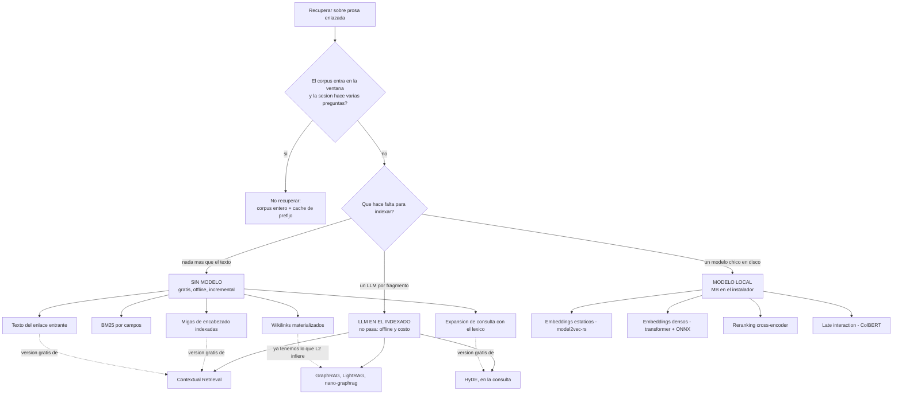

# Memoria documental para IA — el estado del arte, contra nuestro caso

**Investigación** · 2026-09-23 · `FUN-L-09` `IA-MCP-MYCELIUM`

Esta nota contrasta [[MCP de Mycelium - plan]] con lo que existe hoy afuera para darle a una
IA memoria sobre **documentación** —prosa, notas, un vault de markdown enlazado—. No rehace
el diseño: dice **qué le falta, qué le sobra y qué habría que cambiarle**, y termina con tres
propuestas concretas, cada una con su forma de comprobarse en el arnés de
[[MCP de Mycelium - evaluacion]].

> [!important] El filtro que ordena todo lo demás
> **Documentación, no código.** Casi todo lo que hay publicado está pensado para
> repositorios: AST, símbolos, llamadas, tree-sitter. Ese mundo tiene estructura formal y
> referencias sin ambigüedad; la prosa no. Cuando abajo aparece algo nacido para código, se
> dice **qué parte se traslada y cuál no**, en vez de listarlo como si sirviera igual.
>
> Y el corolario: **no tiene por qué ser un MCP.** Varias de las técnicas que mejor puntúan
> contra nuestras restricciones no son un servidor: son una columna más en el índice, una
> convención de escritura o directamente no recuperar nada.

> [!info] La vara
> `docs/` de este repo: **93 notas, 1,16 MB, 1.291 secciones, 1.517 wikilinks**. El vault
> personal del usuario: **1.220 notas, 5,60 MB, 6.199 secciones**. Mediana de sección: 556 B
> acá, 392 B allá. Línea base de hoy: `grep -ril "enlaces" docs` → 35 archivos = **694 KB
> ≈ 173.000 tokens** si se leen enteros. Restricciones que no se negocian
> ([[MCP de Mycelium - encuadre]] § 4): **local y sin conexión**, sin telemetría, Windows de
> escritorio, y velocidad y tokens **medibles**.

---

## 1. El mapa del espacio de soluciones

**Lo que el diagrama dice de un vistazo, y es la tesis de esta nota**: la columna de la
izquierda —la gratuita— ya contiene **versiones baratas** de casi todo lo que hay en la
columna cara. No porque sean equivalentes, sino porque en un vault de wikilinks el humano ya
escribió a mano lo que las técnicas caras van a inferir con un LLM.

---

## 2. La tabla comparativa

Leerla con el encuadre puesto: una técnica que necesita red, GPU o un LLM por fragmento
**no entra**, por buena que sea. La columna «sin conexión» es la primera eliminatoria.

| Técnica | Qué problema resuelve | ¿Prosa o solo código? | ¿Sin conexión? | Costo de construcción | Costo por consulta | Madurez |
|---|---|---|---|---|---|---|
| **BM25 por campos** (FTS5, MiniSearch) | Desajuste **léxico** cero; ranking base | Prosa | Sí | Un parseo por nota | µs–ms | Muy alta. Es lo que usa [Omnisearch](https://github.com/scambier/obsidian-omnisearch), el buscador más usado de Obsidian |
| **Migas de encabezado indexadas** (contextual chunk headers, [AutoContext](https://d-star-ai.github.io/dsRAG/)) | Un fragmento suelto no dice de qué nota es | Prosa | Sí | Cero: ya se calculan al partir | Cero | Alta. Medida solo **en conjunto** con otra técnica (83 % vs 19 % en FinanceBench) |
| **Texto del enlace entrante** (anchor text) | «¿Cuál es *la* nota de X?» — la consulta navegacional | Prosa (en código no hay alias) | Sí | Una columna más en el FTS | Cero | Muy alta como idea IR ([Craswell 2001](https://www.researchgate.net/publication/2518877_Effective_Site_Finding_using_Link_Anchor_Information), [reproducida en 2022](https://downloads.webis.de/publications/papers/froebe_2022a.pdf)); **inédita en herramientas de vault** |
| **Expansión de consulta con léxico propio** | Desajuste de vocabulario, sin modelo | Prosa | Sí | Cero: `enlaces-lexico.json` ya existe | 1–4 subconsultas | Media. Bien establecida; el aporte depende del léxico |
| **[Contextual Retrieval](https://www.anthropic.com/news/contextual-retrieval)** (Anthropic) | El fragmento pierde el contexto del documento | Prosa (nació ahí) | **No**: un LLM por fragmento | **$1,02 / M tokens** de documento, y se rehace al editar | Cero | Alta y **con medición publicada** |
| **Embeddings densos** (transformer + ONNX) | Desajuste de vocabulario y paráfrasis | Prosa | Sí, pero hay que empaquetar runtime + modelo | Minutos; se rehace por nota | ms | Muy alta |
| **Embeddings estáticos** ([model2vec-rs](https://github.com/MinishLab/model2vec-rs)) | Lo mismo, sin runtime ni GPU | Prosa | **Sí, en Rust puro** | ~8.000 textos/s, 1 hilo | µs | Media (215 ★, activo). [Multilingüe](https://huggingface.co/minishlab/potion-multilingual-128M): 90,86 % de LaBSE |
| **Híbrido léxico + denso** (RRF) | Cubre lo que cada uno pierde | Prosa | Sí (si el denso entra) | Los dos índices | ms | Muy alta. +7,4 % NDCG sobre el mejor de los dos en WANDS |
| **Reranking cross-encoder** | Ordenar bien un top-50 ya recuperado | Prosa | Sí, con modelo local | Cero (no indexa) | **100–300 ms** por 50 candidatos en CPU; modelo de 90 MB | Muy alta. En contextual retrieval sube el corte de fallos del 49 % al **67 %** |
| **Late interaction** (ColBERT, PLAID) | Precisión a nivel de token | Prosa | En teoría | Un vector **por token** | ms | Alta en la academia; índice **2–4×** el de un vector único ([ColBERTv2](https://arxiv.org/pdf/2112.01488)) |
| **[GraphRAG](https://arxiv.org/html/2410.05779v1)** (Microsoft) | **Inferir** entidades, relaciones y comunidades de texto plano | Prosa | **No**: LLM por fragmento + por comunidad | ~2.791 tokens y **5 llamadas** por fragmento; ~40 K tokens/documento en modo global | 610.000 tokens por consulta (medido en el corpus Legal) | Alta, muy citada |
| **[LightRAG](https://arxiv.org/html/2410.05779v1) / [nano-graphrag](https://github.com/gusye1234/nano-graphrag)** | Lo mismo, más barato e incremental | Prosa | **No**: sigue necesitando un LLM | ~1.269 tokens y **1 llamada** por fragmento (~8–10 K tokens/documento) | <100 tokens, 1 llamada | Media-alta; nano-graphrag son ~1.100 líneas |
| **Grafo escrito a mano** (wikilinks materializados) | Las mismas preguntas que GraphRAG… | Prosa **y** código, pero solo donde hay wikilinks | Sí | ~17 sentencias por nota | Una búsqueda por índice | Alta en el mundo Obsidian; es lo que ya decide el plan |
| **Corpus entero en contexto + caché** | Todo: recall = 1 por construcción | Ambos | Sí (el corpus; el modelo es remoto igual) | **Cero** | Ver § 5 | Alta; [Anthropic lo recomienda por debajo de 200 K tokens](https://www.anthropic.com/news/contextual-retrieval) |
| **[Memory tool](https://platform.claude.com/docs/en/agents-and-tools/tool-use/memory-tool) / archivos de memoria** | Que el agente **escriba** lo que aprende | Ambos | Depende del anfitrión | Cero | Cero | Alta, pero es **otro problema** (§ 6) |
| **Compactación / context editing** | Que la sesión larga no reviente | Ambos | Sí | Cero | Ahorro reportado del 84 % | Alta |
| **tree-sitter / AST** (graphify) | Símbolos y llamadas **sin ambigüedad** | **Solo código** | Sí | Rápido | Cero | Alta — y no aplica (§ 4.3) |
| **Convenciones de escritura** (MOC, notas atómicas, títulos-clave, frontmatter) | Que el corpus sea recuperable de entrada | Prosa | Sí | Disciplina humana | Cero | Consenso práctico, **sin medición publicada** (§ 8) |

---

## 3. Lo que va directo a nuestro problema

### 3.1 Contextual Retrieval: el número, y por qué igual no entra

El [trabajo de Anthropic](https://www.anthropic.com/news/contextual-retrieval) es el que más
se parece a nuestro caso, porque ataca exactamente el daño de trocear: un fragmento arrancado
de su documento pierde de qué habla. Prefijando cada trozo con 50–100 tokens de contexto
generados por un LLM, la tasa de fallo de recuperación en el top-20 cae de **5,7 % a 3,7 %**
solo con embeddings contextuales, a **2,9 %** sumando BM25 contextual, y a **1,9 %** con
*reranking*. Costo declarado: **$1,02 por millón de tokens de documento**, una vez, con
Claude 3 Haiku y caché de prefijo.

> [!danger] No pasa la restricción 1, y el motivo no es el precio
> Para `docs/` el costo único sería de unos **30 centavos** — irrelevante. Lo que lo
> descalifica es que **hay que rehacerlo cada vez que se edita una nota**, con red y con un
> modelo remoto. Mycelium se vende como una app que funciona sin conexión sobre una carpeta
> de disco; un índice que solo se puede actualizar online convierte «escribí una nota» en
> «pagá una llamada a la API o quedate con el índice viejo». Y el peor resultado posible
> para una memoria es responder con confianza sobre un índice desactualizado.

**Lo que sí se traslada, y es lo importante**: los dos ingredientes que el trabajo prueba que
importan —*de qué documento es este trozo* y *qué lugar ocupa dentro de él*— **ya están
escritos en un vault de markdown**, gratis: los da la jerarquía de encabezados. Es lo que
[dsRAG](https://d-star-ai.github.io/dsRAG/) llama *contextual chunk headers*, y el plan ya lo
tiene decidido (`ruta_encabezados`, § 4 de [[MCP de Mycelium - memoria]]) — aunque, como se
ve en § 9.1, no queda claro si se **indexa** o solo se **muestra**.

Y hay un segundo ingrediente que el vault también tiene escrito y que el plan **no indexa**:
el texto de los enlaces entrantes. Eso es la propuesta 1.

### 3.2 Anchor text: lo mejor que encontró esta investigación

En recuperación web clásica, el **texto del enlace entrante** es una de las señales más
antiguas y mejor medidas. Craswell, Hawking y Robertson (SIGIR 2001,
[resumen](https://www.researchgate.net/publication/2518877_Effective_Site_Finding_using_Link_Anchor_Information))
midieron que rankear por texto de enlace era **el doble de efectivo** que rankear por el
contenido del documento para encontrar la página principal de un sitio. Se
[revisó en 2010](https://dl.acm.org/doi/10.1145/1835449.1835472) y se
[reprodujo en la era neuronal en 2022](https://downloads.webis.de/publications/papers/froebe_2022a.pdf),
con el mismo matiz: sigue siendo especialmente útil en **consultas navegacionales** —«llevame
a *la* página de X»—.

> [!success] En un vault, casi toda consulta es navegacional
> «¿Dónde está lo del versionado?», «¿cuál era la nota de los dos escritores?». No se busca
> un pasaje: se busca **la nota canónica de un tema**. Y el vault tiene anchor text de
> calidad excepcional: **1.517 wikilinks en 93 notas**, escritos a mano por dos autores que
> saben de qué hablan, con alias que son literalmente *cómo se llama a esa idea en ese
> contexto*.
>
> Dicho de otro modo: **Anthropic paga $1,02 por millón de tokens para que un LLM escriba
> el contexto de cada fragmento; en este vault el contexto ya lo escribió el autor, una vez
> por cada enlace que tipeó.**

El plan guarda `alias` en `ENLACES` y lo **devuelve** en `vault_vecinos`, pero
`SECCIONES_FTS` solo tiene `titulo_nota`, `encabezados` y `cuerpo`. El vocabulario de los
enlaces entrantes **no participa del ranking**. Es la mayor oportunidad barata que quedó sobre
la mesa.

---

## 4. Grafos de conocimiento sobre texto: resuelven un problema que no tenemos

### 4.1 Qué hacen en realidad

GraphRAG, LightRAG y nano-graphrag hacen todos lo mismo en el fondo: **pasan un LLM por cada
fragmento de texto plano para inventar un grafo que nadie escribió** —entidades, relaciones,
y en GraphRAG además comunidades con Leiden y un resumen por comunidad—. La recuperación
después recorre ese grafo.

Los costos, del [paper de LightRAG](https://arxiv.org/html/2410.05779v1) § 4.5 y de
comparativas posteriores:

| | Indexado | Actualización incremental | Recuperación |
|---|---|---|---|
| **GraphRAG** | ~2.791 tokens y **5 llamadas** por fragmento; ~40 K tokens por documento en modo global | Reconstruye las comunidades: ~1.399 × 2 × 5.000 tokens | **610.000 tokens** por consulta (610 comunidades × 1.000) |
| **LightRAG** | ~1.269 tokens y **1 llamada** por fragmento (~8–10 K tokens/documento) | Integra sin reconstruir | <100 tokens, 1 llamada |

Contra nuestro corpus: indexar `docs/` con LightRAG serían del orden de **0,9 M tokens de
llamadas a un LLM**; el vault personal, **12 M**. Con red. Cada vez que cambia una nota se
paga de nuevo la parte que cambió — y con GraphRAG, además, la reconstrucción global de
comunidades.

### 4.2 El veredicto, que es más fuerte que «no pasa la restricción»

> [!important] Están resolviendo el problema de **inferir** el grafo. Nosotros no lo tenemos.
> El vault **ya es** un grafo de conocimiento, escrito a mano, con aristas que un humano
> decidió a propósito: 1.517 en 93 notas. Es más limpio que cualquiera que un LLM infiera
> —no tiene entidades duplicadas, ni relaciones alucinadas, ni el problema de resolución de
> entidades que se come la mitad del esfuerzo de GraphRAG— y se mantiene solo, porque se
> actualiza cuando el autor escribe.
>
> Aplicar GraphRAG a un vault de wikilinks es pagar un LLM para adivinar lo que está escrito
> en el archivo. La decisión del plan —**materializar las aristas que ya existen y resolverlas
> por join**— no es una versión pobre de GraphRAG: es la versión correcta del problema.

**Lo único que sí valdría la pena mirar de ahí** es la detección de comunidades (Leiden) como
señal de ranking, porque opera sobre el grafo **ya construido** y no necesita LLM. El plan ya
la tiene en fase 2 y condicionada a que `pop` demuestre que la señal de grafo aporta
([[MCP de Mycelium - memoria]] § 6). **Esa condición está bien puesta**: no hay evidencia
publicada de que las comunidades ayuden en un grafo de 93 nodos, y a esa escala una comunidad
es «casi todo el vault».

### 4.3 Lo que graphify aporta y lo que no

[[MCP de Mycelium - encuadre]] estudió graphify. Vale separar:

- **Se traslada**: extracción determinista sin LLM; aristas con **confianza** (`EXTRACTED` /
  `INFERRED` / `AMBIGUOUS`); re-extracción incremental; empujar al agente a usar la
  herramienta con hooks. El plan ya tomó las tres primeras —la marca `ambiguo: true` es
  exactamente la idea de confianza en su versión barata—.
- **No se traslada**: tree-sitter y todo lo que cuelga de él. Un AST da referencias **sin
  ambigüedad** porque el lenguaje tiene gramática; un `[[Título]]` resuelve por coincidencia
  de nombre y puede ser ambiguo, roto o estar dentro de un bloque de código. El plan ya
  detectó las dos trampas (§ 3.1 y § 5 de [[MCP de Mycelium - plan]]); lo que hay que tener
  claro es que **no existe el equivalente a tree-sitter para prosa** y que por eso el parser
  de wikilinks es código propio con casos borde propios, no una dependencia.

---

## 5. Meter el corpus entero en el contexto: el número, hecho

Esta es la opción que el plan no consideró y que había que numerar. Con caché de prefijo, una
lectura cuesta **0,1× el precio de entrada** y una escritura **1,25×** (TTL de 5 minutos)
([docs](https://platform.claude.com/docs/en/build-with-claude/prompt-caching)).

`docs/` = 1,16 MB ≈ **290.000 tokens** a 4 B/token (un **piso**: el español acentuado tokeniza
peor). Entra cómodo en una ventana de 1 M.

| Camino | Tokens al contexto | Costo por consulta, Haiku 4.5 ($1/MTok) | Sonnet 5 ($2) | Opus 5 ($5) |
|---|---|---|---|---|
| `grep` + leer candidatas (hoy) | 173.000, sin caché | **$0,173** | $0,346 | $0,865 |
| **Corpus entero, primera consulta** (escritura de caché) | 290.000 | **$0,363** | $0,725 | $1,813 |
| **Corpus entero, consultas siguientes** (lectura de caché) | 290.000 | **$0,029** | $0,058 | $0,145 |
| MCP según el plan (~1.500 tokens) | ~1.500 | **$0,0015** | $0,003 | $0,0075 |

> [!success] El hallazgo que sí toca el plan
> A partir de la **tercera pregunta de una misma sesión**, tener el vault entero en caché es
> ~**6× más barato en dólares** que el `grep` de hoy **y tiene recall perfecto por
> construcción**. No es una idea marginal: para `docs/` es una línea base legítima que el MCP
> tiene que superar, y hoy la evaluación no la mide.

**Y por qué igual no reemplaza al plan**, con tres razones de peso distinto:

1. **No escala a los vaults reales.** El vault personal son 5,60 MB ≈ **1,4 M tokens**:
   excede la ventana de 1 M de todos los modelos actuales. Mycelium se entrega a usuarios con
   vaults arbitrarios; un diseño que funciona hasta ~4 MB y después falla por completo no es
   un producto. Anthropic mismo
   [pone el umbral en 200.000 tokens](https://www.anthropic.com/news/contextual-retrieval)
   —`docs/` ya está **por encima**—.
2. **Context rot.** El informe [Context Rot de Chroma](https://www.trychroma.com/research/context-rot)
   probó 18 modelos de frontera y **todos** empeoran a medida que crece la entrada, con caída
   fuerte cuando la pregunta exige **coincidencia semántica** y no léxica — que es justo
   nuestro caso difícil. Recall perfecto **no es** acierto perfecto, y la métrica principal de
   la evaluación es **acierto citado**.
3. **Sigue siendo el modelo remoto.** El vault no sale de la máquina en el diseño del MCP;
   en este camino **el vault entero viaja a la API en cada sesión nueva**. No rompe la
   restricción 1 tal como está escrita (Claude Code ya es remoto), pero cambia de manera
   sustancial qué se manda, y merece ser una decisión explícita y no un efecto lateral.

> [!warning] El arnés, tal como está, penaliza estructuralmente esta opción — dos veces
> **Una**: «una corrida = una pregunta, una sesión nueva» ([[MCP de Mycelium - evaluacion]]
> § 7) hace que este camino pague **siempre** la escritura de caché y **nunca** cobre la
> amortización que es su única ventaja.
> **Dos**: la regla pre-registrada usa `T` = razón de `tokens_recuperacion`. Este brazo daría
> `T = 290.000 / 173.000 = 1,68 > 1` y sería **rechazado por la regla** mientras cuesta **6×
> menos en dólares**. La propia nota de evaluación dice que `total_cost_usd` «ya pesa el
> caché» y que `tokens_recuperacion` no. **La métrica de eficiencia y la de costo se
> contradicen en cuanto entra el caché**, y hoy eso no está resuelto.

---

## 6. Memoria de agentes: es otro problema, y conviene no mezclarlos

La [memory tool de Claude](https://platform.claude.com/docs/en/agents-and-tools/tool-use/memory-tool)
(un directorio `/memories` que el agente crea, lee y edita con seis comandos, ejecutados del
lado del cliente), los archivos de memoria de los CLI (`CLAUDE.md`, skills), y la
**compactación** / *context editing* resuelven **que el agente no repita trabajo dentro y
entre sesiones**. Anthropic reporta un ahorro de tokens del ~84 % en flujos largos combinando
memoria con context editing.

**Qué de eso aplica a un corpus que el usuario también edita a mano**, que es nuestra
diferencia esencial:

| Pieza | ¿Aplica acá? |
|---|---|
| Directorio de memoria que el agente escribe | **Ya lo tenemos, y mejor**: el vault entero. Con la ventaja de que el usuario lo lee y lo corrige, y la desventaja de que puede cambiar debajo del agente |
| Recuperación *just-in-time* (leer la memoria cuando hace falta, no toda al empezar) | **Sí, y es la misma idea** que `vault_buscar` → `vault_leer`. Convergente con la recuperación progresiva de engram |
| Context editing / compactación | **Sí, pero es ortogonal**: no cambia qué se recupera, cambia cuánto sobrevive. No pertenece al MCP |
| Que el agente **escriba** memoria por herramienta | **No**, y el plan hace bien en dejar la mitad de memoria en solo lectura: el agente ya escribe notas con sus herramientas de archivos, y una herramienta de escritura acá reintroduce el problema de los dos escritores |

> [!important] Lo que ninguna herramienta de memoria de agente resuelve y nosotros sí tenemos
> **El corpus tiene un segundo autor humano.** Toda la familia de *agent memory* asume que el
> único que escribe es el agente, y por eso puede guardar índices derivados con confianza. Acá
> el usuario edita en la app mientras el agente consulta. Es exactamente lo que fuerza la
> **revalidación perezosa** del plan ([[MCP de Mycelium - memoria]] § 9) y lo que hace que
> «leer el texto del archivo, no del índice» sea correcto y no una precaución exagerada. Esa
> decisión del plan **no tiene equivalente en el estado del arte** porque el estado del arte
> no tiene el problema.

---

## 7. El vecindario: qué hacen las herramientas de Obsidian/markdown

| Herramienta | Troceado | Enlaces | Costo | Qué se aprende |
|---|---|---|---|---|
| [Omnisearch](https://github.com/scambier/obsidian-omnisearch) (el buscador más usado del ecosistema) | Nota entera | No los usa | Cero, todo local | **BM25 con pesos por campo: nombre de archivo, encabezados, cuerpo.** Es, campo por campo, el `-bm25(secciones_fts, 0, W_tit, W_enc, 1.0)` del plan. Convergencia independiente |
| [Smart Connections](https://github.com/msdanyg/smart-connections-mcp) + su MCP | **Por encabezado** (bloque) | No | Modelo local de ~25 MB vía transformers.js; embeddings ya calculados por el plugin | Confirma dos cosas del plan: **la sección es la unidad correcta** en markdown, y un modelo de embeddings de vault cabe en decenas de MB, no cientos |
| [vault-mcp](https://github.com/cxrobx/vault-mcp) | Por nota | No | Ollama local + SQLite FTS5 | **Híbrido FTS5/BM25 + vectores locales**, sin costo de API. Es la forma que tendría nuestra fase 2 si los embeddings entraran |
| [basic-memory](https://github.com/basicmachines-co/basic-memory) | Por entidad/observación | **Sí**: `[[WikiLinks]]` como relaciones tipadas | SQLite reconstruible | **El markdown es la verdad, SQLite es un caché reconstruible.** Misma decisión que el plan, tomada por otro y por los mismos motivos. Además tipa las relaciones (`- relation_type [[Target]]`), cosa que nuestro vault **no** hace |

> [!tip] Lo que el vecindario dice del plan
> Nadie en este vecindario **indexa el texto de los enlaces entrantes**. Todos guardan las
> aristas para navegar el grafo y ninguno las usa como **señal de ranking**. Si la propuesta 1
> funciona, sería lo único de este diseño que no existe ya afuera.
>
> Y hay un contraste que conviene registrar: basic-memory **tipa** sus relaciones. Nuestro
> vault tiene aristas sin tipo. Tiparlas sería un cambio de convención de escritura, no de
> software — y encarecería escribir. No lo recomiendo, pero conviene saber que la diferencia
> existe y que es la razón por la que `vault_vecinos` no puede contestar «¿qué notas
> *contradicen* a esta?».

---

## 8. Convenciones de escritura: lo más barato, y lo peor medido

MOCs, notas atómicas, títulos que funcionan como clave de búsqueda, frontmatter consistente.
Es lo que más recomienda la comunidad de PKM y lo que **nunca** aparece en un comparativo de
RAG, porque no es software.

**Honestidad primero: no encontré medición publicada de ninguna de estas convenciones.** Lo
que sí hay es su equivalente en recuperación de información, y ahí sí hay evidencia:

| Convención del vault | Su nombre en IR | Evidencia |
|---|---|---|
| **Título específico y único** por nota | Campo de título con peso alto | Estándar; es el campo más discriminante en todo buscador de documentos |
| **Enlazar con alias** (`[[destino\|cómo lo llamo acá]]`) | **Anchor text / expansión de documento** | Fuerte (§ 3.2) |
| **Notas mapa (MOC)** | *Hub* / página de entrada; la señal `pop` del plan | Indirecta: es lo que PageRank y el anchor text premian |
| **Una idea por nota** | Granularidad de la unidad recuperada | Indirecta, pero alineada con toda la literatura de *chunking* — y en este vault **medida**: la sección divide el costo de lectura por 14 |
| **Frontmatter consistente** | Filtrado por facetas | Estándar; el plan ya lo tiene (`propiedades`, `tags`) |

> [!success] La conclusión que no cuesta nada
> **La regla dura nº 1 del vault —títulos únicos y específicos— y la nº 3 —nada huérfano— no
> son higiene documental: son las dos decisiones de recuperación de mayor impacto por unidad
> de esfuerzo que hay en todo este informe.** Un vault que las respeta se recupera bien con
> BM25 y nada más. Un vault que no las respeta no se arregla con embeddings.
>
> Esto sí tiene una consecuencia práctica para el producto: `vault_salud` —que detecta títulos
> duplicados, huérfanas y enlaces rotos— no es un accesorio de diagnóstico. **Es la
> herramienta que mantiene en forma el corpus del que depende todo lo demás.** El plan la pone
> en la v1; esto refuerza esa decisión.

---

## 9. Evidencia contra promesa

Regla de lectura para todo lo de arriba:

| Nivel | Qué hay | Cuáles |
|---|---|---|
| **Medición publicada y reproducible** | Paper o informe con corpus, método y números | Contextual Retrieval (5,7 → 1,9 %), LightRAG vs GraphRAG (§ 4.1), ColBERTv2, anchor text (Craswell 2001 y su reproducción 2022), Context Rot (18 modelos) |
| **Benchmark propio del autor** | El número existe pero lo publicó quien vende la técnica, sin réplica independiente | dsRAG (83 % vs 19 % en FinanceBench, **y con AutoContext y RSE medidos juntos**: no se sabe cuánto aporta cada uno); late chunking; las cifras de híbrido (+7,4 % NDCG en WANDS) |
| **Promesa de README** | Afirmación sin medición | Casi todos los MCP de Obsidian, incluidos los de la § 7. Ninguno publica un *benchmark* de recuperación. **Se citan por su arquitectura, no por sus resultados** |
| **Medición de blog, sin réplica** | Un número suelto, útil como orden de magnitud | Los 100–300 ms de CPU para rerankear 50 candidatos; los ~90 MB del cross-encoder MiniLM |

> [!warning] El sesgo del que hay que cuidarse acá
> Lo más citado de este campo —GraphRAG, ColBERT, RAG denso— se midió sobre corpus de
> **millones de pasajes**, donde BM25 empieza a perder precisión porque demasiados documentos
> comparten vocabulario. `docs/` tiene **1.291 secciones**. No hay ninguna evidencia publicada
> de que esas técnicas aporten a esta escala, y sí hay razones estructurales para pensar que no:
> el problema de BM25 aparece con la ambigüedad de vocabulario a gran escala, y este vault
> tiene vocabulario controlado, dos autores y un tesauro escrito (`enlaces-lexico.json`).

---

## 10. Las tres cosas que le cambiaría al plan

### Propuesta 1 · Indexar el texto de los enlaces entrantes

**Qué.** Agregar a `SECCIONES_FTS` una cuarta columna —`enlaces_entrantes`, peso medio-alto—
con, para cada nota, la concatenación de los **alias** y la **frase alrededor** de cada enlace
que le apunta. Se llena con un `SELECT` sobre la tabla `ENLACES` que el plan ya construye.

**Qué gana.** Es *contextual retrieval* sin LLM y sin red: el contexto de cada nota lo
escribieron los autores, uno por enlace. Ataca exactamente el **desajuste de vocabulario** que
[[MCP de Mycelium - memoria]] § 10 admite como el punto débil de no llevar embeddings, y lo
ataca en la clase de consulta dominante en un vault —la navegacional—, que es donde el anchor
text tiene su evidencia más fuerte (§ 3.2). Material disponible: **1.517 enlaces en 93 notas**.

**Qué cuesta.** Una columna más en el FTS (~10 % del índice, est.) y —esto es lo caro— **rompe
la localidad del reindexado incremental**: si se materializa el texto entrante en la fila de la
nota destino, editar A obliga a tocar las filas de todas las notas a las que A apunta. Eso
contradice la propiedad más valiosa de § 5 del plan («escribir una nota toca solo las filas de
esa nota»). **Hay salida**: una tabla `ENLACES_FTS` **aparte**, indexada por `destino_norm`,
que se consulta en paralelo y se funde por `nota_id`. Así editar A sigue tocando solo las filas
de A, y el costo se paga en la consulta (una subconsulta más) y no en la escritura. Esa variante
es la que recomiendo.

**Cómo se comprueba.** Es una señal más, así que entra por la puerta que el plan ya dejó
abierta: se calcula como quinta señal, se registra en peso cero y se calibra **offline** sobre
las corridas ya ejecutadas. No hace falta una tanda nueva. La pregunta concreta que contesta:
**en las preguntas donde el brazo C falla, ¿la nota correcta habría subido al top-10 si el
vocabulario de sus enlaces entrantes hubiera contado?** Se responde releyendo los registros.

---

### Propuesta 2 · Un cuarto brazo: el corpus entero en contexto

**Qué.** Agregar al arnés un **brazo D**: la misma pregunta, sin herramientas de archivo, con
`docs/` completo pegado en el prompt y cacheado. ~40 líneas en el planificador.

**Qué gana.** Tres cosas, y ninguna es opcional:

1. **Un techo de recall.** El brazo D tiene la respuesta en el contexto **siempre**. Lo que
   falle ahí no falló por recuperación: falló por lectura. Eso convierte «el MCP perdió» en
   dos diagnósticos distintos, que es lo que más falta en el diseño actual.
2. **Mide context rot en *nuestro* corpus**, en vez de suponerlo (§ 5).
3. **Puede ganar**, y hay que saberlo. Si para `docs/` el brazo D empata en acierto citado y
   cuesta 6× menos que el `grep` de hoy, el argumento del MCP se reduce a «el vault personal
   no entra en la ventana» — que sigue siendo un argumento válido, pero es **otro** argumento,
   y merece decirse en voz alta antes de construir.

**Qué cuesta.** Dólares de corrida (~$0,36 por corrida en Haiku, ~$38 en una tanda de 21 × 5
si se corre siempre en frío) y **una decisión metodológica**: el protocolo de sesión nueva por pregunta
es el peor caso para este brazo (§ 5). La salida honesta es correrlo **de las dos maneras** —en
frío y en una sesión con el caché ya caliente— y reportar las dos, porque las dos corresponden
a usos reales.

**Cómo se comprueba.** Es en sí mismo una medición. Pero arrastra una corrección obligatoria a
la § 9 de [[MCP de Mycelium - evaluacion]]: **la regla pre-registrada tiene que pasar de `T` =
razón de tokens a razón de costo**, o declarar las dos con umbrales distintos. Tal como está
escrita hoy, rechazaría por `T > 1` un brazo seis veces más barato.

---

### Propuesta 3 · Hacer medible la decisión sobre embeddings, que hoy no lo es

**El problema, y es un hueco real entre dos notas hermanas.** [[MCP de Mycelium - memoria]]
§ 10 pre-registra el disparador de los embeddings así: entran si el arnés mide **recall@10 por
debajo de 0,80** en «la clase de preguntas *con las palabras del usuario, no las del vault*».
Pero [[MCP de Mycelium - evaluacion]] **no puede producir ese número**, por dos motivos
independientes:

1. **Esa clase no existe.** Las siete son C1…C7 y ninguna es de desajuste de vocabulario. La
   § 8 de esa nota *induce* desajuste en todas (regla de «máximo dos palabras de contenido
   compartidas con el título»), pero eso lo reparte — no lo aísla, y por lo tanto no da una
   celda que leer.
2. **`recall@10` no es una métrica del arnés.** El arnés puntúa la **respuesta final** del
   agente (acierto citado, precisión y exhaustividad de citas), no la **lista ordenada de
   candidatos** del recuperador. Y las claves traen `notas_clave` —títulos de nota—, no
   secciones, así que ni siquiera hay etiqueta de relevancia a nivel de sección para calcular
   recall@k.

**O sea: la decisión más cara del diseño está pre-registrada contra un número que el arnés,
tal como está especificado, nunca va a producir.** Se descubriría el día que haya que decidir.

**Qué cambiar**, en tres piezas chicas:

- **Una clase C8 · desajuste de vocabulario**, con tres preguntas redactadas a propósito con
  términos que **no aparecen** en la nota objetivo. Sube el conjunto de 21 a 24.
- **Que `vault_buscar` registre su lista ordenada** —las 10 `ref` con sus cuatro señales, que
  ya calcula— en la transcripción de cada corrida. Es una línea de log y habilita `recall@k`
  y la calibración offline de pesos **sobre las mismas corridas**, sin repetir nada.
- **Que las claves traigan `secciones_clave`** además de `notas_clave`. Es el trabajo caro
  (se escribe a mano) pero solo para las preguntas de C8.

**Y el número real que hoy falta en la § 10 de memoria.** El tercer requisito escrito allí
—«un modelo con calidad aceptable en español que sume menos de ~40 MB al instalador»— está
apuntando al artefacto equivocado. La opción realista de 2026 no es un transformer con ONNX:
es una **tabla de consulta estática**, [model2vec-rs](https://github.com/MinishLab/model2vec-rs),
**crate de Rust puro, sin runtime, sin GPU, ~8.000 textos/s en un hilo** — o sea, encaja en el
stack que el plan ya eligió. Sus tamaños reales, verificados en el repositorio de pesos:

| Modelo | Pesos f32 | Estimado int8 | Cobertura |
|---|---|---|---|
| [potion-multilingual-128M](https://huggingface.co/minishlab/potion-multilingual-128M) | **488,6 MB** + 17,8 MB de tokenizador | **~122 MB** + tokenizador | 101 idiomas; 90,86 % del rendimiento de LaBSE |
| potion-retrieval-32M | 129,2 MB | ~32 MB | Solo inglés — **no sirve acá** |

**La conclusión honesta: el umbral de 40 MB no se cumple** —la opción multilingüe real son
~140 MB con tokenizador, 3,5× el precio que draw.io fijó como techo aceptable—. Pero el umbral
está mal planteado, porque supone que el modelo viaja **en el instalador**. Un modelo estático
es un archivo inerte: puede ser una **descarga opcional** desde Configuración, y entonces la
restricción de «local y sin conexión» se respeta igual (se descarga una vez, se usa siempre
offline) y el instalador no crece ni un byte. **La recomendación no es agregar embeddings: es
reescribir el criterio para que mida lo que de verdad decide** —«¿el usuario acepta una
descarga opcional de ~140 MB?», no «¿el modelo pesa menos de 40 MB?»— y dejar el disparador
colgando de C8, que es lo que la propuesta hace medible.

---

## 11. El veredicto, sin adornos

> [!success] El plan es, en lo esencial, correcto — y esa es una conclusión, no una cortesía
> **FTS5 por sección + aristas materializadas + previews progresivos** es la arquitectura
> adecuada para 1.291 secciones en una máquina sin GPU y sin red. El estado del arte no tiene
> nada mejor para este caso, y donde parece tenerlo es porque está resolviendo otro problema:
>
> - **GraphRAG y familia** infieren un grafo. El nuestro está escrito. Aplicarlos es pagar un
>   LLM para adivinar el contenido de un archivo.
> - **Contextual Retrieval** paga un LLM para escribir el contexto de cada fragmento. En
>   markdown ese contexto son los encabezados, y son gratis.
> - **Embeddings, reranking y late interaction** atacan la ambigüedad de vocabulario a escala
>   de millones de pasajes. Acá hay mil, con vocabulario controlado y un tesauro escrito.
> - **La memoria de agentes** asume un solo autor. El nuestro tiene dos, y esa diferencia es
>   la que justifica la revalidación perezosa — una decisión del plan que **no tiene
>   equivalente afuera porque afuera no tienen el problema**.
>
> Que [Omnisearch](https://github.com/scambier/obsidian-omnisearch) —el buscador más usado del
> ecosistema— haya llegado por su cuenta a BM25 con pesos por título, encabezados y cuerpo, y
> que [basic-memory](https://github.com/basicmachines-co/basic-memory) haya llegado por su
> cuenta a «markdown es la verdad, SQLite es un caché reconstruible», es convergencia
> independiente sobre las dos decisiones centrales del plan.

Lo que el estado del arte **sí** aporta son las tres cosas de la § 10, y conviene ver que las
tres son del mismo tipo: **ninguna agrega un componente; las tres hacen que el plan mida algo
que hoy no mide.** Anchor text es una señal más en un ranking que ya está diseñado para
calibrarse; el corpus completo es un brazo más en un arnés que ya tiene tres; C8 es una clase
más en un conjunto que ya tiene siete. Ninguna cuesta una fase.

## 12. Lo que queda sin resolver

1. **El aporte de las migas está sin aislar.** El único número publicado de *contextual chunk
   headers* (dsRAG, 83 % vs 19 %) midió AutoContext y RSE **juntos**. No sé cuánto aporta
   indexar las migas por separado — y no lo sabe nadie, por lo que encontré.
2. **No sé si `SECCIONES_FTS.encabezados` del plan es el encabezado propio o toda la cadena de
   ancestros.** Si es lo primero, indexar la cadena completa es la versión gratis de contextual
   retrieval y es más barata que la propuesta 1. Es una pregunta de una línea para quien
   escribió esa nota.
3. **No encontré ninguna medición de recuperación sobre un vault de wikilinks.** Todos los
   comparativos usan corpus de documentos sin enlaces. El grafo escrito a mano es, en la
   literatura, un caso que no existe — lo cual significa que si el arnés produce ese número,
   **será dato nuevo**, y vale la pena decirlo así.
4. **No verifiqué la calidad en español** de potion-multilingual más allá del agregado de MTEB
   (90,86 % de LaBSE sobre 101 idiomas). Antes de pagar 140 MB habría que medirlo en el vault.
5. **Queda abierto si el brazo D debería usar el vault personal recortado** para tener un caso
   donde el corpus completo no entra. Probablemente sí, pero es trabajo de diseño del arnés.

## Relacionadas

- [[MCP de Mycelium - plan]] — el diseño que esta nota contrasta.
- [[MCP de Mycelium - memoria]] — el ranking, el troceado y la decisión sobre embeddings que
  las propuestas 1 y 3 tocan.
- [[MCP de Mycelium - evaluacion]] — el arnés donde se comprueban las tres propuestas.
- [[MCP de Mycelium - encuadre]] — las restricciones que actúan de eliminatoria.
- [[MCP de Mycelium - control]] — la otra mitad; esta nota no la toca.
- [[Mycelium como memoria de la IA]] — la decisión de producto de la que sale todo.
- [[Capa de datos del desktop]] — el índice de hoy.
- [[Rendimiento del grafo]] — el costo actual de contestar «quién apunta acá».
- [[ia-framework-vault]] — las convenciones de escritura de la § 8, ya instaladas en el vault.
- [[BACKLOG]] — `FUN-L-09`.
- [[Mapa de documentacion]] — índice general.
