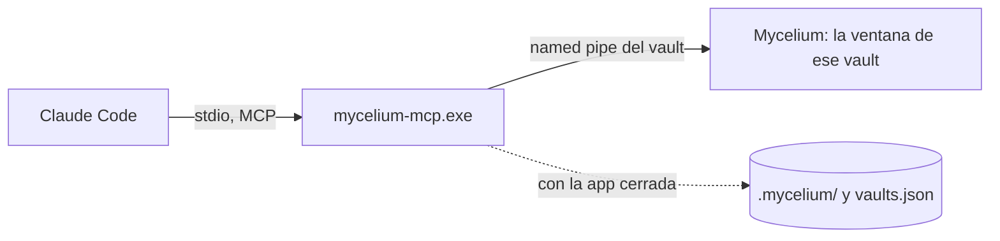
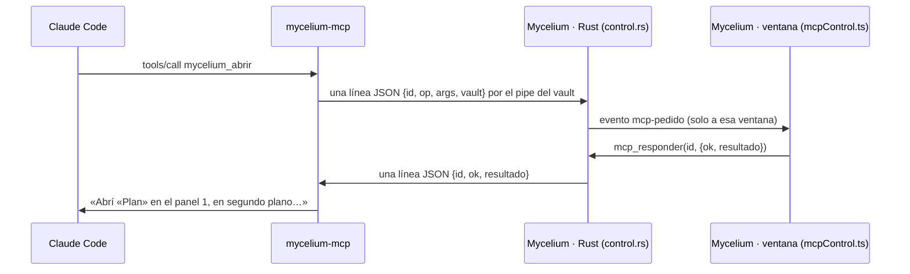

# MCP de control de Mycelium (`FUN-L-09`)

**Solo desktop** · decidido el 2026-10-01 · sale de [[MCP de Mycelium - control]] (el diseño de
septiembre) recortado por [[Skill o MCP, segun quien sabe hacerlo]]

Un servidor MCP que deja a la IA del vault (Claude Code) **operar Mycelium** en lo que no puede
hacer escribiendo archivos: mostrar algo en pantalla, saber qué está abierto, renombrar sin
romper enlaces, usar la papelera, **modificar el calendario** y el **diccionario del vault**.

> [!important] Sin búsqueda
> La mitad de memoria del MCP (`vault_buscar`, `vault_leer`, su índice propio) se evaluó en dos
> vaults y **no entra**: no le ganó a `grep` en exactitud ([[MCP de Mycelium - tesina, protocolo]]
> § 9). Su código queda en la historia de `feat/mcp-desktop` (`4d7830b`). Este servidor no
> indexa nada.

## 1. Qué hay y qué no

| Herramienta | Parte | Qué hace | ¿App abierta? | ¿Pregunta? |
|---|---|---|---|---|
| `mycelium_estado` | 1 | Si hay ventana, qué vault, si el control está encendido, **qué está mirando el usuario**: pestañas por panel, la activa, las que tienen **cambios sin guardar** | No: con la app cerrada responde `app: "cerrada"` | No |
| `mycelium_abrir` | 1 | Abre una nota o archivo, **el grafo** o **el calendario** en una pestaña; opcionalmente salta a un encabezado, una línea o un texto, y la revela en el explorador. Los dibujos y lienzos abren encuadrados | Sí | No |
| `mycelium_recordatorios` | 2 | Las **ocurrencias** entre dos fechas, calculadas por la misma lógica que la app (`lib/recordatorios.ts`): título, fecha, hora, color, si se repite, si está completada | Sí | No |
| `mycelium_recordatorio_crear` | 2 | Crea un recordatorio; la app lo **agenda y lo muestra** al instante | Sí | No |
| `mycelium_recordatorio_editar` | 2 | Cambia campos de uno existente | Sí | No |
| `mycelium_recordatorio_completar` | 2 | Marca (o desmarca) una ocurrencia como completada | Sí | No |
| `mycelium_recordatorio_borrar` | 2 | Borra un recordatorio | Sí | No: queda **Deshacer** en el registro de actividad |
| `mycelium_renombrar` | 3 | Renombra una nota o carpeta **reparando los enlaces entrantes**, con el mismo código que usa la app al renombrar desde el explorador o el título | Sí | Solo si reescribe enlaces en **más de 5 notas** |
| `mycelium_mover` | 3 | Mueve una nota o carpeta a otra carpeta, con la misma reparación | Sí | Igual que renombrar |
| `mycelium_borrar` | 3 | Manda una nota o carpeta a la **papelera de Mycelium** | Sí | Nota: no (hay Deshacer). **Carpeta: sí** |
| `mycelium_papelera` | 3 | Lista la papelera y **restaura** de ella | Sí | No |
| `mycelium_diccionario` | 4 | Lista, agrega y quita palabras del **diccionario del vault** (`.mycelium/diccionario.txt`); el corrector abierto se entera | Sí | No |

**No entran**, a propósito (detalle en [[MCP de Mycelium - control]] § 1.2): borrado
permanente, preferencias, `.mycignore`, cambiar o abrir vaults, la terminal, exportar, editar el
contenido de una nota (lo hace escribiendo el archivo). Y del diseño de septiembre se caen:
`mycelium_crear` (lo cubren las skills y las Esporas), `mycelium_sincronizar` (no hay índice
propio que esperar) y `mycelium_cerrar` (poco valor). `mycelium_capturar` —devolver una imagen de
cómo se ve un dibujo— queda como candidata, **a medir** antes de construirla.

## 2. Las piezas

- **El servidor** (`frontend/src-tauri/crates/mycelium-mcp`): un binario aparte, hablado por
  stdio. Resuelve su vault (`MYCELIUM_VAULT` o el cwd) contra el registro de la app
  (`vaults.json`, con la comparación canónica `misma_ruta`) y le habla a la ventana de ese
  vault por un *named pipe*. **No** guarda estado ni indexa.
- **La escucha en la app** (Rust, en `src-tauri`): cada ventana con el control encendido abre
  un pipe para **su** vault. Recibe un pedido, lo pasa al frontend de esa ventana (evento
  Tauri), espera la respuesta y la devuelve. La lógica de cada operación vive en el frontend,
  **donde ya existe** (`tabsStore`, `lib/recordatorios.ts` + `recordatoriosStore`, la papelera
  de `lib/db/papelera`, el renombrado con reparación, el corrector): el MCP no duplica reglas.
- **El binario se instala con la app** como *sidecar* de Tauri (`bundle.externalBin`), así que
  no puede quedar de otra versión. La app conoce su ruta.

### 2.1 El canal

- **Nombre**: `\\.\pipe\mycelium-<hash>`, con `<hash>` = `hashRuta` de la ruta canónica del
  vault (los primeros 8 bytes del SHA-256 en hex: la misma función que nombra
  `index-<hash>.db`). En Unix, un socket con ese nombre en el directorio de datos de la app.
- **Solo el usuario actual** puede conectarse (descriptor de seguridad del pipe). No es un
  puerto: un navegador no lo alcanza. Límite, dicho sin adornos: cualquier proceso del mismo
  usuario puede hablarle — es la misma confianza que ya tiene para escribir el vault.
- **Formato**: JSON por línea. Pedido `{"id", "op", "args"}`; respuesta `{"id", "ok": true,
  "resultado"}` o `{"id", "ok": false, "error": {"codigo", "mensaje", "datos"}}`.
- **Dos ventanas con el mismo vault** no pasan: la app ya enfoca la existente ([[ventanas-multiples]]).

### 2.2 El interruptor

**Configuración → Vault → «Asistente IA (Claude Code)»**, junto al generador del framework: «Dejar
que la IA controle Mycelium». **Por vault** (`.mycelium/preferencias.json`,
[[preferencias-por-vault]]) y **apagado por defecto**. Encender o apagar abre o cierra el pipe en
caliente, sin reiniciar nada.

> [!warning] Lo que apaga, y lo que no
> Apaga **el canal de control**: con él en «no», ningún proceso puede pedirle a Mycelium que
> abra, renombre, borre o agende nada. **No** le impide a Claude Code leer o escribir los
> archivos del vault: eso lo hace con sus herramientas, como siempre. No se vende como ahorro:
> la escucha de un pipe no consume nada medible.

### 2.3 El registro de actividad

Un ítem en el **rail** que abre un panel con **lo que hizo la IA**: operación, momento, **efecto**
(«renombró *X* → *Y*, reescribió 7 enlaces»), ir a lo afectado, **Deshacer** donde aplique, lo
rechazado y lo que falló, y el **estado del canal** (encendido, conectado, apagado) con el botón
para encenderlo. Se guarda en `.mycelium/actividad.jsonl`, *append-only*, con tope. **Entra con la
primera herramienta que escribe** (Parte 2): es lo que permite que lo reversible no pregunte.

## 3. El contrato de las herramientas

Nombres **en español** (`mycelium_*`), como el resto del vault. Cada respuesta es texto para la
IA, corto, y dice **el efecto, no el eco**: al renombrar, cuántas notas se reescribieron y
cuáles; al borrar, con qué entrada se restaura; al abrir, en qué panel quedó y qué pestañas hay.

### 3.1 Errores

| Código | Cuándo | Qué trae |
|---|---|---|
| `APP_CERRADA` | Nadie escucha en el pipe | Qué sí se puede hacer sin ventana (`mycelium_estado`; leer el calendario con la skill) |
| `MCP_DESACTIVADO` | La app está abierta pero el control está apagado en ese vault | **Dónde** se enciende |
| `VAULT_DESCONOCIDO` | El servidor no pudo resolver su vault | Los vaults registrados |
| `NO_ENCONTRADO` | El objetivo no existe | Las candidatas más parecidas por título, con su ruta |
| `AMBIGUO` | Dos notas con ese título | Las rutas; se repite con la ruta |
| `CAMBIOS_SIN_GUARDAR` | La operación tocaría una pestaña con borrador | Qué pestaña |
| `OCUPADA` | La app está abriendo el vault o indexando | La etapa y `reintentar_en_ms` |
| `RECHAZADO` | El usuario dijo que no a la confirmación | — |
| `INVALIDO` | Argumentos que no cumplen el formato (fecha, color, nombre con `? : * \| " < >`) | Qué campo y por qué |

Un error **nunca** deja al servidor esperando: si la ventana no contesta en 10 s, `OCUPADA`.

### 3.2 Por herramienta

- **`mycelium_estado()`** → `app` (`"abierta"`/`"cerrada"`), `vault` (ruta y nombre),
  `control` (`"encendido"`/`"apagado"`), y con la app abierta `pestanas` por panel (título,
  ruta, tipo, activa, **sin_guardar**). Con la app cerrada, lo que se sabe del disco.
- **`mycelium_abrir({objetivo, ir_a?, revelar?, foco?})`** — `objetivo`: ruta, título, `"grafo"`
  o `"calendario"`. `ir_a`: `{encabezado}`, `{linea}` o `{texto}` (solo notas). `foco` por
  defecto **false**: abre la pestaña sin robarle el foco a lo que el usuario esté escribiendo.
- **`mycelium_recordatorios({desde, hasta})`** — fechas `YYYY-MM-DD`; tope de 366 días.
- **`mycelium_recordatorio_crear({titulo, fecha, hora?, repeticion?, color?, detalle?})`** —
  los campos y valores de `lib/recordatorios.ts` ([[calendario-recordatorios]] § 2): `hora`
  `HH:MM` o ausente (todo el día); `repeticion` `ninguna`, `dia`, `semana`, `mes` o `anio`;
  `color` **por nombre** de la paleta (`Hifa`, `Musgo`, `Liquen`, `Yesca`, `Amanita`, `Coral`,
  `Espora`, `Bruma`), por defecto el primero. `vigenteDesde` lo fija la app, como al crearlo
  desde el formulario. Devuelve el `id` y la próxima ocurrencia.
- **`mycelium_recordatorio_editar({id, ...campos})`**, **`_completar({id, fecha, completado?})`**
  (la ocurrencia de esa fecha), **`_borrar({id})`**.
- **`mycelium_renombrar({objetivo, nombre})`** / **`mycelium_mover({objetivo, carpeta})`** →
  ruta nueva y enlaces reescritos (hasta 10, con el total).
- **`mycelium_borrar({objetivo})`** → la entrada de papelera y las pestañas que se cerraron.
- **`mycelium_papelera({accion: "listar" | "restaurar", id?})`**.
- **`mycelium_diccionario({accion: "listar" | "agregar" | "quitar", palabras?})`**.

## 4. Lo que aprende la IA (framework `1.7.0`)

El framework **sigue en `1.7.0`**: esa versión todavía no se publicó (la 2.2.0 salió con la
`1.6.0`), y un release lleva un solo incremento ([[Versionado del sistema]]). Cada parte agrega lo
suyo a los templates de `lib/ia/framework.ts`:

- **`.mcp.json`** en la raíz del vault con el servidor (la ruta del binario instalado y
  `MYCELIUM_VAULT`). Se escribe al generar el framework **si el control está encendido**; empieza
  con punto, así que la app no lo muestra.
- En **`CLAUDE.md`**, una sección «Operar Mycelium» con las herramientas y **la línea divisoria**:
  el contenido se lee y escribe en los archivos; mostrar, renombrar, mover, borrar, el calendario
  y el diccionario pasan por Mycelium. La regla dura 2 cambia: **para renombrar o mover, usá la
  herramienta**; `mv` solo si el MCP no está, y entonces los enlaces los arreglás vos.
- **`mycelium-calendario`**: para leer, **preferí `mycelium_recordatorios`**; si no está, el
  script. Para modificar, **solo** las herramientas del MCP; si no están, decilo y no toques el
  archivo.
- Un **hook `PreToolUse`** en `.claude/settings.json` que, dentro del vault, frena `mv` y `rm`
  sobre notas y recuerda la herramienta que corresponde (Parte 3).

## 5. Las partes

Una rama y un merge por parte, **en serie** (tocan los mismos archivos). El usuario prueba cada
una en la app.

| Parte | Rama | Entra | Se prueba |
|---|---|---|---|
| **0. Base** | `feat/mcp-base-desktop` | Esta spec y la decisión; la documentación y el arnés de evaluación de `feat/mcp-desktop`; el servidor **sin la memoria** (protocolo, resolución del vault, sonda) | Tests verdes; nada visible |
| **1. Canal y mostrar** | `feat/mcp-canal-desktop` | El pipe en la app y en el servidor, el interruptor, el sidecar, `mycelium_estado`, `mycelium_abrir`, `.mcp.json` y la sección de `CLAUDE.md` | «Abrime tal nota», «mostrame el calendario», «¿qué tengo abierto?» |
| **2. Calendario** | `feat/mcp-calendario-desktop` | Las cinco herramientas del calendario, el **registro de actividad** en el rail, la skill del calendario | «Recordame X el viernes a las 10», y que aparezca y avise |
| **3. Archivos** | `feat/mcp-archivos-desktop` | Renombrar, mover, borrar, papelera, la confirmación por alcance, el hook de `mv`/`rm` | Renombrar una nota enlazada y ver los enlaces intactos |
| **4. Diccionario** | `feat/mcp-diccionario-desktop` | `mycelium_diccionario` | «Agregá al diccionario los términos de esta nota» |

## Cómo quedó — Parte 1 (canal y mostrar, 2026-10-01)

Rama `feat/mcp-canal-desktop`. Entra el canal en las dos puntas, el interruptor, el
sidecar, `mycelium_estado`, `mycelium_abrir`, el `.mcp.json` y la sección «Operar
Mycelium» del `CLAUDE.md` generado.

### Dónde está cada cosa

| Pieza | Archivo |
|---|---|
| Lo que comparten las dos puntas: nombre del canal, forma de pedidos y respuestas, códigos de error, plazos | `src-tauri/crates/mycelium-vault/src/canal.rs` |
| Si el control está encendido, leído del disco | `src-tauri/crates/mycelium-vault/src/preferencias.rs` |
| La escucha en la app: pipe con descriptor de seguridad, puente al frontend, comandos | `src-tauri/src/control.rs` |
| El cliente del pipe en el servidor, con plazos | `src-tauri/crates/mycelium-mcp/src/canal.rs` |
| Las dos herramientas: esquema, validación y redacción de las respuestas | `src-tauri/crates/mycelium-mcp/src/herramientas.rs` |
| Las operaciones en la app (`estado`, `abrir`), el interruptor y el `.mcp.json` | `frontend/lib/mcpControl.ts` |
| La lógica pura: resolver el objetivo, el salto, las candidatas | `frontend/lib/mcpControlLogica.ts` |
| Fusionar y quitar nuestra entrada del `.mcp.json` | `frontend/lib/ia/mcpJson.ts` |
| El interruptor | `components/settings/VaultSection.tsx` (preferencia `controlIa` de `stores/prefsVaultStore.ts`) |
| El sidecar | `bundle.externalBin` en `tauri.conf.json` · `scripts/preparar-mcp.mjs` · `src-tauri/build.rs` |
| Pruebas | `cargo test -p mycelium-vault -p mycelium-mcp` (incluye `tests/punta_a_punta.rs`) · `cargo test --lib control` · `node --test scripts/test-mcp-control.mjs` |

### Cómo viaja un pedido

### Decisiones

- **El nombre del canal se calcula en las dos puntas con la misma función**
  (`nombre_canal`, en el crate compartido) y sobre **la cadena registrada** en
  `vaults.json`: la app resuelve su ruta contra el registro antes de hashearla, igual
  que el servidor. Si una hasheara otra escritura de la misma carpeta, nunca se
  encontrarían.
- **Un pedido por conexión** del lado del servidor (la app acepta varios por
  conexión): atiende una llamada a la vez y reconectar cuesta microsegundos.
- **Un pedido a la vez por ventana** del lado de la app (un `Mutex` por escucha): un
  agente que abre seis notas en paralelo no deja el `tabsStore` en un estado que nadie
  diseñó.
- **Plazos**: la app contesta `OCUPADA` si su ventana no responde en 10 s; el servidor
  corta a los 13 s por si la app misma no contesta. La lectura del pipe en Windows no
  admite plazo, así que se hace en un hilo: si vence, el hilo queda colgado hasta que la
  app conteste o cierre (caso raro, documentado en `canal.rs`). Mientras el vault se
  abre, `OCUPADA` trae la etapa de la pantalla de carga y `reintentar_en_ms`.
- **`APP_CERRADA` vs `MCP_DESACTIVADO`**: con el control apagado no hay pipe, así que
  «nadie escucha» no distingue los dos casos. Los distingue la preferencia del disco
  (`controlIa`): encendida → la app está cerrada; apagada → el control está apagado, y
  el mensaje dice dónde se enciende. `mycelium_estado` no falla en ninguno de los dos:
  informa `app: cerrada` o `app: sin canal · control: apagado`.
- **El pedido declara su vault** y la app lo compara (`misma_ruta`): protege de un pipe
  viejo o de un cliente apuntado a otro vault. El frontend vuelve a comparar antes de
  atender, y Rust emite el evento con `emit_to` a la etiqueta de la ventana.
- **`AMBIGUO` donde un enlace elegiría**: el título se resuelve con las reglas de los
  wikilinks (`candidatosWikilinkEnIndice`, que se separó de `resolveWikilinkEnIndice`
  sin cambiar lo que resuelve un enlace), pero con dos candidatas se contesta con las
  rutas en vez de elegir la más cercana a la raíz.
- **`NO_ENCONTRADO` con candidatas** por parecido de título (distancia de edición sin
  tildes ni mayúsculas, más contener o estar contenido), hasta cinco.
- **`grafo` y `calendario` son palabras reservadas**: una nota que se llame así se abre
  por su ruta (`grafo.md`). También se aceptan los archivos que no se indexan (PDF,
  imágenes) por su ruta, y `Nota#Sección` como en un enlace.
- **`ir_a` se resuelve contra el archivo antes de abrir**: un encabezado que no existe es
  `NO_ENCONTRADO` con la lista de encabezados, y no se abre la pestaña para nada.
  Encabezado y texto se convierten en una **línea**, que el editor recibe por el mismo
  mecanismo que la búsqueda global (`lib/editor/pendingMatch.ts`, que ahora acepta
  `{ linea }`). La app **no tenía** salto a `[[nota#encabezado]]`: esto es nuevo.
- **El foco**: con `foco: false` (el defecto) la pestaña se abre con
  `openNoteBackground` y, si la nota ya estaba a la vista, **no se le mueve el cursor al
  usuario**: el salto queda pendiente para cuando la mire, o se avisa que no se hizo.
  Con `foco: true` se activa y se pone en la URL, como un clic (la URL es la fuente de
  navegación: el workspace registra su `router.replace` con `registrarNavegadorMcp`).
- **`revelar`**: la app no tenía «revelar en el explorador»; se hace lo mínimo —abrir el
  panel del explorador y desplegar las carpetas de la nota—.
- **`sin_guardar`** sale del estado de guardado por nota (`syncStore`: `local`,
  `syncing` o `error`), el mismo que pinta el punto de la pestaña. Los dibujos solo pasan
  por `syncing`, así que casi nunca figuran sin guardar.
- **El `.mcp.json` se fusiona**: se agrega o reemplaza solo `mcpServers.mycelium`,
  conservando el orden y las demás claves; un archivo que no es JSON no se toca y se
  dice. Al apagar se quita solo esa entrada, y el archivo se borra únicamente si quedó
  vacío **y** lo había creado Mycelium (`mcpJsonCreado` en las preferencias). Al abrir
  un vault con el control encendido se refresca la ruta del binario (cambia entre la app
  instalada y la de desarrollo). La entrada es `command` + `args: []` +
  `env.MYCELIUM_VAULT`.
- **Sidecar**: `bundle.externalBin: ["binaries/mycelium-mcp"]`. `npm run preparar-mcp`
  compila el servidor (release; con `--dev`, debug) y lo copia a
  `src-tauri/binaries/mycelium-mcp-<target-triple>.exe` (fuera de git); corre solo en
  `beforeBuildCommand` y `beforeDevCommand`. Como `tauri-build` exige el archivo hasta
  para un `cargo check`, `build.rs` lo suple en debug (con el binario ya compilado, o un
  marcador vacío que la app reconoce y no ofrece) y en release **corta** con la
  instrucción: un instalador con un MCP vacío sería peor que no compilar. La ruta la da
  `mcp_ruta_binario`: junto al ejecutable, instalado y en desarrollo.
- **Seguridad del pipe**: DACL explícito y protegido (`D:P(A;;GA;;;<SID del usuario>)`),
  `PIPE_REJECT_REMOTE_CLIENTS` y `first_pipe_instance` en la primera instancia (si otro
  proceso ya tiene el nombre, la app no lo comparte). Un test crea el pipe, entra como el
  usuario y comprueba que no admite otra «primera» instancia. **El límite**: cualquier
  proceso del mismo usuario puede hablarle; es la misma confianza que ya tiene para
  escribir el vault. No hay *token* (el de [[MCP de Mycelium - control]] § 3.4 no entró
  en este recorte).
- **El framework sigue en `1.7.0`** (sin publicar): «Operar Mycelium» es una tabla
  `Querés… | Herramienta` para que las partes 2–4 agreguen filas ([[ia-framework-vault]]).

### Cómo probarlo en la app

1. `cd frontend && npx tauri dev` (corre solo `npm run preparar-mcp -- --dev`) y abrir
   Mycelium con un vault.
2. Configuración → Vault → «Asistente IA (Claude Code)» → encender **«Dejar que la IA
   controle Mycelium»**. Aparece el aviso «Control encendido…» y, en la raíz del vault,
   un `.mcp.json` con `mcpServers.mycelium` apuntando a `target\debug\mycelium-mcp.exe`
   (o al `mycelium-mcp.exe` junto a `Mycelium.exe`, en la instalada). Si ya había un
   `.mcp.json` con otros servidores, siguen ahí.
3. Regenerar las instrucciones IA desde el mismo bloque: el `CLAUDE.md` trae «Operar
   Mycelium».
4. Abrir una sesión **nueva** de Claude Code en el vault (la terminal integrada sirve) y
   aprobar el servidor `mycelium` cuando lo pregunte. `/mcp` lo muestra conectado, con
   dos herramientas.
5. «¿Qué tengo abierto?» → lista las pestañas por panel, la visible y las que tienen
   cambios sin guardar (escribí algo en una nota y preguntá enseguida).
6. «Abrime la nota X» → se abre **en segundo plano**: aparece la pestaña, no cambia la
   que estás mirando. «Mostrame X ahora» o «llevame al encabezado Y de X» → la activa y
   el cursor queda en ese encabezado.
7. «Mostrame el grafo» / «el calendario» → se abren como pestaña.
8. Un título repetido → la IA cuenta que hay dos y con qué rutas; uno mal escrito → te
   ofrece los parecidos.
9. Apagar el interruptor → la IA recibe `MCP_DESACTIVADO` diciendo dónde se enciende, y
   la entrada `mycelium` desaparece del `.mcp.json` (el archivo entero, si lo había
   creado Mycelium). Cerrar Mycelium con el control encendido → `mycelium_estado`
   contesta `app: cerrada`, y `mycelium_abrir`, `APP_CERRADA`.
10. Con dos vaults en dos ventanas, cada sesión de Claude Code opera solo la ventana de
    su vault.

### Límites y lo que queda abierto

- **Sin probar en la app** por quien lo implementó: la verificación fue de tipos, tests
  de Rust (incluida una punta a punta con el binario real contra una app falsa en un pipe
  de verdad) y tests de la lógica en Node. Lo visible lo confirma el usuario con los pasos
  de arriba.
- **Unix**: el socket compila con la misma forma, pero no se probó.
- **Recompilar con una sesión abierta**: en desarrollo el `.mcp.json` apunta a
  `target/debug/mycelium-mcp.exe`; si una sesión de Claude Code lo tiene corriendo,
  Windows no deja reemplazarlo y la compilación falla. Cerrar la sesión antes de
  recompilar.
- **El salto en modo lectura**: como el de la búsqueda global, mueve el cursor del
  editor; con la nota en modo lectura no se ve el desplazamiento.
- El **registro de actividad** (§ 2.3) entra en la Parte 2, con la primera herramienta
  que escribe.

## Cómo quedó — Parte 2 (calendario y registro de actividad, 2026-10-01)

Rama `feat/mcp-calendario-desktop`, desde la integración de las partes 0 y 1. Entran las
cinco herramientas del calendario, el **registro de actividad** en el rail y lo que aprende
la IA (framework sin cambiar de versión: sigue en `1.7.0`).

### Dónde está cada cosa

| Pieza | Archivo |
|---|---|
| Las cinco herramientas: esquema y redacción de las respuestas | `src-tauri/crates/mycelium-mcp/src/herramientas.rs` |
| Validar argumentos, colores por nombre, ocurrencias de un rango, próxima ocurrencia, texto del efecto, qué se guarda para deshacer (puro) | `frontend/lib/mcpCalendarioLogica.ts` |
| Las operaciones sobre `recordatoriosStore` y el Deshacer | `frontend/lib/mcpCalendario.ts` |
| Lo que se agregó al modelo del calendario: `fijarCompletada`, `ocurrenciasDe`, `restaurarRecordatorio`, `normalizarTitulo` | `frontend/lib/recordatorios.ts` · `stores/recordatoriosStore.ts` (`fijarCompletada`, `restaurar`) |
| El registro: formato del renglón, lectura tolerante, tope, cruce de los deshacer, qué se registra, estado del canal (puro) | `frontend/lib/actividadIa.ts` |
| El registro: estado, persistencia y estado del canal | `frontend/stores/actividadIaStore.ts` (lo carga y vacía `vaultSessionStore`) |
| El panel | `components/actividad/ActividadPanel.tsx` + `.module.css`; sección `actividad` en `panelLayoutStore`, `Rail.tsx` y `LeftPanel.tsx` |
| Qué se registra de cada pedido | `contestar` y `registrar` en `lib/mcpControl.ts` |
| `actividad.jsonl` en la lista cerrada | `ESTADOS` de `src-tauri/src/prefs_vault.rs` (con test) |
| Pruebas | `cargo test -p mycelium-vault -p mycelium-mcp` (unitarias del servidor y la punta a punta con un calendario en memoria) · `cargo test --lib prefs_vault` · `node --test scripts/test-mcp-calendario.mjs` (19) · `test-framework-ia.mjs` |

### Decisiones

- **La validación es de la app, no del servidor.** Fechas, horas, colores y repeticiones
  los valida `lib/mcpCalendarioLogica.ts` con las reglas de `lib/recordatorios.ts`; el
  servidor solo comprueba que los argumentos sean un objeto. Así las reglas están una sola
  vez, y lo que falla queda en el registro de actividad. El costo: con Mycelium cerrado, un
  argumento malo contesta `APP_CERRADA`, no `INVALIDO` (no se puede hacer nada igual).
- **El efecto lo redacta la app** («Creé «Revisar conclusiones» para el sábado 3 de octubre
  a las 10:00, color Hifa. Va a avisar.»): es el mismo texto que va al registro. El servidor
  le agrega el id; el listado sí lo arma el servidor, con los datos estructurados.
- **«Va a avisar»** se calcula, no se promete: uno de todo el día para hoy creado hoy no
  avisa hoy (`vigenteDesde`, [[calendario-recordatorios]]) y la respuesta lo dice, igual
  que una fecha que ya pasó.
- **`INVALIDO` siempre con el campo** (`` `fecha`: «2026-02-30» no existe en el
  calendario.``) y en `datos.campo`. Un campo desconocido también es `INVALIDO`: un typo no
  pasa en silencio. `completar` en un día en que el recordatorio no ocurre dice las
  ocurrencias vecinas.
- **`NO_ENCONTRADO` con candidatas por título**, con su id (`Médico — id …`): el agente a
  veces manda el título en vez del id.
- **`OCUPADA` mientras carga el calendario**: los recordatorios se cargan sin esperar al
  abrir el vault, y contestar con un calendario vacío que no es el real sería peor.
- **Archivo dañado**: si `recordatorios.json` no se pudo leer, la app no lo sobrescribe
  (`bloqueado`); las herramientas que escriben contestan `INVALIDO` diciendo que el usuario
  tiene que arreglarlo, en vez de cambiar algo que no se guardaría. No hay un código mejor
  en la lista cerrada del § 3.1.
- **Borrar no pregunta**: deja **Deshacer** en el registro, que restaura con el mismo id y
  el estado de sus ocurrencias. Restaurar fija `vigenteDesde` a ese momento: no avisa lo que
  venció mientras no estaba.
- **Deshacer**: crear → borrar; borrar → restaurar; editar → los valores anteriores (pasa
  por `guardar`, que renueva `vigenteDesde` si cambia cuándo ocurre); completar → el estado
  anterior (sin Deshacer si no cambió nada). No se puede si lo creado ya no existe o lo
  borrado ya volvió: se avisa y no se toca nada.

### El registro de actividad

- **Ítem «Actividad de la IA»** (ícono de robot) en el grupo de arriba del rail, después del
  Calendario. Arriba, el **estado del canal**: *Control apagado* (con **Encender**, que hace
  lo mismo que el interruptor de Configuración, y un botón a Configuración), *Control
  encendido* (esperando a Claude Code), *Conectado* («Claude Code habló hace 2 minutos») o
  *El canal no se abrió* (con el error y **Reintentar**). «Conectado» no es un estado del
  pipe —el servidor abre una conexión por pedido—: es que hubo un pedido en los últimos
  10 minutos.
- **Cada entrada**: la operación, la hora, el efecto, **Ir** (abre la nota, el grafo o el
  calendario en el día del recordatorio, resaltado) y **Deshacer** donde aplica. Lo que
  falló o rechazó el usuario lleva un borde rojo y el código; lo deshecho, borde punteado y
  tachado, sin `opacity` ([[DESIGN_SYSTEM]] § Atenuado).
- **Qué se registra**: todo lo que pasa por el canal **salvo `estado`** (es la primera llamada
  de cada sesión y no cambia nada) y **salvo leer el calendario cuando sale bien** (por lo
  mismo); sus fallos sí. `abrir` se registra sin Deshacer.
- **El archivo** `.mycelium/actividad.jsonl`: un JSON por renglón con `v`, `id`, `momento`
  (ISO, UTC), `op`, `resultado` (`hecho`·`fallo`·`rechazado`), `efecto`, y según el caso
  `codigo`, `objetivo` y `deshacer`. **Append-only en el contenido**: ninguna entrada se
  cambia; deshacer agrega una entrada `deshacer` con `ref` a la original, y al leer se
  cruzan. **Tope de 500 renglones**, recortado al escribir. Se escribe entero y atómico
  por `escribir_estado_vault` (la lista cerrada de `prefs_vault.rs` no tiene un «agregar
  al final», y con 500 renglones no hace falta). Un renglón que no se entiende se ignora.
- **Es de este vault**: se carga al abrirlo y se vacía al salir, como el calendario.

### Cómo probarlo en la app

1. `cd frontend && npx tauri dev`, abrir un vault, y en Configuración → Vault encender
   «Dejar que la IA controle Mycelium» (o desde el panel nuevo: ícono de robot del rail →
   **Encender**). El panel pasa a «Control encendido».
2. Regenerar las instrucciones IA (mismo bloque de Configuración): el `CLAUDE.md` trae las
   cinco herramientas en «Operar Mycelium» y la skill `mycelium-calendario` dice «leer por
   MCP, modificar solo por MCP».
3. Sesión **nueva** de Claude Code en el vault. `/mcp` → `mycelium` con **siete**
   herramientas. Al primer pedido el panel pasa a «Conectado».
4. «Recordame revisar las conclusiones el viernes a las 10, en Coral» → la IA contesta con
   el efecto; el recordatorio aparece en el calendario (pestaña y panel) con ese color, y
   en el registro: «Crear recordatorio» con **Ir** y **Deshacer**. Para ver el aviso, crear
   uno para dentro de dos minutos: tiene que salir la tarjeta (y la notificación de Windows
   con la ventana minimizada).
5. «¿Qué tengo esta semana?» → la IA usa `mycelium_recordatorios` (no el script) y cita
   las ocurrencias con su hora; no aparece en el registro.
6. «Cambialo a las 11» / «marcá como hecho el de hoy» / «borralo» → cada uno en el
   registro con su efecto. **Deshacer** en el borrado → vuelve al calendario con el mismo
   color, y si tenía ocurrencias completadas, completadas. La entrada queda tachada,
   «Deshecho a las …».
7. Errores: «el 30 de febrero» → la IA recibe `INVALIDO` y lo corrige o pregunta; el
   registro lo muestra con borde rojo. Un color que no existe → la lista de la paleta.
8. Apagar el control → el panel muestra «Control apagado» con **Encender**; pedirle a la IA
   que agende algo → contesta que no puede (`MCP_DESACTIVADO`) y **no** escribe
   `.mycelium/recordatorios.json` (comprobar que el archivo no cambió).
9. Cerrar y reabrir el vault: el registro sigue ahí (`.mycelium/actividad.jsonl`). Romper
   un renglón del archivo a mano → los demás siguen apareciendo.

### Límites y lo que queda abierto

- **Sin probar en la app** por quien lo implementó: verificación de tipos, lint, tests de
  Rust (incluida la punta a punta del binario real contra un calendario falso por el pipe)
  y 19 tests de la lógica en Node. Lo visible lo confirma el usuario con los pasos de
  arriba.
- ~~**Deshacer no mira lo que pasó después**~~ — **corregido en la Parte 3**: deshacer una
  edición después de otra edición volvía a los valores de antes de la primera y pisaba la
  segunda. Ahora cada deshacer guarda también cómo lo dejó la operación y solo se aplica si
  sigue así; si no, el botón queda deshabilitado con el motivo («cambió después»). Ver
  «Cómo quedó — Parte 3».
- **«Ir» a una nota renombrada** avisa que ya no existe (el registro guarda la ruta).
- **Abierta**: si el registro debería mostrar también lo que hace el usuario en el
  calendario (hoy solo lo de la IA, como pide § 8.1).

## Cómo quedó — Parte 3 (archivos, confirmación y hook, 2026-10-01)

Rama `feat/mcp-archivos-desktop`, desde la integración de las partes 0–2 (`cef65a3`).
Entran `mycelium_renombrar`, `mycelium_mover`, `mycelium_borrar` y `mycelium_papelera`,
la **confirmación por alcance**, el **hook** de `mv`/`rm` y, en un commit aparte, la
corrección del Deshacer de la Parte 2. El framework sigue en `1.7.0`.

### Dónde está cada cosa

| Pieza | Archivo |
|---|---|
| Las cuatro herramientas: esquema, la espera de una confirmación (`pedir_con_permiso`) y la redacción | `src-tauri/crates/mycelium-mcp/src/herramientas.rs` |
| Los plazos de la confirmación (`ESPERA_CONFIRMACION`, `INTERVALO_CONFIRMACION`) | `src-tauri/crates/mycelium-vault/src/canal.rs` |
| Validar argumentos y nombres, resolver nota o carpeta, el destino, el alcance (`UMBRAL_CONFIRMAR = 5`), la pregunta, el efecto, qué se guarda para deshacer y si todavía se puede, la papelera (puro) | `frontend/lib/mcpArchivosLogica.ts` |
| Las operaciones sobre `vaultStore` y la papelera, el Deshacer | `frontend/lib/mcpArchivos.ts` |
| La reparación de enlaces, **compartida con la UI** | `frontend/lib/repararEnlaces.ts` · `reescribirEnlacesMovidos` en `lib/enlaces.ts` · `retroenlaces` en `lib/db/grafo.ts` · `vaultStore.renameNota/renameCarpeta/moveNota/moveCarpeta` |
| Las confirmaciones de la IA: pedir, consultar, retirar | «Confirmaciones» en `frontend/lib/mcpControl.ts` · `confirmarIa`/`retirarConfirmacion` en `lib/confirmar.ts` · la cola en `stores/confirmarStore.ts` · el rótulo en `components/workspace/DialogoConfirmar.tsx` |
| El Deshacer del registro, para calendario y archivos | `frontend/lib/deshacerIa.ts` · `components/actividad/ActividadPanel.tsx` |
| El hook: el script (fuente de verdad), su fusión con `settings.json`, la instalación | `frontend/scripts/hook-mv-rm.mjs` (viaja como `HOOK_MV_RM` por `scripts/generar-skills-ia.mjs`) · `lib/ia/hookMvRm.ts` · `asegurarHook`/`quitarHook`/`asegurarIntegracion` en `lib/mcpControl.ts` · `mcp_config_borrar` (lista cerrada) en `src-tauri/src/control.rs` · preferencia `settingsCreado` |
| Lo que aprende la IA | Regla dura 2, «Operar Mycelium» y las precauciones de las skills en `lib/ia/framework.ts` |
| Pruebas | `cargo test -p mycelium-vault -p mycelium-mcp` (`tests_archivos` y `los_archivos_de_punta_a_punta`) · `cargo test --lib control` · `node --test scripts/test-mcp-archivos.mjs` (18) · `test-enlaces.mjs` · `test-framework-ia.mjs` · `test-mcp-calendario.mjs` |

### Decisiones

- **El mismo código que la UI, y la UI mejoró de paso.** Renombrar y mover pasan por
  `vaultStore`, y la reparación se separó a `lib/repararEnlaces.ts`. Al hacerlo apareció
  que la app solo reparaba los enlaces **por título** al renombrar una nota: los que
  llevan pista de carpeta (`[[Proyectos/Plan]]`) quedaban rotos al renombrar, al mover y
  al renombrar o mover una carpeta. Ahora se reparan en todos esos casos, también cuando
  los hace el usuario ([[titulo-renombra]] § 6.1). Un enlace por título no se toca al
  mover: sigue resolviendo.
- **Objetivo**: una nota por ruta o título, con la resolución de `mycelium_abrir`
  (`AMBIGUO` con las rutas). Una carpeta por ruta o por nombre si es la única; con `/` al
  final se fuerza carpeta; una nota y una carpeta homónimas son `AMBIGUO`. El grafo, el
  calendario y los archivos que no se indexan (PDF, imágenes) son `INVALIDO`: no tienen
  enlaces que reparar y la papelera de Mycelium es de notas.
- **Nombre**: lo valida `motivoNombreInvalido`, el mismo del título editable (rechaza, no
  corrige). La extensión de la nota escrita en el nombre se quita (`Plan 2026.md` →
  `Plan 2026`). Mismo nombre → `INVALIDO` («ya se llama así»). Destino ocupado (sin
  distinguir mayúsculas) → `INVALIDO` con la ruta: renombrar no pisa ni numera.
- **Mover no crea carpetas**: el destino tiene que existir, o `NO_ENCONTRADO` con las
  parecidas. Crearla sobre la marcha convertiría un typo en una carpeta nueva con la nota
  perdida adentro.
- **`CAMBIOS_SIN_GUARDAR`** si la nota, cualquier nota de la carpeta o cualquiera de las
  que habría que reescribir tiene un borrador (`syncStore`: `local`, `syncing`, `error`).
  Mycelium guarda solo en segundos; la IA espera y repite.
- **El alcance se mide en seco** con el mismo código que repara (`repararEntrantes` con
  `simular`): cuántas notas **cambiarían de verdad**, no cuántas enlazan.
- **Una confirmación de punta a punta.** Una persona tarda más que los 10 s del canal, así
  que la operación **no espera dentro del pedido**: la app muestra la pregunta y contesta
  enseguida `{esperando_confirmacion: {id}}`; el servidor consulta `confirmacion({id})`
  cada 500 ms (cada consulta contesta al instante) y, a los **2 minutos**, pide
  `confirmacion_retirar`: la pregunta sale de la pantalla y cuenta como «no» —`RECHAZADO`,
  «no contestó»—. Para el agente es **una sola llamada**. Alternativas descartadas: un
  plazo más largo del canal para ciertas operaciones (dejaría el turno de la ventana
  tomado mientras el usuario piensa: ni `mycelium_estado` contestaría) o una herramienta
  aparte para consultar (el agente tendría que acordarse de llamarla).
- **La operación confirmada se registra cuando el usuario contesta** (hecha, fallida o
  rechazada), no al preguntar. Al aceptar, la operación **se vuelve a validar** desde cero
  (el vault puede haber cambiado mientras esperaba) pero no vuelve a preguntar.
- **La cola de confirmaciones.** Se comprobó lo que señalaba el diseño: `confirmarStore`
  resolvía con `false` la pregunta pendiente al llegar otra. Ahora es una cola: entre
  preguntas del usuario sigue igual (la nueva reemplaza a la anterior), una de la IA se
  encola **detrás** de las del usuario y nunca las cancela, y si el usuario provoca una
  con la de la IA en pantalla, la suya pasa adelante ([[avisos-y-confirmaciones]]). Sin
  interfaz montada, la IA recibe `RECHAZADO` enseguida: ante la duda, no se hace.
- **Borrar una nota no pregunta**: cierra sus pestañas (y su historial, como el
  explorador), la manda a la papelera y muestra el mismo aviso con **Deshacer** que el
  explorador («Claude Code mandó «X» a la papelera»). **Borrar una carpeta pregunta
  siempre**, con cuántas notas manda a la papelera.
- **Restaurar en su lugar**: si la carpeta de una nota ya no existe (se borró la carpeta
  entera), se **recrea** antes de restaurar; sin eso `recuperarNota` la deja en la raíz.
  El `id` de `mycelium_papelera` es la ruta original de la nota; la ruta de una carpeta
  borrada restaura todas sus notas. Si el lugar está ocupado, `INVALIDO`.
- **Deshacer** (registro de actividad): renombrar → renombrar de vuelta, reparando otra
  vez; mover → mover de vuelta; borrar → restaurar de la papelera (recreando carpetas);
  restaurar una nota → mandarla otra vez a la papelera. Restaurar una carpeta no tiene
  Deshacer. «Ir» abre la nota, despliega la carpeta en el explorador o abre la papelera.
- **El defecto del Deshacer de la Parte 2** (commit aparte). Causa raíz: lo guardado para
  deshacer era solo el estado de **antes**, y `puedeDeshacer` solo miraba que el objeto
  existiera. Ahora cada deshacer guarda **cómo lo dejó** la operación (`despues` en crear
  y editar; lo que fijó un completar; la ruta en que quedó un archivo) y solo se aplica si
  sigue así. Si no, el botón queda **deshabilitado** con «No se puede deshacer: cambió
  después» (también como texto bajo la entrada). Para el calendario se comparan los campos
  que cambia el usuario, no `vigenteDesde`. Los renglones viejos, sin `despues`, se
  deshacen como antes. No lleva `DEF-*`: la Parte 2 no está consolidada.
- **El hook**: `PreToolUse` con `matcher` `Bash|PowerShell` y `node
  "$CLAUDE_PROJECT_DIR/.claude/hooks/mycelium-mv-rm.mjs"`. Si un comando hace `mv`, `rm`,
  `git mv`/`git rm` o sus pares de PowerShell sobre **notas o carpetas del vault**
  (no lo que empieza con punto, ni `node_modules`, ni lo que no se indexa) y el control
  está encendido (lo lee de `preferencias.json` en cada llamada), contesta `deny` con el
  motivo: qué herramienta usar. **No es un bloqueo duro**: si el MCP no está o no
  responde, la IA repite el comando con `MYCELIUM_SIN_MCP=1` delante y pasa —y entonces
  los enlaces los arregla ella—. Un bloqueo sin salida dejaría a la IA sin forma de mover
  nada con la app cerrada.
- **El hook se instala como el `.mcp.json`**: solo con el control encendido (al
  encenderlo, al abrir el vault y al regenerar el framework), y se quita al apagarlo. En
  `.claude/settings.json` se **fusiona**: se agrega o reemplaza solo nuestra entrada
  (reconocida por la ruta del script), sin tocar los permisos ni los hooks del usuario;
  un archivo que no es JSON no se toca y se avisa. El archivo se borra al apagar solo si
  quedó vacío **y** lo había creado Mycelium (`settingsCreado`). El script lleva la marca
  `<!-- mycelium-ia v…` y se reescribe; si en su ruta hay un archivo del usuario, no se
  pisa ni se registra el hook. `mcp_config_borrar` pasó a una **lista cerrada** de tres
  archivos.

### Cómo probarlo en la app

1. `cd frontend && npx tauri dev`, abrir un vault con el control encendido (o encenderlo:
   Configuración → Vault). Comprobar que aparecen `.claude/hooks/mycelium-mv-rm.mjs` y
   `.claude/settings.json` con la entrada `PreToolUse` (si ya había un `settings.json`
   con otras cosas, siguen ahí). Regenerar las instrucciones IA: la regla dura 2 dice
   «Para renombrar o mover, usá la herramienta».
2. Sesión **nueva** de Claude Code en el vault: `/mcp` → `mycelium` con **once**
   herramientas.
3. Una nota `Plan` enlazada desde dos o tres notas (una con `[[Carpeta/Plan]]`):
   «renombrá Plan a Plan 2026» → no pregunta; la respuesta dice en qué notas reparó los
   enlaces; abrirlas: los enlaces andan (también el de pista). En el registro de actividad:
   «Renombrar» con **Ir** y **Deshacer**.
4. **Deshacer** → vuelve a llamarse `Plan` y los enlaces otra vez a `Plan`. Renombrarla a
   mano después de una operación de la IA → el Deshacer de esa entrada queda
   deshabilitado, «cambió después».
5. Una nota enlazada desde **seis o más** notas: «renombrala» → aparece el diálogo
   «Lo pide Claude Code… reescribe enlaces en N notas: …», con el foco en Cancelar.
   **Cancelar** → la IA recibe `RECHAZADO` y no insiste; el registro lo muestra en rojo.
   Repetir y **Renombrar** → se hace. Dejarlo sin contestar 2 minutos → la pregunta
   desaparece y la IA recibe `RECHAZADO` («no contestó»).
6. Con una pregunta de la IA en pantalla, borrar una carpeta desde el explorador → la
   pregunta del usuario pasa adelante; al contestarla, vuelve la de la IA. (Al revés:
   con la del usuario en pantalla, la de la IA espera.)
7. «Mové Plan a Archivo» (carpeta existente) → se mueve, `[[Carpeta/Plan]]` pasa a
   `[[Archivo/Plan]]`. A una carpeta que no existe → `NO_ENCONTRADO` con las parecidas.
8. «Borrá Plan» → se cierra su pestaña, aviso «Claude Code mandó «Plan» a la papelera»
   con Deshacer, y la IA dice con qué id se restaura. «Borrá la carpeta X» → pregunta
   siempre. «¿Qué hay en la papelera?» / «restaurá la carpeta X» → vuelve con sus
   carpetas.
9. Escribir en una nota y, enseguida, pedir que la renombre → `CAMBIOS_SIN_GUARDAR`.
10. Pedirle a la IA que haga `mv` de una nota por terminal → el hook la frena y le dice qué
    herramienta usar. Cerrar Mycelium y pedir lo mismo → las herramientas contestan
    `APP_CERRADA`, la IA repite con `MYCELIUM_SIN_MCP=1 mv …` y arregla los enlaces ella.
11. Apagar el control → desaparece la entrada del hook de `settings.json` (el archivo
    entero si lo había creado Mycelium) y el script.

### Límites y lo que queda abierto

- **Sin probar en la app** por quien lo implementó: tipos, lint, tests de Rust (la punta a
  punta del binario real con un vault falso que acepta una confirmación y rechaza otra, y
  la espera que vence y retira) y tests de Node (lógica pura, la cola de confirmaciones,
  el hook y su fusión). El hook se corrió como proceso con un JSON de Claude Code de
  mentira. Lo visible lo confirma el usuario con los pasos de arriba.
- **El hook depende de `node`** en el `PATH` de la sesión de Claude Code (como los
  validadores de las skills). Sin `node`, el hook falla como «error no bloqueante» y el
  comando pasa. Y su análisis del comando es simple a propósito —no es un shell—: una
  variable o una sustitución (`mv $X …`) no se ve.
- **El contador por sesión** del diseño de septiembre (§ 3.3: pasadas `M` escrituras sin
  intervención, preguntar) **no entró**: el umbral por alcance cubre el caso de un
  renombrado masivo, y el registro deja ver y deshacer lo demás. El umbral (5) y la
  espera (2 min) son fijos, no preferencias.
- **Los lienzos**: una tarjeta de nota de un `.canvas` guarda la ruta del archivo, no un
  `[[enlace]]`; mover la nota no la actualiza (tampoco desde la UI). Igual que antes.
- **Restaurar una carpeta** no tiene Deshacer en el registro, y las subcarpetas vacías de
  una carpeta borrada no vuelven (la papelera guarda notas).

## Cómo quedó — Parte 4 (diccionario del vault, 2026-10-03)

Rama `feat/mcp-diccionario-desktop`, desde la integración de las partes 0–3 (`6f03fe1`).
Entra `mycelium_diccionario` y lo que aprende la IA. El framework sigue en `1.7.0`. Solo el
diccionario **del vault** (`.mycelium/diccionario.txt`); el de Mycelium no se toca.

### Dónde está cada cosa

| Pieza | Archivo |
|---|---|
| La herramienta: esquema y redacción (listado con total; efecto con rechazadas y la palabra parecida) | `src-tauri/crates/mycelium-mcp/src/herramientas.rs` (`herramienta_diccionario`, `redactar_diccionario`) |
| Validar argumentos y el tope, qué se acepta, el efecto contra el archivo, el texto, el Deshacer (puro) | `frontend/lib/mcpDiccionarioLogica.ts` |
| La operación y el Deshacer sobre el corrector | `frontend/lib/mcpDiccionario.ts` |
| Qué es una palabra (la regla de `extraerPalabras` al revés) y la parecida sin tildes ni mayúsculas | `motivoPalabraNoAceptada` y `entradaParecida` en `frontend/lib/ortografia/palabras.ts` |
| Escribir varias de una vez por el camino del menú | `cambiarPalabrasDe` en `frontend/lib/ortografia/corrector.ts` (y `cargandoPersonales`) |
| El Deshacer en el registro | `lib/deshacerIa.ts` · `usePalabrasDelVault` en `components/actividad/ActividadPanel.tsx` · `esDeshacer` y `NOMBRE_OP` en `lib/actividadIa.ts` |
| Lo que aprende la IA | «Operar Mycelium», la regla 8 y la tabla de herramientas en `lib/ia/framework.ts`; la línea de `.mycelium/` en la skill `mycelium-vault` |
| Pruebas | `cargo test -p mycelium-vault -p mycelium-mcp` (`tests_diccionario` y `el_diccionario_de_punta_a_punta`) · `node --test scripts/test-mcp-diccionario.mjs` (12) · `test-framework-ia.mjs` · `test-ortografia.mjs` |

### Decisiones

- **El mismo camino que el clic derecho.** `agregarA`/`quitarDe` se generalizaron a
  `cambiarPalabrasDe(dic, cambiar)`: recibe lo que hay **en el archivo** en ese momento
  (dentro de la cola de escrituras), escribe con el formato de `palabras.ts` y avisa al
  worker, a los editores y a Configuración. El efecto se cuenta contra ese archivo, no contra
  la memoria. Sin cambios no se escribe (vale también para el menú).
- **Qué es una palabra lo decide el corrector**: `motivoPalabraNoAceptada` acepta un texto si
  `extraerPalabras` lo devolvería entero como una sola palabra. Lo que el corrector nunca
  revisa (dígitos, `_`, `camelCase`, una letra) se rechaza con «no hace falta agregarla»; lo
  que parte en varias («Wi-Fi», «dos palabras») dice cómo lo ve el corrector. No hay una
  regla aparte que pueda desalinearse.
- **Al quitar no se valida el formato**, solo que no esté vacía: el archivo puede tener
  entradas escritas a mano que hoy no se aceptarían, y tienen que poder limpiarse. Una que no
  está trae la **parecida** sin tildes ni mayúsculas («mycelium» → «Mycelium»).
- **Tope de 200 por llamada** (`INVALIDO` con `campo: palabras`) y `listar` devuelve hasta
  500 con el total. Las repetidas de un mismo pedido se cuentan una vez. Un campo desconocido
  es `INVALIDO`, como en la Parte 2. La validación es de la app (como las partes 2 y 3): el
  servidor solo exige un objeto.
- **`OCUPADA`** si el corrector está leyendo los diccionarios personales (al arrancar o al
  cambiar de vault) o la ventana no tiene todavía su vault. Al hacerlo apareció una carrera que
  ya existía para el menú: un «Agregar» que terminaba durante esa lectura quedaba tapado en
  memoria por la lectura vieja. Ahora la lectura se repite si cambió `epocaPersonales`. No
  lleva `DEF-*`: no se observó, se encontró leyendo.
- **Con el corrector apagado también anda**: se escribe el archivo y lo toma al encenderse.
  «El corrector abierto se entera» aplica cuando está encendido.
- **Deshacer**: agregar → quitar **las que se agregaron** (no las que ya estaban); quitar →
  volver a agregar las quitadas. Se apaga («cambió después») si alguna de esas ya no está o
  ya volvió; el panel lo sabe leyendo el diccionario (y se suscribe a sus cambios), y la
  escritura lo vuelve a comprobar **dentro de la cola**, contra el archivo: si cambió, no
  escribe nada. `listar` no se registra; sus fallos sí. Sin «Ir»: Configuración no tiene una
  forma de abrirse en una sección.
- **Sin la app**, `APP_CERRADA`/`MCP_DESACTIVADO` como siempre, más que el archivo no se
  escribe a mano y que el usuario puede agregar la palabra con el clic derecho.

### Cómo probarlo en la app

1. `cd frontend && npx tauri dev`, vault con el control encendido y Español descargado y
   activo (Configuración → Editor). Regenerar las instrucciones IA: «Operar Mycelium» trae
   `mycelium_diccionario` y la regla 8 dice que `.mycelium/diccionario.txt` no se escribe a
   mano.
2. Sesión **nueva** de Claude Code: `/mcp` → `mycelium` con **doce** herramientas.
3. Abrir una nota con términos propios subrayados (nombres de proyecto, siglas) y pedir
   «agregá al diccionario los términos de esta nota» → la IA elige los términos (no las
   erratas), la respuesta dice cuántos agregó; **los subrayados desaparecen sin recargar**.
   En Configuración → Editor → «Diccionarios personales», el del vault los lista.
4. «Agregá Wi-Fi y JavaScript» → las rechaza con el motivo. «¿Qué hay en el diccionario?» →
   las lista con el total (no aparece en el registro).
5. Registro de actividad: «Diccionario del vault» con **Deshacer** → las palabras vuelven a
   subrayarse. Quitar una a mano en Configuración después de que la IA la agregó → el
   Deshacer de esa entrada queda deshabilitado, «cambió después».
6. «Quitá mycelium» con «Mycelium» en el diccionario → no la quita y dice cuál estaba.
7. Cerrar Mycelium y pedir que agregue una palabra → `APP_CERRADA`, y la IA **no** escribe
   el archivo.

### Límites y lo que queda abierto

- **Sin probar en la app** por quien lo implementó: tipos, lint, tests de Rust (la punta a
  punta del binario real con un diccionario en memoria, app cerrada y control apagado) y de
  Node (la lógica pura y que la regla coincide con `extraerPalabras`).
- **Una edición a mano** del archivo mientras la app está abierta no la ve el panel hasta
  la próxima escritura (no hay vigilancia del archivo, como antes).
- **Dos ventanas** no aplica: un vault se abre en una sola. El diccionario de Mycelium, que sí
  cruza ventanas, no se toca por MCP.

## Estado al cerrar las cuatro partes (2026-10-03)

Las cuatro partes están integradas en `feat/mcp-control-desktop` (la cuarta, en
`feat/mcp-diccionario-desktop` hasta su merge) y **ninguna está probada por el usuario en la
app**. No están en `desktop-tauri`.

### Las 12 herramientas

| Herramienta | Parte | Pregunta | Deshacer en el registro |
|---|---|---|---|
| `mycelium_estado` | 1 | No | — (no se registra) |
| `mycelium_abrir` | 1 | No | — (se registra) |
| `mycelium_recordatorios` | 2 | No | — (solo sus fallos) |
| `mycelium_recordatorio_crear` | 2 | No | Sí: borrar |
| `mycelium_recordatorio_editar` | 2 | No | Sí: los valores anteriores |
| `mycelium_recordatorio_completar` | 2 | No | Sí, si cambió algo |
| `mycelium_recordatorio_borrar` | 2 | No | Sí: restaurar con el mismo id |
| `mycelium_renombrar` | 3 | Si reescribe enlaces en más de 5 notas | Sí: renombrar de vuelta |
| `mycelium_mover` | 3 | Igual | Sí: mover de vuelta |
| `mycelium_borrar` | 3 | Carpeta, siempre; nota, no | Sí: restaurar |
| `mycelium_papelera` | 3 | No | Restaurar una nota: sí; una carpeta: no; listar no se registra |
| `mycelium_diccionario` | 4 | No | Agregar y quitar: sí; listar no se registra |

Todo Deshacer se apaga, con el motivo, si lo que dejó la operación cambió después.

### Probar el conjunto en un solo recorrido

1. **Arrancar**: `cd frontend && npx tauri dev` (compila el servidor con
   `preparar-mcp -- --dev`). Abrir un vault de prueba con: una nota `Plan` enlazada desde dos
   notas (una con `[[Carpeta/Plan]]`), una nota `Hub` enlazada desde seis o más, una carpeta
   `Archivo`, y Español descargado en Configuración → Editor.
2. **Encender el control**: Configuración → Vault → «Asistente IA (Claude Code)» → «Dejar que
   la IA controle Mycelium». Comprobar en la raíz `.mcp.json` (entrada `mycelium`) y
   `.claude/settings.json` + `.claude/hooks/mycelium-mv-rm.mjs`. El panel del robot en el rail
   dice «Control encendido».
3. **Regenerar el framework** (mismo bloque): el `CLAUDE.md` trae «Operar Mycelium» con las
   doce herramientas, la regla dura 2 («Para renombrar o mover, usá la herramienta») y la 8
   (calendario y diccionario solo por MCP).
4. **Sesión nueva de Claude Code** en el vault (la terminal integrada sirve), aprobar el
   servidor: `/mcp` → `mycelium` conectado con **12** herramientas. El panel pasa a
   «Conectado» con el primer pedido.
5. **Estado y abrir**: «¿qué tengo abierto?» (escribí algo antes en una nota: figura sin
   guardar) → «abrime Plan» (segundo plano, no cambia la pestaña visible) → «llevame al
   encabezado X de Plan» (con foco) → «mostrame el grafo» y «el calendario».
6. **Calendario**: «recordame revisar Plan en dos minutos» → aparece y avisa (tarjeta y
   notificación con la ventana minimizada) → «¿qué tengo esta semana?» (no va al registro) →
   «cambialo a las 11», «marcalo como hecho», «borralo» → **Deshacer** el borrado en el
   registro. «El 30 de febrero» → `INVALIDO` en rojo.
7. **Archivos**: «renombrá Plan a Plan 2026» → no pregunta, los enlaces (también el de
   carpeta) siguen andando; **Deshacer**. «Renombrá Hub» → diálogo de confirmación;
   **Cancelar** → `RECHAZADO`, la IA no insiste; repetir y aceptar. «Mové Plan a Archivo»;
   «borrá Plan» → aviso con Deshacer; «¿qué hay en la papelera?» → «restaurala». «Borrá la
   carpeta Archivo» → pregunta siempre. Pedir un `mv` por terminal → el hook lo frena.
8. **Diccionario**: «agregá al diccionario los términos de esta nota» → se van los
   subrayados sin recargar; «agregá Wi-Fi» → rechazada con el motivo; **Deshacer** → vuelven a
   subrayarse.
9. **Cambió después**: renombrar a mano una nota que renombró la IA → su Deshacer queda
   deshabilitado («cambió después»). Igual con una palabra quitada a mano.
10. **Sin app y apagado**: cerrar Mycelium → `mycelium_estado` dice `app: cerrada`; las demás,
    `APP_CERRADA`, y la IA no escribe `.mycelium/` (ni el calendario ni el diccionario).
    Reabrir, apagar el control → `MCP_DESACTIVADO` con dónde se enciende; desaparecen la
    entrada de `.mcp.json` y el hook (los archivos enteros si los había creado Mycelium).

### Límites y decisiones abiertas (de las cuatro partes)

- **Nada probado en la app** por quien lo implementó: tipos, lint, tests de Rust (con puntas a
  punta del binario real contra apps falsas en un pipe de verdad) y de Node. Lo visible lo
  confirma el usuario con el recorrido de arriba.
- **Unix**: el socket compila con la misma forma, sin probar (Parte 1).
- **Recompilar con una sesión de Claude Code abierta** falla en desarrollo: Windows no deja
  reemplazar `target/debug/mycelium-mcp.exe` mientras corre (Parte 1).
- **El salto en modo lectura** mueve el cursor pero no se ve el desplazamiento (Parte 1).
- **Sin token** en el pipe: cualquier proceso del mismo usuario puede hablarle, la misma
  confianza que para escribir el vault (Parte 1).
- **Con la app cerrada, un argumento malo contesta `APP_CERRADA`**, no `INVALIDO`: la
  validación es de la app (partes 2–4).
- **«Ir» a una nota renombrada** avisa que ya no existe: el registro guarda la ruta (Parte 2).
- **Abierta**: si el registro debería mostrar también lo que hace el usuario (Parte 2).
- **El hook depende de `node`** en el `PATH` de la sesión, y su análisis del comando es simple
  (no ve `mv $X`) (Parte 3).
- **No entró el contador por sesión** del diseño de septiembre; el umbral (5 notas) y la
  espera (2 min) son fijos, no preferencias (Parte 3).
- **Lienzos**: mover una nota no actualiza las tarjetas de un `.canvas` que la apuntan (Parte 3,
  igual que desde la UI).
- **Restaurar una carpeta** no tiene Deshacer y no recrea subcarpetas vacías (Parte 3).
- **El diccionario**: sin «Ir» en el registro, una edición a mano del archivo no se ve hasta la
  próxima escritura, y el de Mycelium queda fuera del MCP (Parte 4).
- **Candidata sin construir**: `mycelium_capturar` (la imagen de un dibujo), a medir antes.

## Relacionadas

- [[Skill o MCP, segun quien sabe hacerlo]] — por qué esto va por MCP y lo demás por skill.
- [[MCP de Mycelium - control]] — el diseño completo de septiembre (canal, seguridad, errores).
- [[calendario-recordatorios]] · [[corrector-ortografico]] · [[ia-skills-herramientas]] ·
  [[ia-framework-vault]].
- [[titulo-renombra]] — la reparación de enlaces que comparten la UI y `mycelium_renombrar`.
- [[avisos-y-confirmaciones]] — la cola de confirmaciones que pide la Parte 3.
