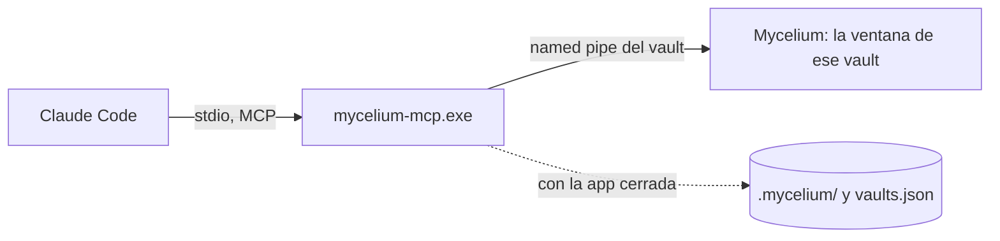
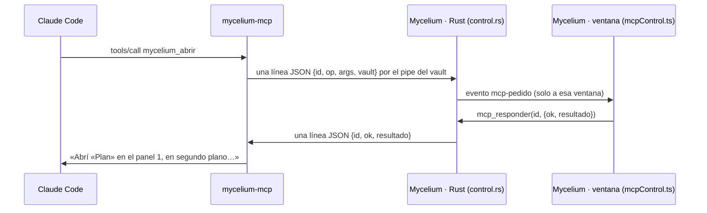

# MCP de control de Mycelium (`FUN-L-09`)

**Solo desktop** · decidido el 2026-10-01 · sale de [[MCP de Mycelium - control]] (el diseño de
septiembre) recortado por [[Skill o MCP, segun quien sabe hacerlo]]

Un servidor MCP que deja a la IA del vault (Claude Code) **operar Mycelium** en lo que no puede
hacer escribiendo archivos: mostrar algo en pantalla, saber qué está abierto, renombrar sin
romper enlaces, usar la papelera, **modificar el calendario** y el **diccionario del vault**.

> [!important] Sin búsqueda
> La mitad de memoria del MCP (`vault_buscar`, `vault_leer`, su índice propio) se evaluó en dos
> vaults y **no entra**: no le ganó a `grep` en exactitud ([[MCP de Mycelium - tesina, protocolo]]
> § 9). Su código queda en la historia de `feat/mcp-desktop` (`4d7830b`). Este servidor no
> indexa nada.

## 1. Qué hay y qué no

| Herramienta | Parte | Qué hace | ¿App abierta? | ¿Pregunta? |
|---|---|---|---|---|
| `mycelium_estado` | 1 | Si hay ventana, qué vault, si el control está encendido, **qué está mirando el usuario**: pestañas por panel, la activa, las que tienen **cambios sin guardar** | No: con la app cerrada responde `app: "cerrada"` | No |
| `mycelium_abrir` | 1 | Abre una nota o archivo, **el grafo** o **el calendario** en una pestaña; opcionalmente salta a un encabezado, una línea o un texto, y la revela en el explorador. Los dibujos y lienzos abren encuadrados | Sí | No |
| `mycelium_recordatorios` | 2 | Las **ocurrencias** entre dos fechas, calculadas por la misma lógica que la app (`lib/recordatorios.ts`): título, fecha, hora, color, si se repite, si está completada | Sí | No |
| `mycelium_recordatorio_crear` | 2 | Crea un recordatorio; la app lo **agenda y lo muestra** al instante | Sí | No |
| `mycelium_recordatorio_editar` | 2 | Cambia campos de uno existente | Sí | No |
| `mycelium_recordatorio_completar` | 2 | Marca (o desmarca) una ocurrencia como completada | Sí | No |
| `mycelium_recordatorio_borrar` | 2 | Borra un recordatorio | Sí | No: queda **Deshacer** en el registro de actividad |
| `mycelium_renombrar` | 3 | Renombra una nota o carpeta **reparando los enlaces entrantes**, con el mismo código que usa la app al renombrar desde el explorador o el título | Sí | Solo si reescribe enlaces en **más de 5 notas** |
| `mycelium_mover` | 3 | Mueve una nota o carpeta a otra carpeta, con la misma reparación | Sí | Igual que renombrar |
| `mycelium_borrar` | 3 | Manda una nota o carpeta a la **papelera de Mycelium** | Sí | Nota: no (hay Deshacer). **Carpeta: sí** |
| `mycelium_papelera` | 3 | Lista la papelera y **restaura** de ella | Sí | No |
| `mycelium_diccionario` | 4 | Lista, agrega y quita palabras del **diccionario del vault** (`.mycelium/diccionario.txt`); el corrector abierto se entera | Sí | No |

**No entran**, a propósito (detalle en [[MCP de Mycelium - control]] § 1.2): borrado
permanente, preferencias, `.mycignore`, cambiar o abrir vaults, la terminal, exportar, editar el
contenido de una nota (lo hace escribiendo el archivo). Y del diseño de septiembre se caen:
`mycelium_crear` (lo cubren las skills y las Esporas), `mycelium_sincronizar` (no hay índice
propio que esperar) y `mycelium_cerrar` (poco valor). `mycelium_capturar` —devolver una imagen de
cómo se ve un dibujo— queda como candidata, **a medir** antes de construirla.

## 2. Las piezas

- **El servidor** (`frontend/src-tauri/crates/mycelium-mcp`): un binario aparte, hablado por
  stdio. Resuelve su vault (`MYCELIUM_VAULT` o el cwd) contra el registro de la app
  (`vaults.json`, con la comparación canónica `misma_ruta`) y le habla a la ventana de ese
  vault por un *named pipe*. **No** guarda estado ni indexa.
- **La escucha en la app** (Rust, en `src-tauri`): cada ventana con el control encendido abre
  un pipe para **su** vault. Recibe un pedido, lo pasa al frontend de esa ventana (evento
  Tauri), espera la respuesta y la devuelve. La lógica de cada operación vive en el frontend,
  **donde ya existe** (`tabsStore`, `lib/recordatorios.ts` + `recordatoriosStore`, la papelera
  de `lib/db/papelera`, el renombrado con reparación, el corrector): el MCP no duplica reglas.
- **El binario se instala con la app** como *sidecar* de Tauri (`bundle.externalBin`), así que
  no puede quedar de otra versión. La app conoce su ruta.

### 2.1 El canal

- **Nombre**: `\\.\pipe\mycelium-<hash>`, con `<hash>` = `hashRuta` de la ruta canónica del
  vault (los primeros 8 bytes del SHA-256 en hex: la misma función que nombra
  `index-<hash>.db`). En Unix, un socket con ese nombre en el directorio de datos de la app.
- **Solo el usuario actual** puede conectarse (descriptor de seguridad del pipe). No es un
  puerto: un navegador no lo alcanza. Límite, dicho sin adornos: cualquier proceso del mismo
  usuario puede hablarle — es la misma confianza que ya tiene para escribir el vault.
- **Formato**: JSON por línea. Pedido `{"id", "op", "args"}`; respuesta `{"id", "ok": true,
  "resultado"}` o `{"id", "ok": false, "error": {"codigo", "mensaje", "datos"}}`.
- **Dos ventanas con el mismo vault** no pasan: la app ya enfoca la existente ([[ventanas-multiples]]).

### 2.2 El interruptor

**Configuración → Vault → «Asistente IA (Claude Code)»**, junto al generador del framework: «Dejar
que la IA controle Mycelium». **Por vault** (`.mycelium/preferencias.json`,
[[preferencias-por-vault]]) y **apagado por defecto**. Encender o apagar abre o cierra el pipe en
caliente, sin reiniciar nada.

> [!warning] Lo que apaga, y lo que no
> Apaga **el canal de control**: con él en «no», ningún proceso puede pedirle a Mycelium que
> abra, renombre, borre o agende nada. **No** le impide a Claude Code leer o escribir los
> archivos del vault: eso lo hace con sus herramientas, como siempre. No se vende como ahorro:
> la escucha de un pipe no consume nada medible.

### 2.3 El registro de actividad

Un ítem en el **rail** que abre un panel con **lo que hizo la IA**: operación, momento, **efecto**
(«renombró *X* → *Y*, reescribió 7 enlaces»), ir a lo afectado, **Deshacer** donde aplique, lo
rechazado y lo que falló, y el **estado del canal** (encendido, conectado, apagado) con el botón
para encenderlo. Se guarda en `.mycelium/actividad.jsonl`, *append-only*, con tope. **Entra con la
primera herramienta que escribe** (Parte 2): es lo que permite que lo reversible no pregunte.

## 3. El contrato de las herramientas

Nombres **en español** (`mycelium_*`), como el resto del vault. Cada respuesta es texto para la
IA, corto, y dice **el efecto, no el eco**: al renombrar, cuántas notas se reescribieron y
cuáles; al borrar, con qué entrada se restaura; al abrir, en qué panel quedó y qué pestañas hay.

### 3.1 Errores

| Código | Cuándo | Qué trae |
|---|---|---|
| `APP_CERRADA` | Nadie escucha en el pipe | Qué sí se puede hacer sin ventana (`mycelium_estado`; leer el calendario con la skill) |
| `MCP_DESACTIVADO` | La app está abierta pero el control está apagado en ese vault | **Dónde** se enciende |
| `VAULT_DESCONOCIDO` | El servidor no pudo resolver su vault | Los vaults registrados |
| `NO_ENCONTRADO` | El objetivo no existe | Las candidatas más parecidas por título, con su ruta |
| `AMBIGUO` | Dos notas con ese título | Las rutas; se repite con la ruta |
| `CAMBIOS_SIN_GUARDAR` | La operación tocaría una pestaña con borrador | Qué pestaña |
| `OCUPADA` | La app está abriendo el vault o indexando | La etapa y `reintentar_en_ms` |
| `RECHAZADO` | El usuario dijo que no a la confirmación | — |
| `INVALIDO` | Argumentos que no cumplen el formato (fecha, color, nombre con `? : * \| " < >`) | Qué campo y por qué |

Un error **nunca** deja al servidor esperando: si la ventana no contesta en 10 s, `OCUPADA`.

### 3.2 Por herramienta

- **`mycelium_estado()`** → `app` (`"abierta"`/`"cerrada"`), `vault` (ruta y nombre),
  `control` (`"encendido"`/`"apagado"`), y con la app abierta `pestanas` por panel (título,
  ruta, tipo, activa, **sin_guardar**). Con la app cerrada, lo que se sabe del disco.
- **`mycelium_abrir({objetivo, ir_a?, revelar?, foco?})`** — `objetivo`: ruta, título, `"grafo"`
  o `"calendario"`. `ir_a`: `{encabezado}`, `{linea}` o `{texto}` (solo notas). `foco` por
  defecto **false**: abre la pestaña sin robarle el foco a lo que el usuario esté escribiendo.
- **`mycelium_recordatorios({desde, hasta})`** — fechas `YYYY-MM-DD`; tope de 366 días.
- **`mycelium_recordatorio_crear({titulo, fecha, hora?, repeticion?, color?, detalle?})`** —
  los campos y valores de `lib/recordatorios.ts` ([[calendario-recordatorios]] § 2): `hora`
  `HH:MM` o ausente (todo el día); `repeticion` `ninguna`, `dia`, `semana`, `mes` o `anio`;
  `color` **por nombre** de la paleta (`Hifa`, `Musgo`, `Liquen`, `Yesca`, `Amanita`, `Coral`,
  `Espora`, `Bruma`), por defecto el primero. `vigenteDesde` lo fija la app, como al crearlo
  desde el formulario. Devuelve el `id` y la próxima ocurrencia.
- **`mycelium_recordatorio_editar({id, ...campos})`**, **`_completar({id, fecha, completado?})`**
  (la ocurrencia de esa fecha), **`_borrar({id})`**.
- **`mycelium_renombrar({objetivo, nombre})`** / **`mycelium_mover({objetivo, carpeta})`** →
  ruta nueva y enlaces reescritos (hasta 10, con el total).
- **`mycelium_borrar({objetivo})`** → la entrada de papelera y las pestañas que se cerraron.
- **`mycelium_papelera({accion: "listar" | "restaurar", id?})`**.
- **`mycelium_diccionario({accion: "listar" | "agregar" | "quitar", palabras?})`**.

## 4. Lo que aprende la IA (framework `1.7.0`)

El framework **sigue en `1.7.0`**: esa versión todavía no se publicó (la 2.2.0 salió con la
`1.6.0`), y un release lleva un solo incremento ([[Versionado del sistema]]). Cada parte agrega lo
suyo a los templates de `lib/ia/framework.ts`:

- **`.mcp.json`** en la raíz del vault con el servidor (la ruta del binario instalado y
  `MYCELIUM_VAULT`). Se escribe al generar el framework **si el control está encendido**; empieza
  con punto, así que la app no lo muestra.
- En **`CLAUDE.md`**, una sección «Operar Mycelium» con las herramientas y **la línea divisoria**:
  el contenido se lee y escribe en los archivos; mostrar, renombrar, mover, borrar, el calendario
  y el diccionario pasan por Mycelium. La regla dura 2 cambia: **para renombrar o mover, usá la
  herramienta**; `mv` solo si el MCP no está, y entonces los enlaces los arreglás vos.
- **`mycelium-calendario`**: para leer, **preferí `mycelium_recordatorios`**; si no está, el
  script. Para modificar, **solo** las herramientas del MCP; si no están, decilo y no toques el
  archivo.
- Un **hook `PreToolUse`** en `.claude/settings.json` que, dentro del vault, frena `mv` y `rm`
  sobre notas y recuerda la herramienta que corresponde (Parte 3).

## 5. Las partes

Una rama y un merge por parte, **en serie** (tocan los mismos archivos). El usuario prueba cada
una en la app.

| Parte | Rama | Entra | Se prueba |
|---|---|---|---|
| **0. Base** | `feat/mcp-base-desktop` | Esta spec y la decisión; la documentación y el arnés de evaluación de `feat/mcp-desktop`; el servidor **sin la memoria** (protocolo, resolución del vault, sonda) | Tests verdes; nada visible |
| **1. Canal y mostrar** | `feat/mcp-canal-desktop` | El pipe en la app y en el servidor, el interruptor, el sidecar, `mycelium_estado`, `mycelium_abrir`, `.mcp.json` y la sección de `CLAUDE.md` | «Abrime tal nota», «mostrame el calendario», «¿qué tengo abierto?» |
| **2. Calendario** | `feat/mcp-calendario-desktop` | Las cinco herramientas del calendario, el **registro de actividad** en el rail, la skill del calendario | «Recordame X el viernes a las 10», y que aparezca y avise |
| **3. Archivos** | `feat/mcp-archivos-desktop` | Renombrar, mover, borrar, papelera, la confirmación por alcance, el hook de `mv`/`rm` | Renombrar una nota enlazada y ver los enlaces intactos |
| **4. Diccionario** | `feat/mcp-diccionario-desktop` | `mycelium_diccionario` | «Agregá al diccionario los términos de esta nota» |

## Cómo quedó — Parte 1 (canal y mostrar, 2026-10-01)

Rama `feat/mcp-canal-desktop`. Entra el canal en las dos puntas, el interruptor, el
sidecar, `mycelium_estado`, `mycelium_abrir`, el `.mcp.json` y la sección «Operar
Mycelium» del `CLAUDE.md` generado.

### Dónde está cada cosa

| Pieza | Archivo |
|---|---|
| Lo que comparten las dos puntas: nombre del canal, forma de pedidos y respuestas, códigos de error, plazos | `src-tauri/crates/mycelium-vault/src/canal.rs` |
| Si el control está encendido, leído del disco | `src-tauri/crates/mycelium-vault/src/preferencias.rs` |
| La escucha en la app: pipe con descriptor de seguridad, puente al frontend, comandos | `src-tauri/src/control.rs` |
| El cliente del pipe en el servidor, con plazos | `src-tauri/crates/mycelium-mcp/src/canal.rs` |
| Las dos herramientas: esquema, validación y redacción de las respuestas | `src-tauri/crates/mycelium-mcp/src/herramientas.rs` |
| Las operaciones en la app (`estado`, `abrir`), el interruptor y el `.mcp.json` | `frontend/lib/mcpControl.ts` |
| La lógica pura: resolver el objetivo, el salto, las candidatas | `frontend/lib/mcpControlLogica.ts` |
| Fusionar y quitar nuestra entrada del `.mcp.json` | `frontend/lib/ia/mcpJson.ts` |
| El interruptor | `components/settings/VaultSection.tsx` (preferencia `controlIa` de `stores/prefsVaultStore.ts`) |
| El sidecar | `bundle.externalBin` en `tauri.conf.json` · `scripts/preparar-mcp.mjs` · `src-tauri/build.rs` |
| Pruebas | `cargo test -p mycelium-vault -p mycelium-mcp` (incluye `tests/punta_a_punta.rs`) · `cargo test --lib control` · `node --test scripts/test-mcp-control.mjs` |

### Cómo viaja un pedido

### Decisiones

- **El nombre del canal se calcula en las dos puntas con la misma función**
  (`nombre_canal`, en el crate compartido) y sobre **la cadena registrada** en
  `vaults.json`: la app resuelve su ruta contra el registro antes de hashearla, igual
  que el servidor. Si una hasheara otra escritura de la misma carpeta, nunca se
  encontrarían.
- **Un pedido por conexión** del lado del servidor (la app acepta varios por
  conexión): atiende una llamada a la vez y reconectar cuesta microsegundos.
- **Un pedido a la vez por ventana** del lado de la app (un `Mutex` por escucha): un
  agente que abre seis notas en paralelo no deja el `tabsStore` en un estado que nadie
  diseñó.
- **Plazos**: la app contesta `OCUPADA` si su ventana no responde en 10 s; el servidor
  corta a los 13 s por si la app misma no contesta. La lectura del pipe en Windows no
  admite plazo, así que se hace en un hilo: si vence, el hilo queda colgado hasta que la
  app conteste o cierre (caso raro, documentado en `canal.rs`). Mientras el vault se
  abre, `OCUPADA` trae la etapa de la pantalla de carga y `reintentar_en_ms`.
- **`APP_CERRADA` vs `MCP_DESACTIVADO`**: con el control apagado no hay pipe, así que
  «nadie escucha» no distingue los dos casos. Los distingue la preferencia del disco
  (`controlIa`): encendida → la app está cerrada; apagada → el control está apagado, y
  el mensaje dice dónde se enciende. `mycelium_estado` no falla en ninguno de los dos:
  informa `app: cerrada` o `app: sin canal · control: apagado`.
- **El pedido declara su vault** y la app lo compara (`misma_ruta`): protege de un pipe
  viejo o de un cliente apuntado a otro vault. El frontend vuelve a comparar antes de
  atender, y Rust emite el evento con `emit_to` a la etiqueta de la ventana.
- **`AMBIGUO` donde un enlace elegiría**: el título se resuelve con las reglas de los
  wikilinks (`candidatosWikilinkEnIndice`, que se separó de `resolveWikilinkEnIndice`
  sin cambiar lo que resuelve un enlace), pero con dos candidatas se contesta con las
  rutas en vez de elegir la más cercana a la raíz.
- **`NO_ENCONTRADO` con candidatas** por parecido de título (distancia de edición sin
  tildes ni mayúsculas, más contener o estar contenido), hasta cinco.
- **`grafo` y `calendario` son palabras reservadas**: una nota que se llame así se abre
  por su ruta (`grafo.md`). También se aceptan los archivos que no se indexan (PDF,
  imágenes) por su ruta, y `Nota#Sección` como en un enlace.
- **`ir_a` se resuelve contra el archivo antes de abrir**: un encabezado que no existe es
  `NO_ENCONTRADO` con la lista de encabezados, y no se abre la pestaña para nada.
  Encabezado y texto se convierten en una **línea**, que el editor recibe por el mismo
  mecanismo que la búsqueda global (`lib/editor/pendingMatch.ts`, que ahora acepta
  `{ linea }`). La app **no tenía** salto a `[[nota#encabezado]]`: esto es nuevo.
- **El foco**: con `foco: false` (el defecto) la pestaña se abre con
  `openNoteBackground` y, si la nota ya estaba a la vista, **no se le mueve el cursor al
  usuario**: el salto queda pendiente para cuando la mire, o se avisa que no se hizo.
  Con `foco: true` se activa y se pone en la URL, como un clic (la URL es la fuente de
  navegación: el workspace registra su `router.replace` con `registrarNavegadorMcp`).
- **`revelar`**: la app no tenía «revelar en el explorador»; se hace lo mínimo —abrir el
  panel del explorador y desplegar las carpetas de la nota—.
- **`sin_guardar`** sale del estado de guardado por nota (`syncStore`: `local`,
  `syncing` o `error`), el mismo que pinta el punto de la pestaña. Los dibujos solo pasan
  por `syncing`, así que casi nunca figuran sin guardar.
- **El `.mcp.json` se fusiona**: se agrega o reemplaza solo `mcpServers.mycelium`,
  conservando el orden y las demás claves; un archivo que no es JSON no se toca y se
  dice. Al apagar se quita solo esa entrada, y el archivo se borra únicamente si quedó
  vacío **y** lo había creado Mycelium (`mcpJsonCreado` en las preferencias). Al abrir
  un vault con el control encendido se refresca la ruta del binario (cambia entre la app
  instalada y la de desarrollo). La entrada es `command` + `args: []` +
  `env.MYCELIUM_VAULT`.
- **Sidecar**: `bundle.externalBin: ["binaries/mycelium-mcp"]`. `npm run preparar-mcp`
  compila el servidor (release; con `--dev`, debug) y lo copia a
  `src-tauri/binaries/mycelium-mcp-<target-triple>.exe` (fuera de git); corre solo en
  `beforeBuildCommand` y `beforeDevCommand`. Como `tauri-build` exige el archivo hasta
  para un `cargo check`, `build.rs` lo suple en debug (con el binario ya compilado, o un
  marcador vacío que la app reconoce y no ofrece) y en release **corta** con la
  instrucción: un instalador con un MCP vacío sería peor que no compilar. La ruta la da
  `mcp_ruta_binario`: junto al ejecutable, instalado y en desarrollo.
- **Seguridad del pipe**: DACL explícito y protegido (`D:P(A;;GA;;;<SID del usuario>)`),
  `PIPE_REJECT_REMOTE_CLIENTS` y `first_pipe_instance` en la primera instancia (si otro
  proceso ya tiene el nombre, la app no lo comparte). Un test crea el pipe, entra como el
  usuario y comprueba que no admite otra «primera» instancia. **El límite**: cualquier
  proceso del mismo usuario puede hablarle; es la misma confianza que ya tiene para
  escribir el vault. No hay *token* (el de [[MCP de Mycelium - control]] § 3.4 no entró
  en este recorte).
- **El framework sigue en `1.7.0`** (sin publicar): «Operar Mycelium» es una tabla
  `Querés… | Herramienta` para que las partes 2–4 agreguen filas ([[ia-framework-vault]]).

### Cómo probarlo en la app

1. `cd frontend && npx tauri dev` (corre solo `npm run preparar-mcp -- --dev`) y abrir
   Mycelium con un vault.
2. Configuración → Vault → «Asistente IA (Claude Code)» → encender **«Dejar que la IA
   controle Mycelium»**. Aparece el aviso «Control encendido…» y, en la raíz del vault,
   un `.mcp.json` con `mcpServers.mycelium` apuntando a `target\debug\mycelium-mcp.exe`
   (o al `mycelium-mcp.exe` junto a `Mycelium.exe`, en la instalada). Si ya había un
   `.mcp.json` con otros servidores, siguen ahí.
3. Regenerar las instrucciones IA desde el mismo bloque: el `CLAUDE.md` trae «Operar
   Mycelium».
4. Abrir una sesión **nueva** de Claude Code en el vault (la terminal integrada sirve) y
   aprobar el servidor `mycelium` cuando lo pregunte. `/mcp` lo muestra conectado, con
   dos herramientas.
5. «¿Qué tengo abierto?» → lista las pestañas por panel, la visible y las que tienen
   cambios sin guardar (escribí algo en una nota y preguntá enseguida).
6. «Abrime la nota X» → se abre **en segundo plano**: aparece la pestaña, no cambia la
   que estás mirando. «Mostrame X ahora» o «llevame al encabezado Y de X» → la activa y
   el cursor queda en ese encabezado.
7. «Mostrame el grafo» / «el calendario» → se abren como pestaña.
8. Un título repetido → la IA cuenta que hay dos y con qué rutas; uno mal escrito → te
   ofrece los parecidos.
9. Apagar el interruptor → la IA recibe `MCP_DESACTIVADO` diciendo dónde se enciende, y
   la entrada `mycelium` desaparece del `.mcp.json` (el archivo entero, si lo había
   creado Mycelium). Cerrar Mycelium con el control encendido → `mycelium_estado`
   contesta `app: cerrada`, y `mycelium_abrir`, `APP_CERRADA`.
10. Con dos vaults en dos ventanas, cada sesión de Claude Code opera solo la ventana de
    su vault.

### Límites y lo que queda abierto

- **Sin probar en la app** por quien lo implementó: la verificación fue de tipos, tests
  de Rust (incluida una punta a punta con el binario real contra una app falsa en un pipe
  de verdad) y tests de la lógica en Node. Lo visible lo confirma el usuario con los pasos
  de arriba.
- **Unix**: el socket compila con la misma forma, pero no se probó.
- **Recompilar con una sesión abierta**: en desarrollo el `.mcp.json` apunta a
  `target/debug/mycelium-mcp.exe`; si una sesión de Claude Code lo tiene corriendo,
  Windows no deja reemplazarlo y la compilación falla. Cerrar la sesión antes de
  recompilar.
- **El salto en modo lectura**: como el de la búsqueda global, mueve el cursor del
  editor; con la nota en modo lectura no se ve el desplazamiento.
- El **registro de actividad** (§ 2.3) entra en la Parte 2, con la primera herramienta
  que escribe.

## Relacionadas

- [[Skill o MCP, segun quien sabe hacerlo]] — por qué esto va por MCP y lo demás por skill.
- [[MCP de Mycelium - control]] — el diseño completo de septiembre (canal, seguridad, errores).
- [[calendario-recordatorios]] · [[corrector-ortografico]] · [[ia-skills-herramientas]] ·
  [[ia-framework-vault]].
