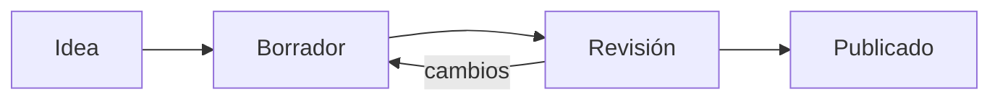

Mycelium dibuja **fórmulas matemáticas** escritas en LaTeX (con KaTeX) y **diagramas**
escritos como texto (con Mermaid). Los dos viven en la nota como texto plano: el dibujo
se arma cada vez que se muestra.

## Para qué sirve

Para escribir una ecuación como se ve en un libro, sin imágenes, y para hacer un diagrama
de flujo, de secuencia o un cronograma que se corrige editando una línea en vez de
redibujar cajas.

## Fórmulas

1. **En línea**: encerrá la fórmula entre signos de pesos, `$…$`, dentro de una oración.
2. **En bloque**: poné `$$` en una línea, la fórmula debajo y otro `$$` para cerrar. Se
   ve centrada y más grande.

```ejemplo
La energía es $E = mc^2$ y el área del círculo, $\pi r^2$.

$$
\int_0^1 x^2\,dx = \frac{1}{3}
$$
```

En la vista en vivo la fórmula se ve dibujada; un clic en ella, o el cursor encima, muestra
su texto para editarlo. Si está mal escrita, se ve en rojo en vez de romper la nota. Para
escribir un signo de pesos suelto, usá `\$`. Dentro de código, un `$` es solo un `$`.

## Diagramas Mermaid

1. Abrí un bloque de código con tres comillas invertidas y la palabra `mermaid`.
2. Escribí el diagrama en la sintaxis de Mermaid y cerrá el bloque.
3. Pasá a lectura o a dividido para verlo dibujado.

````ejemplo

````

Si el diagrama tiene un error, en su lugar aparece «Diagrama Mermaid inválido» con el
motivo, y el resto de la nota se ve igual.

> [!warning] En la vista en vivo, Mermaid se ve como código
> El diagrama se dibuja en lectura, en dividido y al exportar a PDF. Mientras editás en
> vivo, el bloque queda como texto. Ver [Vista en vivo y lectura](ayuda:escribir-notas/vista-en-vivo-y-lectura).
